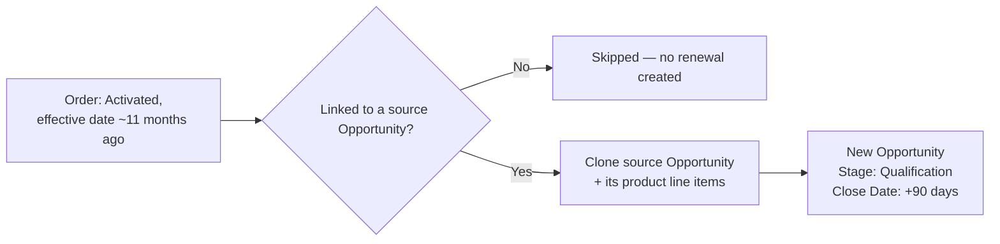

## Overview

As an activated order approaches the end of its term, the system automatically builds next year's deal for
the rep instead of leaving the renewal to be created from scratch. A scheduled background job looks for
activated orders around 11 months old and, for each one that's linked to an opportunity, clones that
opportunity — including its account, pricebook, amount, and product line items — into a brand-new opportunity
sitting fresh at the Qualification stage with a close date three months out. No user action is required to
trigger it; reps simply find the new renewal opportunity in their pipeline and start working it.



## Prerequisites

- The order must already be **Activated** and linked to the opportunity it was created from — see [[order-activation-fulfillment]]
- Standard User (or higher) profile with access to Opportunities, to find and work the generated renewal
- No setup is required to trigger the clone itself — it runs as scheduled background automation

## Steps to Navigate

1. Click the **App Launcher** and search for **Opportunities**.
2. Open a list view (or create one) sorted by **Created Date** and filtered on **Opportunity Name contains "(renewal)"** to surface auto-generated renewals.
3. Open a renewal opportunity to review the cloned **Account**, **Amount**, **Pricebook**, and **Products**.
4. Update the **Close Date**, **Owner**, or any line items as needed, then continue working the deal through the normal stage guardrails.

```screenshot
id: opportunity-renewal-cloning-list-view
alt: Opportunity list view filtered to names containing "(renewal)" showing auto-generated renewal opportunities
step: Open the Opportunities tab and view a list filtered to Opportunity Name contains (renewal)
url_pattern: /lightning/o/Opportunity/list
actions:
  - open_app_launcher
  - search_app_launcher: Opportunities
  - click_app_launcher_result: Opportunities
```

```screenshot
id: opportunity-renewal-cloning-record
alt: Renewal opportunity record page at Qualification stage with cloned product line items
step: Open a generated renewal opportunity and review its Stage, Close Date, and Products related list
url_pattern: /lightning/r/Opportunity/{recordId}/view
actions:
  - open_record: Opportunity
```

## Use Cases

### Order reaches its renewal window (standard case)

1. An order's **Status** is **Activated** and its **Effective Date** is 330 or more days in the past (about 11 months), and it's linked to a source Opportunity.
2. On the next scheduled run, that opportunity is cloned: the new opportunity copies the source's Account, Pricebook, Amount, and Owner, is named **"{Source Name} (renewal)"**, and is set to **Stage = Qualification** with **Close Date = today + 90 days**.
3. Every product line item on the source opportunity (quantity, unit price, pricebook entry) is copied onto the new opportunity as well.
4. The rep finds the new opportunity in their pipeline and works it like any other deal, subject to the normal stage guardrails (see [[opportunity-pipeline-guardrails]]).

### Order with no linked opportunity (skipped)

1. An order meets the same Activated / ~11-month-old criteria, but its **Opportunity** lookup is blank.
2. That order is skipped entirely — no renewal opportunity is created for it, and no error is raised.
3. Nothing else in the org indicates this order was considered; sales ops would need to check the order's Opportunity field directly if a renewal was expected but didn't appear.

### Source opportunity has no product line items

1. A qualifying order's source opportunity has zero Opportunity Product lines (for example, an older deal entered before products were tracked).
2. The renewal opportunity is still created with its header fields cloned (Account, Amount, Pricebook, Owner, Stage reset to Qualification), but with no product lines to copy.
3. The rep needs to add products to the renewal opportunity manually before it can progress past Needs Analysis (see [[opportunity-pipeline-guardrails]]).

### More than 50 orders qualify in a single run

1. More than 50 activated orders meet the ~11-month-old criteria at the same time.
2. Only the first 50 (by the query's default order) are cloned in that run; the remainder are picked up on a later scheduled run, since the job re-evaluates all currently-qualifying orders each time it runs.
3. No orders are lost — they simply renew a run later than the rest.

## Validations & Business Rules

- Automation: `OrderRenewalSchedulable` is a scheduled Apex job that, each run, queries Orders where **Status = Activated** and **Effective Date ≤ today − 330 days**, up to 50 at a time.
- Automation: for each qualifying order with a linked Opportunity, `OpportunityCloneService.deepClone` creates the renewal — Stage is always reset to **Qualification** and Close Date to **today + 90 days**, regardless of the source opportunity's stage or close date.
- Orders with no linked Opportunity are silently skipped — a renewal opportunity is only ever created when there's a source opportunity to clone from.
- The cloned opportunity's product lines carry over **Quantity**, **Unit Price**, and **Pricebook Entry** only; if the source has no lines, the renewal is created with none.
- The default renewal name is **"{Source Name} (renewal)"**; the underlying clone service accepts an explicit name instead, but the scheduled job doesn't currently supply one.

```callout
type: warning
The scheduled job doesn't mark the source order (or the opportunity it already renewed) as "already renewed."
If an order keeps meeting the Activated / ~11-month-old filter across multiple scheduled runs, it will
generate another renewal opportunity each time. If you see duplicate renewal opportunities for the same
order, check whether the order's Status or Effective Date changed to take it out of the filter — otherwise
it will keep renewing on every run.
```

## Related Features

- [[order-activation-fulfillment]] — the order must be Activated (and linked to its originating opportunity) before it can qualify for renewal cloning.
- [[opportunity-pipeline-guardrails]] — the newly cloned opportunity re-enters the pipeline at Qualification and is subject to the same stage-skip, product, and Closed-Won guardrails as any other opportunity.
- [[nightly-sales-operations]] — a separate scheduled job chain that runs on its own cadence; renewal cloning is not part of that chain and isn't logged to its audit trail.
