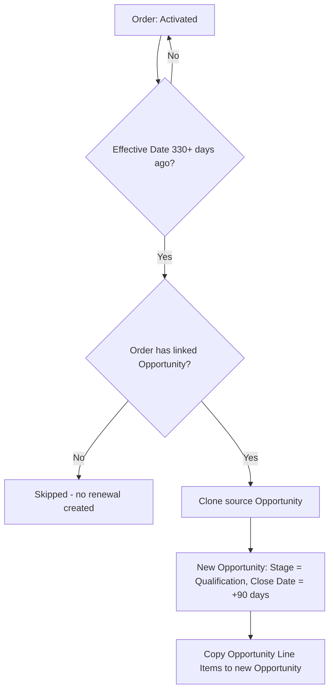

## Overview

The Opportunity Renewal Scheduler is a scheduled Apex job that finds activated orders approaching their one-year mark and automatically creates a renewal opportunity for each one. This keeps the sales pipeline populated with next year's revenue without a rep having to remember to manually re-create the deal. Each renewal opportunity is a deep clone of the original opportunity, reset to an early stage with a new close date and the same line items, so the sales team can pick up the renewal conversation with the same product mix as a starting point.

```callout
type: note
This job is not automatically scheduled out of the box. An administrator must schedule the `OrderRenewalSchedulable` class from Setup for renewals to be generated on an ongoing basis.
```

## Prerequisites

- System Administrator access (or a profile with **Author Apex** and **Schedule Apex** permission) to schedule or reschedule the job
- Orders must reach **Activated** status and have an **Effective Date** for the renewal window to start counting
- The order must be linked to an **Opportunity** (`Order.OpportunityId`) — orders without a related opportunity are skipped
- The source opportunity should have a **Pricebook** and **Opportunity Line Items** if the renewal needs to carry over the same products

## Steps to Navigate

1. Click the gear icon in the top-right, then click **Setup**.
2. In the Quick Find box, type **Apex Classes** and select it.
3. Click **Schedule Apex**.

```screenshot
id: opportunity-renewal-scheduler-schedule-apex
alt: Schedule Apex page in Setup with the class lookup field visible
step: Open Setup, search for Apex Classes, and click Schedule Apex
url_pattern: /lightning/setup/ScheduleApex/home
```

4. Enter a **Job Name** (for example, "Monthly Opportunity Renewal").
5. In the **Apex Class** field, search for and select `OrderRenewalSchedulable`.
6. Choose a **Frequency** (Weekly or Monthly) and a **Start Date** / **End Date**.
7. Select a **Preferred Start Time**.
8. Click **Save**.
9. To confirm the job is active, go to **Setup > Scheduled Jobs** and look for the job name entered above.

```screenshot
id: opportunity-renewal-scheduler-scheduled-jobs
alt: Scheduled Jobs list showing the renewal job with its next scheduled run time
step: Open Setup and navigate to Scheduled Jobs
url_pattern: /lightning/setup/ScheduledJobs/home
```

## Use Cases

### Standard renewal generated

1. An order reaches **Activated** status and its **Effective Date** is 330 or more days in the past.
2. On the next scheduled run, the job picks up the order (batches of up to 50 at a time) and calls the clone service using the order's linked opportunity.
3. A new opportunity is inserted with the name `<original opportunity name> (renewal)`, **Stage** set to **Qualification**, and **Close Date** set to 90 days from today.
4. All of the original opportunity's line items are copied onto the new renewal opportunity with the same product, quantity, and unit price.
5. The sales team finds the new renewal opportunity in their pipeline and works it like any other open deal.



### Order with no linked opportunity

1. An order qualifies on Status and Effective Date, but its **Opportunity** lookup is blank.
2. The job silently skips that order — no renewal opportunity is created and no error is raised.
3. If a renewal is still needed, a user must manually create the opportunity (and optionally link it back to the order) so future automation and reporting can find it.

### Bulk renewal run (governor-limit safe batch)

1. On a given run, more than 50 orders may qualify for renewal at once (for example, after a large cohort of orders were activated around the same date).
2. The job only processes the first 50 qualifying orders it retrieves in that execution.
3. The remaining qualifying orders are picked up automatically on the **next** scheduled run, since they still meet the Status and Effective Date criteria.
4. No manual intervention is required, but renewal opportunities for a large cohort may appear across more than one scheduled run rather than all at once.

### Correcting a renewal created in error

1. If a renewal opportunity is created that shouldn't have been (for example, the account is being closed and shouldn't renew), there is no automatic undo.
2. A user with edit access should either set the renewal opportunity's stage to **Closed Lost** with an appropriate reason, or delete it if it was created purely in error.
3. Deleting or closing the renewal opportunity does not change the original order or opportunity in any way — the clone is fully independent once created.

## Validations & Business Rules

- **Qualifying criteria:** an order is only considered for renewal when `Status = 'Activated'` and `EffectiveDate <= Today - 330 days`.
- **Batch cap:** each scheduled execution queries at most 50 qualifying orders (`LIMIT 50`); larger backlogs spill over into subsequent runs.
- **Skip condition:** orders with no `OpportunityId` are skipped — no renewal opportunity is created and no error/log entry is generated.
- **Clone reset logic:** regardless of the source opportunity's current stage or close date, every renewal clone is forced to `StageName = 'Qualification'` and `CloseDate = Today + 90 days`.
- **Clone naming:** the new opportunity name defaults to `<source Opportunity Name> (renewal)`; a custom name can only be supplied by calling `OpportunityCloneService.deepClone` directly from code (the scheduled job always passes a blank name).
- **Fields copied to the clone:** `Name`, `AccountId`, `StageName`, `CloseDate`, `Amount`, `Pricebook2Id`, and `OwnerId` from the source opportunity; all other fields start blank/default as a new record.
- **Line items copied:** only `Quantity`, `UnitPrice`, and `PricebookEntryId` are copied to the new opportunity's line items — no other line item fields carry over.
- **No linkage back to source:** the renewal opportunity is a standalone record; it is not automatically related back to the originating order or opportunity through any field.

## Related Features

- Order lifecycle and activation (the order status and effective date this job depends on)
- Opportunity management and pipeline reporting (where renewal opportunities surface once created)
