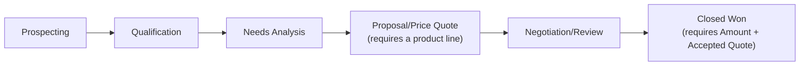

## Overview

This feature keeps opportunity data honest as reps move deals through the pipeline. When a stage is changed,
Salesforce automatically checks that the move makes sense — deals can't skip stages, can't reach Proposal
without any products added, and can't be marked Closed Won without an accepted quote and a dollar amount.
Separately, whenever a deal's Amount crosses $250,000, a high-priority follow-up task is created for the
opportunity owner so leadership has visibility into big deals as they emerge. Sales reps and sales managers
encounter this automatically every time they edit an Opportunity's Stage or Amount — there is nothing to
turn on.



## Prerequisites

- Ability to edit Opportunity records (standard edit access).
- To move an opportunity to **Proposal/Price Quote** or later, at least one product (Opportunity Line Item) must already be added.
- To move an opportunity to **Closed Won**, the opportunity must have a positive **Amount** and a related **Quote** with **Status = Accepted**.

```callout
type: note
The $250,000 big-deal threshold and the stage order used for the skip-check are defined in code
(`OpportunityForecastService.BIG_DEAL_AMOUNT` and `OpportunityStageGuardService.STAGE_ORDER`). Changing
either requires a code change/deployment, not a configuration update.
```

## Steps to Navigate

1. Open an **Opportunity** record.
2. Click into the **Stage** field (or click **Edit**) and choose a new stage.
3. Click **Save**.
4. If the move is blocked, an error banner appears at the top of the record and the stage is not changed. Fix the underlying issue (add a product, get the quote accepted, enter an Amount) and save again.

```screenshot
id: opportunity-stage-guardrails-forecasting-stage-field
alt: Opportunity record page with the Stage field open for editing
step: Open an Opportunity and click into the Stage field to change it
url_pattern: /lightning/r/Opportunity/{recordId}/view
actions:
  - open_record: Opportunity
```

## Use Cases

### Standard forward stage move

1. Rep opens an opportunity currently at **Qualification** and changes Stage to **Needs Analysis** (one step forward).
2. Rep clicks **Save**.
3. Because the move is only one stage forward and doesn't require line items or an accepted quote, the save succeeds immediately.

### Blocked: skipping stages

1. Rep opens an opportunity at **Prospecting** and changes Stage directly to **Negotiation/Review**, skipping several stages.
2. Rep clicks **Save**.
3. Salesforce blocks the save with: *"Stages cannot be skipped: move one stage at a time (from Prospecting)."*
4. Rep must move the opportunity forward one stage at a time instead.

```callout
type: note
Jumping directly to **Closed Won** from any earlier stage is allowed by the skip check — it is treated as
a deal-closing shortcut, not a skip — but it still must pass the Closed Won requirements below (Amount and
accepted quote).
```

### Blocked: no product line items before Proposal

1. Rep changes Stage on an opportunity with no products added to **Proposal/Price Quote** (or any later stage).
2. Rep clicks **Save**.
3. Salesforce blocks the save with: *"Add at least one product before moving to Proposal/Price Quote."*
4. Rep adds at least one product to the Opportunity Products related list, then retries the stage change.

### Blocked: Closed Won without an accepted quote

1. Rep changes Stage on an opportunity to **Closed Won**, but no Quote on the opportunity has Status = Accepted (e.g. the quote is still Draft or was never synced/accepted).
2. Rep clicks **Save**.
3. Salesforce blocks the save with: *"Closed Won requires an Accepted quote on this opportunity."*
4. Rep (or the customer, via the quote approval process) must get a quote to Accepted status before retrying.

### Blocked: Closed Won without an Amount

1. Rep changes Stage to **Closed Won** on an opportunity that has no Amount (or Amount is zero/negative).
2. Rep clicks **Save**.
3. Salesforce blocks the save with: *"Closed Won requires a positive Amount."*
4. Rep enters a valid Amount and retries.

```callout
type: warning
If an opportunity fails both the Amount check and the accepted-quote check at the same time, both error
messages are shown together — the rep needs to resolve each one before the stage change will save.
```

### Bulk stage updates (e.g. mass edit or data load)

1. A batch of opportunities is updated at once (mass Stage change, data import, or an integration update).
2. Each opportunity in the batch is evaluated independently against the same rules (skip check, line-item check, quote/Amount check for Closed Won).
3. Opportunities that pass are saved; opportunities that fail are rejected with their specific error, while the rest of the batch is unaffected.

### Big deal crosses the forecast threshold

1. Rep updates the Amount on an open (not closed) opportunity from below $250,000 to $250,000 or more.
2. Rep clicks **Save** — this save is not blocked; the stage guard rules above only apply to Amount when the stage is Closed Won.
3. After the save completes, a high-priority Task titled **"Big deal alert: [Opportunity Name]"** is automatically created, assigned to the opportunity owner, due the next day.
4. The opportunity owner sees the new task in their task list as a reminder to manage the deal closely.

```screenshot
id: opportunity-stage-guardrails-forecasting-big-deal-task
alt: Task related list on an Opportunity showing an auto-created "Big deal alert" task
step: Open an opportunity whose Amount was just raised above the big-deal threshold and view its Task related list
url_pattern: /lightning/r/Opportunity/{recordId}/view
actions:
  - open_record: Opportunity
```

### No duplicate alert on repeated edits

1. An opportunity's Amount is already at or above $250,000 from a prior save.
2. Rep edits the opportunity again (e.g. changes the Close Date) without dropping the Amount back below $250,000 and re-raising it.
3. No new big-deal Task is created, because the alert only fires the moment Amount *crosses* into the $250,000+ range, not on every subsequent save.

### No alert once the deal is closed

1. An opportunity's Amount crosses $250,000 in the same update that also sets Stage to Closed Won or Closed Lost.
2. No big-deal Task is created, because the alert only applies to open (not-closed) opportunities.

## Validations & Business Rules

- Automation: `OpportunityTriggerHandler.beforeUpdate` runs `OpportunityStageGuardService.enforce` on every Opportunity update, before the save is committed.
- Rule: a stage change of more than one step forward in the standard stage order (Prospecting → Qualification → Needs Analysis → Proposal/Price Quote → Negotiation/Review) is rejected, unless the destination stage is Closed Won.
- Rule: moving to **Proposal/Price Quote** or any later stage requires at least one Opportunity Line Item on the opportunity.
- Rule: moving to **Closed Won** requires both a positive `Amount` and at least one related Quote with `Status = 'Accepted'` (checked via `QuoteApprovalService.opportunitiesWithAcceptedQuote`).
- Automation: `OpportunityTriggerHandler.afterUpdate` runs `OpportunityForecastService.flagBigDeals` after every Opportunity update.
- Rule: a "Big deal alert" Task is created only when `Amount` crosses from below $250,000 to $250,000 or above in the same update, and the opportunity is not closed (`IsClosed = false`).
- All of this automation is skipped entirely when the Opportunity trigger is bypassed via `TriggerControl` (used for controlled data loads/migrations).

## Related Features

- Quote Approval Process — determines when a Quote reaches Accepted status, which this feature checks before allowing Closed Won.
- Opportunity Discount Approval — runs alongside this feature in the same trigger when an opportunity moves into Negotiation/Review.
