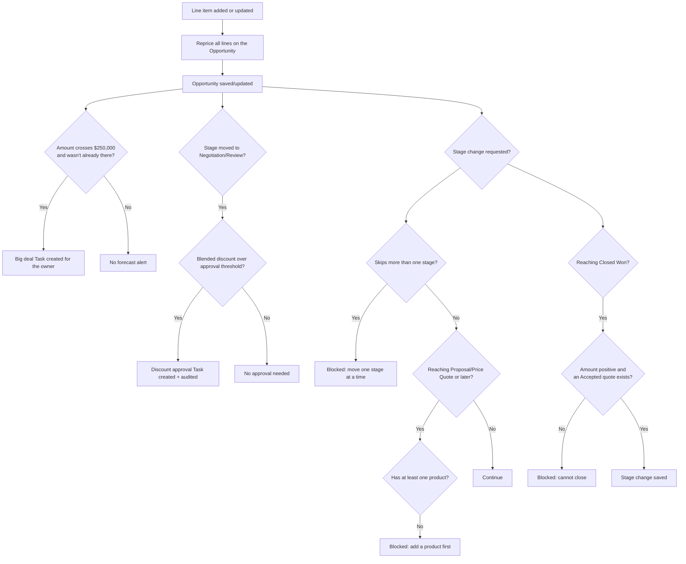

## Overview

This set of automations keeps an opportunity's pricing, forecast visibility, and stage progression
consistent as a deal moves through the pipeline. Whenever a product is added or changed on the
opportunity, line prices are automatically recalculated using the standard pricing rules (volume,
customer tier, and product family adjustments). As the deal amount grows, opportunities that cross a
large-deal threshold are flagged with a Task so leadership has visibility into big deals. When a deal
moves into **Negotiation/Review**, any heavily discounted lines trigger a discount-approval Task
automatically. Finally, the opportunity is prevented from skipping stages, from reaching **Proposal**
without any products, and from being marked **Closed Won** without a positive amount and an accepted
quote.



## Prerequisites

- Edit access to Opportunities and their Opportunity Products (Line Items)
- An active Pricebook with Pricebook Entries assigned to the Opportunity, including a Product Family on each product
- `Account.Rating` set to Hot or Warm where a customer-tier discount should apply
- A Quote related to the Opportunity that has reached **Accepted** status before the deal can be moved to Closed Won

## Steps to Navigate

This feature is entirely automatic — reps do not open a separate screen to trigger it. It runs whenever
an opportunity or its line items are saved.

1. Open an **Opportunity** record.
2. Scroll to the **Products** (Opportunity Line Items) related list and click **Add Product**, or edit the quantity/price of an existing line, then **Save**.

```screenshot
id: pricing-forecasting-and-stage-gates-products-related-list
alt: Opportunity record page showing the Products related list with Add Product button
step: Open an Opportunity and view its Products related list
url_pattern: /lightning/r/Opportunity/{recordId}/view
actions:
  - open_record: Opportunity
```

3. To advance the deal, open the **Stage** field on the opportunity (path bar or edit form) and select the next stage, then **Save**.

```screenshot
id: pricing-forecasting-and-stage-gates-stage-path
alt: Opportunity path bar showing the Stage selector
step: Open an Opportunity and select a new Stage in the path bar
url_pattern: /lightning/r/Opportunity/{recordId}/view
actions:
  - open_record: Opportunity
```

## Use Cases

### Line items are priced automatically

1. A rep adds a product to the Opportunity (or changes an existing line's quantity).
2. On save, `OpportunityLineItemTriggerHandler` collects the affected Opportunity Ids and calls `OpportunityPricingService.repriceOpportunities`.
3. For every line on the opportunity, the service looks up the account's tier and passes list price, quantity, and product family through the shared pricing engine (volume discount, tier discount, family adjustment, capped at 40% combined, then floored at each family's minimum margin).
4. Any line whose computed unit price differs from what is stored is updated. This reprice runs with the Opportunity Line Item trigger bypassed, so it does not recursively re-trigger itself.

### Deal crosses the big-deal threshold

1. A rep updates an open opportunity's **Amount** to $250,000 or more, where it was previously below that amount.
2. On save, `OpportunityForecastService.flagBigDeals` detects the crossing and, because the opportunity is not closed, creates a **High priority Task** ("Big deal alert: ...") assigned to the opportunity owner, due the next day.
3. If the opportunity is already closed, or the amount was already at/above $250,000 before this save, no new Task is created.

### Stage change requires review when discounting is heavy

1. A rep changes an opportunity's **Stage** to **Negotiation/Review**.
2. After save, `OpportunityDiscountApprovalService.reviewDiscounts` calculates the blended discount across all of the opportunity's lines (list total vs. sold total).
3. If that blended discount exceeds the approval matrix — over 30%, or over 20% on deals above $100,000 — a **High priority Task** ("Discount approval needed (...%): ...") is created for the owner, and the request is recorded via `SalesOpsAuditService`.
4. If the discount is within normal limits, no Task is created and the stage change proceeds without interruption.

### Stage cannot be skipped forward

1. A rep tries to change **Stage** directly from **Prospecting** to **Negotiation/Review** (skipping intermediate stages).
2. `OpportunityStageGuardService.enforce` runs in before-update, detects the stage move skips more than one position, and blocks the save with an error: "Stages cannot be skipped: move one stage at a time (from Prospecting)."
3. The rep must instead advance the opportunity one stage at a time.

### Cannot reach Proposal/Price Quote (or later) without products

1. A rep tries to move an opportunity to **Proposal/Price Quote** (or any later stage) while it has no Opportunity Line Items.
2. The save is blocked with: "Add at least one product before moving to Proposal/Price Quote."
3. The rep adds at least one product to the opportunity and retries the stage change, which now succeeds (assuming the skip-stage and closed-won checks also pass).

### Cannot close won without an accepted quote

1. A rep tries to set **Stage** to **Closed Won**.
2. `OpportunityStageGuardService.enforce` checks that `Amount` is a positive number and, separately, that at least one related **Quote** has reached **Accepted** status.
3. If Amount is blank or zero, the save is blocked with: "Closed Won requires a positive Amount."
4. If no Quote on the opportunity is Accepted, the save is blocked with: "Closed Won requires an Accepted quote on this opportunity."
5. Once the opportunity has a positive Amount and an Accepted quote, the stage change to Closed Won succeeds.

## Validations & Business Rules

- Automation: `OpportunityLineItemTriggerHandler` (after insert/update on Opportunity Line Item) calls `OpportunityPricingService.repriceOpportunities`, which reprices every line on the affected opportunities via the shared pricing engine and updates only lines whose price actually changed.
- Automation: `OpportunityTriggerHandler.beforeUpdate` calls `OpportunityStageGuardService.enforce`, which blocks the save (via `addError`) when:
  - the stage moves more than one position forward in the sequence Prospecting → Qualification → Needs Analysis → Proposal/Price Quote → Negotiation/Review → Closed Won (Closed Won is exempt from the skip check),
  - the new stage is Proposal/Price Quote or later and the opportunity has no Opportunity Line Items,
  - the new stage is Closed Won and Amount is not a positive number,
  - the new stage is Closed Won and no related Quote has Status = Accepted.
- Automation: `OpportunityTriggerHandler.afterUpdate` calls `OpportunityForecastService.flagBigDeals`, which creates a High priority Task when Amount crosses from below $250,000 to $250,000 or more on an opportunity that is not closed. It does not fire again if the amount was already at or above the threshold.
- Automation: `OpportunityTriggerHandler.afterUpdate` calls `OpportunityDiscountApprovalService.reviewDiscounts` whenever the stage newly becomes Negotiation/Review. It creates a High priority Task and an audit record via `SalesOpsAuditService` when the blended discount exceeds 30%, or exceeds 20% on deals with Amount over $100,000.
- Pricing logic (shared with Quotes and Orders via `PriceRuleEngine`): volume discount by quantity band per product family, customer-tier discount from `Account.Rating` (Hot/Warm), a product-family adjustment (Subscription +2%, Services −3%), a combined discount cap of 40%, and a margin floor (75% of list for Services, 55% for Hardware, 60% for everything else) that overrides any stacked discount that would go lower.
- All of this automation can be bypassed org-wide via `TriggerControl` (used internally during the reprice update itself to avoid recursive triggering).

## Related Features

- Big Deal Alert (a separate Flow-based automation on the same $250,000 threshold)
- Quote Expiry Alert — quotes must reach Accepted status, tracked on the Quotes pages, before Closed Won is allowed here
