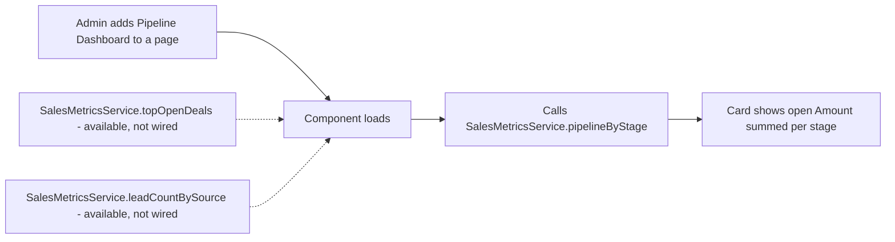

## Overview

The Sales Pipeline Dashboard is a small card component that reps and managers can place on a Home page, App page, or record page to see open pipeline health without running a report. It queries live Opportunity data on load, so it always reflects the current state of the pipeline rather than a saved snapshot.

```callout
type: note
As currently built, the deployed card only shows **open pipeline totals grouped by stage**. Its backing Apex class, `SalesMetricsService`, also exposes a cacheable `topOpenDeals()` method (the top 10 open deals by Amount) and a `leadCountBySource()` method, but the component's markup does not call either of them yet — no "top deals" list or lead-source breakdown is rendered today.
```

## Prerequisites

- The **Pipeline Dashboard** component must be added to a page (Home, App, or record page) via Lightning App Builder — it does not appear anywhere by default.
- Users must have read access to the Opportunity object and to the Amount, StageName, and Account.Name fields.
- No custom setup (no Record Type, Flow, or Queue) is required — the component only reads existing Opportunity data.

## Steps to Navigate

1. As an admin, open the Home page, an App page, or the record page you want the card on, and click **Edit Page** (or **Setup gear → Edit Page**).
2. In Lightning App Builder, drag the **Pipeline Dashboard** component from the Components panel onto the page.
3. Click **Save**, and **Activate** the page if prompted (choose the org default, app default, or app/record-type/profile assignment as needed).
4. Any user who navigates to that page can now see the **Pipeline by Stage** card.

```screenshot
id: sales-pipeline-dashboard-app-builder
alt: Lightning App Builder with the Pipeline Dashboard component dragged onto a Home page layout
step: Open Lightning App Builder for a Home page and drag the Pipeline Dashboard component onto the canvas
url_pattern: /lightning/setup/FlexiPageList/home
actions:
  - goto: /lightning/setup/FlexiPageList/home
```

```screenshot
id: sales-pipeline-dashboard-card-view
alt: Pipeline by Stage card showing stage names next to their summed open Amount
step: View the Home page with the Pipeline Dashboard component active
url_pattern: /lightning/page/home
```

## Use Cases

### Rep checks open pipeline totals by stage

1. The rep opens the Home page (or whichever page the admin placed the card on).
2. The **Pipeline by Stage** card lists every stage that has at least one open Opportunity, showing the stage name next to the summed `Amount` of all open Opportunities in that stage.
3. The rep uses this to spot which stages are carrying the most (or least) open pipeline value at a glance.

### No open Opportunities exist yet

1. If the org (or the user's visible data, subject to sharing rules) has no open Opportunities, the query returns no rows.
2. The card renders its title and icon but no list underneath — this is expected, not an error.

### An Opportunity is closed or its Amount changes

1. Because the card re-queries on each load rather than caching a fixed snapshot in memory, moving an Opportunity to a closed stage removes it from every stage total the next time the card loads.
2. Changing an open Opportunity's Amount updates the stage total it contributes to the next time the card loads.

### Looking for the top individual deals or lead-source counts

1. A user expecting a "top 10 open deals" list or a lead-source breakdown on this card will not find one today — only the by-stage totals are wired into the UI.
2. `SalesMetricsService.topOpenDeals()` and `SalesMetricsService.leadCountBySource()` are available, cacheable Apex methods an admin/developer could wire into this or another component, but neither is currently called from any production code.

## Validations & Business Rules

- The card calls the cacheable Apex method `SalesMetricsService.pipelineByStage()`, which groups `Opportunity` records `WHERE IsClosed = false`, summing `Amount` per `StageName`.
- Because the method is `cacheable=true`, the Lightning Data Service wire may serve a cached result briefly rather than a fresh query on every single page view.
- `SalesMetricsService.topOpenDeals()` queries the top 10 open Opportunities (`IsClosed = false AND Amount != null`) ordered by `Amount` descending, returning `Id`, `Name`, `Amount`, `StageName`, and `Account.Name`. It is `cacheable=true` and callable from Lightning components, but no deployed component currently calls it.
- `SalesMetricsService.leadCountBySource()` counts unconverted Leads grouped by `LeadSource` (nulls bucketed as `Unknown`). It is also unused by any deployed component today.
- All three methods run under `with sharing`, so results respect the running user's Opportunity/Lead sharing rules and field-level access.



## Related Features

No related business features are documented yet.
