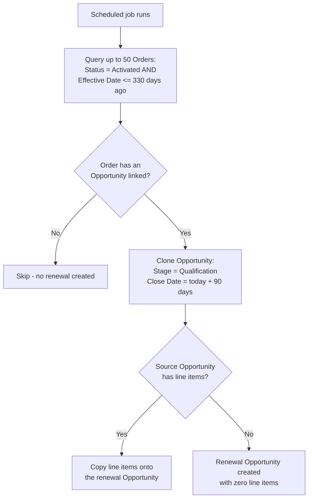

## Overview

This feature keeps the sales pipeline stocked with renewal business by automatically spinning up a new Opportunity whenever an activated Order is approaching the end of its term. Once a day (when scheduled), a job scans for Orders that were Activated roughly eleven months ago or more, and for each one it deep-clones the linked Opportunity — copying the account, pricing, and line items — into a fresh Opportunity sitting in the Qualification stage with a close date 90 days out. Sales reps then see this new Opportunity in their pipeline as the starting point for the renewal conversation, without anyone having to manually recreate the deal.

```callout
type: warning
This job (`OrderRenewalSchedulable`) is not currently invoked by anything else in the org's Apex or Flow automation — it only runs if someone has scheduled it (Setup > Apex Classes > Schedule Apex, or an anonymous Apex `System.schedule(...)` call). If renewal Opportunities are not appearing, the first thing to check is whether the job actually has an active schedule under Setup > Scheduled Jobs.
```

## Prerequisites

- The Apex class `OrderRenewalSchedulable` must be scheduled to run (it is not triggered by any record save, button, or other automation).
- Scheduling the job requires the "Author Apex" permission.
- An Order only produces a renewal if its **Opportunity** lookup is populated; Orders created without a linked Opportunity are silently skipped.
- The source Opportunity should have Opportunity Line Items if the renewal deal is expected to arrive with pricing already populated.

## Steps to Navigate

This is a background scheduled job rather than something a user opens and clicks through. The steps below are for an admin verifying or (re-)scheduling the job.

1. Click the gear icon in the top-right, then click **Setup**.
2. In the Quick Find box, search for and select **Apex Classes**.
3. Confirm `OrderRenewalSchedulable` and `OpportunityCloneService` are both listed and active.

```screenshot
id: opportunity-renewal-automation-apex-classes
alt: Apex Classes setup page showing OrderRenewalSchedulable in the list
step: Search for and open Apex Classes in Setup, showing OrderRenewalSchedulable
url_pattern: /lightning/setup/ApexClasses/home
```

4. In the Quick Find box, search for and select **Scheduled Jobs**.
5. Confirm whether a job backed by `OrderRenewalSchedulable` has an active, upcoming **Next Scheduled Run**. If nothing is listed, the automation described on this page is not currently running.

```screenshot
id: opportunity-renewal-automation-scheduled-jobs
alt: Scheduled Jobs setup page showing any job scheduled against OrderRenewalSchedulable
step: Search for and open Scheduled Jobs in Setup
url_pattern: /lightning/setup/ScheduledJobs/home
```

6. If no job is scheduled and one is needed, use **Setup > Apex Classes > Schedule Apex** to create a new scheduled job pointing at `OrderRenewalSchedulable`.

## Use Cases

### Standard renewal creation

1. The scheduled job runs and queries all Orders with `Status = 'Activated'` and an `Effective Date` at least 330 days in the past (roughly 11 months), up to 50 Orders per run.
2. For each qualifying Order that has an Opportunity linked, the job clones that Opportunity: the same Account, Pricebook, and Owner carry over, the clone's Stage is reset to **Qualification**, and its Close Date is set to 90 days from today.
3. The new Opportunity's Name is the source Opportunity's name with " (renewal)" appended (for example, "Acme Corp - Annual License (renewal)").
4. Every Opportunity Line Item on the source Opportunity (Quantity, Unit Price, Price Book Entry) is copied onto the new Opportunity, so it arrives pre-priced.
5. A sales rep opens their Opportunities list view and sees the new renewal Opportunity ready to work, without needing to manually re-enter the account, products, or pricing.

### Order has no linked Opportunity

1. The job finds an Order that is Activated and past the 330-day threshold, but its **Opportunity** field is blank.
2. That Order is skipped — no renewal Opportunity is created for it, and no error is raised.
3. To fix this going forward, the Order needs an Opportunity populated before it ages past the threshold on a later run.

### Source Opportunity has no line items

1. The job clones an Opportunity whose linked Order qualifies for renewal, but the source Opportunity has no Opportunity Line Items.
2. The renewal Opportunity is still created (same Name, Stage, Close Date, Account, Owner, Pricebook), but it is inserted with zero line items.
3. A rep working the renewal will need to add products manually before it can be quoted.

### More than 50 Orders qualify in a single run

1. On any given day, more than 50 Activated Orders may cross the 330-day threshold at once (for example, after a bulk activation of many Orders around the same effective date).
2. The job's query is capped at `LIMIT 50`, so only the first 50 qualifying Orders (by default query order) get a renewal Opportunity created in that run.
3. The remaining qualifying Orders are picked up on a subsequent scheduled run, since they still match the same `Status` and `Effective Date` filter — they are not skipped permanently, only delayed.



## Validations & Business Rules

- Query filter: only Orders with `Status = 'Activated'` and `EffectiveDate <= Date.today().addDays(-330)` are considered — an Order becomes eligible for renewal roughly 11 months after its effective date, not based on any explicit "renewal date" field.
- The query is capped at `LIMIT 50` per execution; it is not implemented as a true batch job, so any excess eligible Orders roll over to the next scheduled run rather than all being processed the same day.
- Orders without a populated **Opportunity** lookup are silently skipped — there is no error, log, or notification when this happens.
- The clone always sets the new Opportunity's Stage to `Qualification` and Close Date to 90 days from today, regardless of the source Opportunity's original stage or close date.
- The clone's Name is always `<source name> (renewal)` in this automated flow, because the scheduler always calls the cloning logic without a custom name.
- Only Quantity, Unit Price, and Price Book Entry are copied for each Opportunity Line Item — any other line-item-level customizations on the source are not carried over.
- `OrderRenewalSchedulable` and `OpportunityCloneService` both run `with sharing`, so the scheduled job's execution is still subject to the running user's (the user who scheduled the job) record-level sharing on Order and Opportunity.

## Related Features

- Order Activation & Status — governs how an Order reaches the `Activated` status that this renewal job watches for.
- Order Activation, Fulfillment & Margin — related Order lifecycle automation that runs around the same Activated status.
