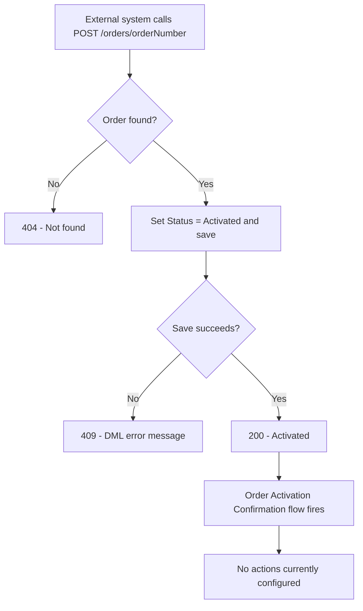

## Overview

This feature exposes Order status over a REST API so that outside systems — such as a customer portal or another back-office system — can check whether an order is still a Draft or has been Activated, and can trigger activation directly without a person opening the order record in Salesforce. When an order's status is changed to Activated (whether through this API or through the standard UI), a paired automation runs against the Order record to confirm the activation happened. Today that automation is a record-triggered Flow with no additional actions configured, so it currently has no visible effect beyond firing.

```callout
type: warning
Neither of these components is currently called by any other part of the org's Apex or Flow automation. The REST endpoint only runs when an external system calls it directly, and the confirmation Flow only runs when an Order's Status field is saved as "Activated" by any means. If activations aren't happening, confirm the calling system is actually invoking `/services/apexrest/orders/*`.
```

## Prerequisites

- Integration user or calling system must have a valid Salesforce session/OAuth token with access to the REST API.
- The integration user's permission set must include read access to Order (for status lookups) and edit access to Order (for activation).
- The Order must already exist and have an `OrderNumber` the caller can supply.

## Steps to Navigate

This is a system-to-system (REST API) feature rather than a page a user clicks through in Salesforce. The steps below are for an admin verifying or configuring the integration in Setup.

1. Click the gear icon in the top-right, then click **Setup**.
2. In the Quick Find box, search for and select **Apex Classes**.
3. Click **OrderStatusRestResource** to confirm the class is active and review its Apex.

```screenshot
id: order-activation-and-status-apex-class
alt: Apex Classes setup page showing OrderStatusRestResource in the list
step: Search for and open Apex Classes in Setup, showing OrderStatusRestResource
url_pattern: /lightning/setup/ApexClasses/home
```

4. In the Quick Find box, search for and select **Flows**.
5. Click **Order Activation Confirmation** to review the flow's trigger (Order record, after save, when Status = "Activated").

```screenshot
id: order-activation-and-status-flow
alt: Flow Builder canvas for the Order Activation Confirmation flow showing its start element
step: Open the Order Activation Confirmation flow in Flow Builder
url_pattern: /lightning/setup/Flows/home
```

## Use Cases

### Check an order's current status

1. The external system sends an HTTP GET request to `/services/apexrest/orders/{orderNumber}`.
2. Salesforce looks up the Order by `OrderNumber` and returns its `Status` value (e.g. `Draft`, `Activated`) as plain text.
3. If no Order matches that number, the response body is `Not found` (the endpoint still returns a 200 status in this case, since no error status is set).

### Activate a Draft order via the API

1. The external system sends an HTTP POST request to `/services/apexrest/orders/{orderNumber}` with `orderNumber` as a parameter.
2. Salesforce looks up the Order by `OrderNumber`, sets its `Status` to `Activated`, and saves it.
3. On success, the response body is `Activated`.
4. Because the Order is saved with `Status = 'Activated'`, the **Order Activation Confirmation** flow fires on that record in the background. It currently has no configured actions, so it runs silently with no further effect.

### Activation fails validation

1. The external system sends the same POST request, but the order fails to save — for example because a validation rule or another automation on Order rejects the status change.
2. The response status code is set to `409` and the response body contains the DML error message returned by Salesforce, so the calling system can surface the reason to its own users.

### Order number not found

1. The external system sends a GET or POST request for an `orderNumber` that doesn't exist.
2. For **GET**, the response body is `Not found` with a normal (200) status.
3. For **POST**, the response status code is set to `404` and the body is `Not found`, so the calling system can distinguish "no such order" from a validation failure.



## Validations & Business Rules

- The REST endpoint is exposed at URL mapping `/orders/*` and requires `with sharing`, so the integration user's record-level access still applies to which Orders can be read or updated.
- `getStatus()` (HTTP GET) looks up the Order by the number in the URL path and returns its `Status`; it does not modify any data.
- `activate()` (HTTP POST) hard-codes the target status to `Activated` — there is no way to set any other status through this endpoint.
- Any validation rule or trigger on Order that blocks a status change to `Activated` will surface to the caller as a 409 response with the underlying DML error message.
- The **Order Activation Confirmation** flow triggers after save whenever an Order's `Status` equals `Activated`, regardless of whether the change came from this API, the standard UI, or any other process. It currently defines no actions, so it does not send notifications, update fields, or perform any other work.

## Related Features

- Any standard Order lifecycle / Order Management pages that also change an Order's Status should be reviewed alongside this API, since both paths can trigger the same activation flow.
