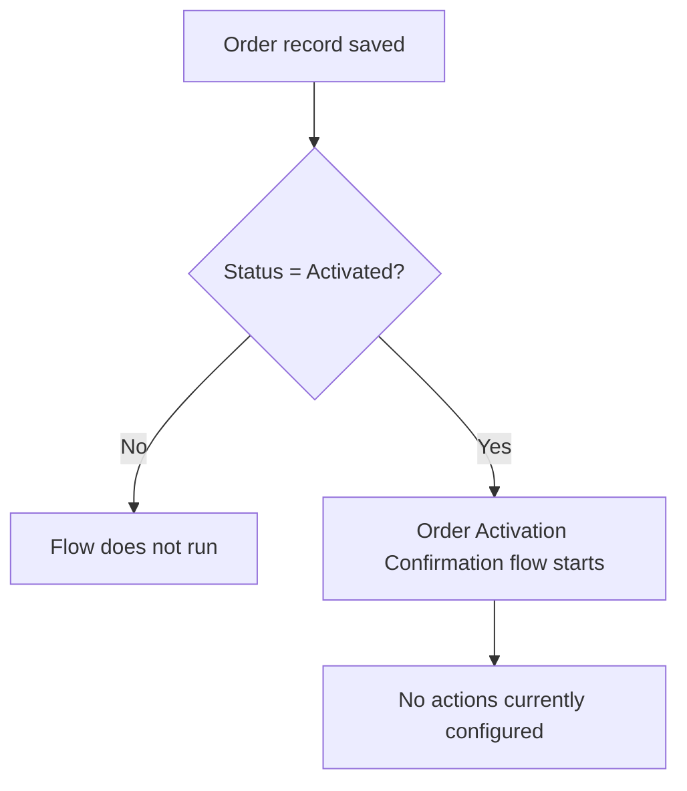

## Overview

Order Activation Confirmation is a background automation that watches Order records for the moment
they become **Activated**. It is not a screen or button a user opens — it runs on its own, right
after an Order is saved, whenever that save results in `Status = Activated`. It exists to confirm
the activation event to whoever needs to know about it, whether that's a user, a downstream process,
or a notification. As shipped, the flow's entry criteria are configured, but no confirmation action
(such as an email, notification, or field update) has been added inside it yet — it currently
evaluates its entry condition and then does nothing further.



```callout
type: warning
This flow currently has no actions defined beyond its entry criteria. It fires correctly whenever
an Order's Status is saved as Activated, but it does not yet send a notification, update a field,
or perform any other confirmation step. Treat this page as documenting the trigger condition only,
until actions are added to the flow.
```

## Prerequisites

- The flow must be Active in Setup > Flows (it ships Active by default)
- An Order must reach Status = Activated through the normal activation process — for example, a user activating the order from the record page, or an external call to the [Order Status API](order-status-api.md)

```callout
type: note
There is nothing for a user to click to run this flow directly — it is a record-triggered flow that
Salesforce runs automatically after an Order record is saved. The steps below describe how to find
and inspect it in Setup, not how to invoke it.
```

## Steps to Navigate

1. Click the gear icon in the top-right, then click **Setup**.
2. In the Quick Find box, type **Flows** and select **Flows**.
3. Click **Order Activation Confirmation** to open it.
4. Click **View** (or **Edit**, if changes are needed) to see the flow's canvas, including its start element and entry conditions.

```screenshot
id: order-activation-confirmation-setup
alt: Flow detail page for Order Activation Confirmation showing its start element and entry conditions
step: Open Setup > Flows and click into the Order Activation Confirmation flow
url_pattern: /lightning/setup/Flows/home
```

## Use Cases

### Order is activated

1. A user opens an Order record and changes its Status to **Activated** (or an integration does the same via the Order Status API), then the record is saved.
2. Immediately after the save completes, the Order Activation Confirmation flow starts for that record because its entry criteria (`Status = "Activated"`) are met.
3. As currently configured, the flow interview starts and finishes with no visible effect — no email, message, or field change occurs, since no actions have been added to it yet.

### Order is saved without becoming Activated

1. A user edits an Order but leaves its Status as something other than **Activated** (for example, updates the Description while the order stays in `Draft`), then saves.
2. The flow's entry criteria are not met, so the flow does not start at all.
3. No confirmation processing of any kind happens for this save.

### Order is re-saved while already Activated

1. An already-Activated Order is edited again (for example, a shipping address correction) and saved without its Status changing.
2. Because this is an Update trigger checking the record's current Status at save time, the flow's entry criteria (`Status = "Activated"`) are still met, so the flow starts again.
3. As with the first activation, no further action currently occurs — the flow simply completes.

## Validations & Business Rules

- The flow only starts on **Update** of an existing Order (`recordTriggerType: Update`), running **after** the save completes (`RecordAfterSave`) — it cannot fire on Order creation, only on a subsequent save.
- The entry condition is a single filter formula: `{!$Record.Status} = "Activated"`. Any save that results in this value re-triggers the flow, including saves where Status was already Activated before the edit.
- The flow performs no other filtering (for example, it does not check Order Type, Account, or who made the change) — every Order in the org that is saved as Activated will trigger it.
- The flow currently contains no elements after its start condition, so it has no observable business effect beyond consuming a flow interview. Any confirmation behavior (email alert, Chatter post, field update, etc.) will need to be added to the flow before this feature does anything user-visible.

## Related Features

- [Order Status API](order-status-api.md) — the REST endpoint that can set an Order's Status to Activated from outside Salesforce, which also satisfies this flow's entry criteria.
