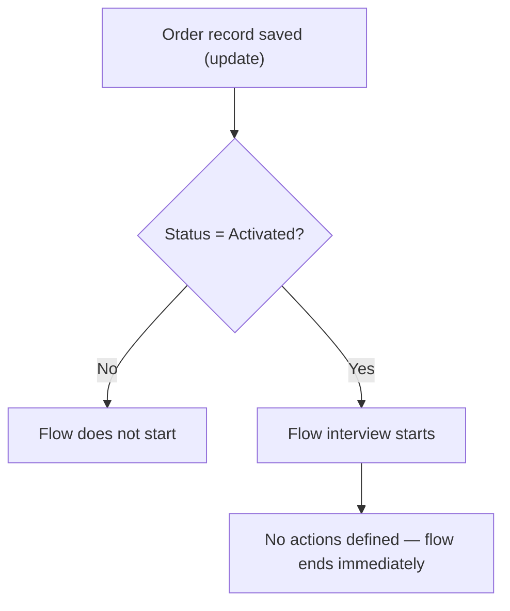

## Overview

Order Activation Confirmation is a background automation that watches every Order record for the moment its
**Status** field changes to **Activated**. It is not something a user opens or clicks into — it runs
automatically, after save, whenever an Order is activated.

```callout
type: warning
As currently configured, this flow's entry criteria fire but the flow defines no actions — no email, no
field update, no notification. Activating an Order today does not produce any visible confirmation from this
flow. Nothing else in the org calls it either, so it only ever runs from its own trigger. Treat this page as
documenting the trigger condition that exists, not a confirmation that is actually sent.
```

## Prerequisites

- No permission is needed to trigger this flow — it runs automatically whenever an Order's Status changes to Activated
- "Manage Orders" permission (or equivalent) is required to edit an Order and change its Status field in the first place

## Steps to Navigate

This flow has no user interface of its own. It runs silently in the background whenever an Order is saved
with Status equal to Activated. The only "steps to navigate" are the ones that change an Order's status:

1. Open the **Order** record.
2. Change the **Status** field to **Activated** and save the record.

```screenshot
id: order-activation-confirmation-status-field
alt: Order record page showing the Status field set to Activated
step: Open an Order record and set the Status field to Activated, then save
url_pattern: /lightning/r/Order/{recordId}/view
```

## Use Cases

### Order activated

1. A user changes an Order's **Status** field to **Activated** and saves the record.
2. After the save completes, the Order Activation Confirmation flow's entry criteria are met and the flow
   interview starts.
3. The flow currently has no actions defined, so nothing further happens — no email is sent, no field is
   updated, and no notification appears to the user.

### Order saved with any other status

1. A user saves an Order with a Status other than Activated (for example Draft or Cancelled).
2. The flow's filter formula evaluates to false, so the flow does not start at all.

### Order re-saved while already Activated

1. A user edits an already-Activated Order and saves it again without changing the Status field away from
   Activated.
2. Because this flow is configured as a **Record-Triggered Flow on Update**, it evaluates the entry condition
   on every update. If Status is Activated both before and after the edit, whether the flow re-fires depends
   on the entry-condition setting configured in the flow (fire only when a specified condition is met by the
   record). No additional action occurs either way, since no actions are defined.



## Validations & Business Rules

- Trigger: `Order_Activation_Confirmation` is a **Record-Triggered Flow** (`AutoLaunchedFlow`, `RecordAfterSave`) on the **Order** object, firing on **Update**.
- Entry condition: `Status = "Activated"` — the flow only starts when an Order is saved with this exact status.
- The flow currently contains no elements beyond its start/trigger definition — no screens, field updates, emails, or subflows. It is effectively a stub: the trigger condition exists, but no confirmation is actually produced.
- No other component in the codebase calls or references this flow; it only ever runs from its own Order-update trigger.

## Related Features

- Account Health Score adds points to an account's score for each Activated Order it has, so activating an Order can also move that number.
