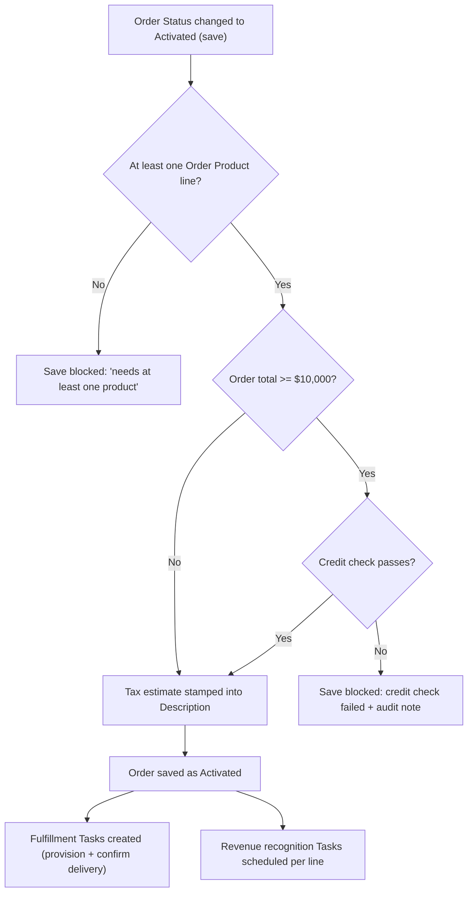

## Overview

This is the gate an Order has to clear to move from **Draft** to **Activated**, and everything that
happens automatically the moment it clears it. Sales ops and order management rely on this gate to
stop an order with no products, or a large order with bad credit, from ever going live. Once an order
does activate, the system kicks off fulfillment (provisioning and delivery-confirmation Tasks), schedules
revenue recognition Tasks for finance, and — independently, whenever order lines are added or edited —
flags any line sold at or below its product family's protected margin. The **Open Orders** tile on the
order tracker component reads the same Draft/Activated orders this page describes.

```callout
type: note
Activation can be triggered from the Order record itself, from a bulk status update, or from an external
system through the Order Status API — all three paths run through the same before/after-save logic
described here.
```

## Prerequisites

- "Manage Orders" permission (or equivalent) to edit an Order and change its **Status** field to Activated.
- The Order must already have at least one **Order Product** (OrderItem) line — activation is blocked otherwise.
- `Product2.Family` should be populated on every product on the order — it decides the margin floor percentage and whether a line's revenue is recognized monthly (Subscription) or immediately (everything else).
- No special permission is needed to view the **Open Orders** tile; it reads Draft and Activated orders visible to the running user.

## Steps to Navigate

1. Open the **Order** record you want to activate.
2. Confirm the **Order Products** related list has at least one line — add products first if it's empty.
3. Change the **Status** field to **Activated**.
4. Click **Save**.
5. If the save succeeds, open the **Activity** related list on the Order to see the fulfillment and revenue-recognition Tasks that were just created.

```screenshot
id: order-activation-fulfillment-status-field
alt: Order record page with the Status field being changed to Activated
step: Open an Order with at least one Order Product line and change Status to Activated
url_pattern: /lightning/r/Order/{recordId}/view
```

```screenshot
id: order-activation-fulfillment-activity-tasks
alt: Order Activity related list showing provisioning, delivery-confirmation and revenue-recognition Tasks
step: Open an activated Order and view its Activity related list
url_pattern: /lightning/r/Order/{recordId}/view
```

```screenshot
id: order-activation-fulfillment-tracker
alt: Open Orders tile listing Draft and Activated orders with their status and total
step: Open the Home page and view the Open Orders tile
url_pattern: /lightning/page/home
```

## Use Cases

### Activate a standard order (happy path)

1. A user sets Status to **Activated** on an Order under $10,000 that has at least one Order Product line.
2. The credit check is skipped because the order total is below the $10,000 threshold.
3. On save, an estimated tax amount is stamped into the Order's **Description** field, prefixed with "Estimated tax at activation: ...".
4. After save, fulfillment kicks off (two Tasks per order — see "Fulfillment and revenue recognition kick off" below) and revenue recognition Tasks are scheduled.

### Activate a large order that passes credit check

1. A user activates an Order whose Order Product lines total **$10,000 or more**.
2. Because the total meets the credit-check threshold, the system calls an external credit bureau with the Account and order total before allowing the save to complete.
3. The credit check returns approved, so activation proceeds exactly like the standard path: tax estimate stamped, fulfillment Tasks created, revenue recognition scheduled.

### Activation blocked — no order product lines

1. A user tries to activate an Order that has no Order Product lines yet.
2. The save is rejected with the error "An order needs at least one product before activation." on the Order record, and Status stays Draft.
3. The user must add at least one Order Product line, then try activating again.

### Activation blocked — credit check fails

1. A user activates an Order totaling $10,000 or more, and the external credit check comes back declined (or the callout itself fails).
2. The save is rejected with an error such as "Credit check failed for this order total (12500)." and Status stays Draft.
3. The failed check is recorded to the sales ops audit trail so sales ops can see which orders were held back on credit and follow up with the account.

### Re-saving an Order that's already Activated

1. A user edits an already-Activated Order (for example, correcting the Description) and saves again without changing Status away from Activated.
2. The activation gate only evaluates orders that are *transitioning into* Activated (Status changes from something else to Activated), so it does not re-run the line-count or credit check on this save.
3. Fulfillment kickoff and revenue recognition scheduling only fire on the save where Status first becomes Activated — resaving an already-Activated order does not create a second set of fulfillment or revenue-recognition Tasks.

### Fulfillment and revenue recognition kick off

1. Immediately after an Order successfully activates, two Tasks are created against the Order: "Provision order {OrderNumber}" (High priority, due tomorrow) and "Confirm delivery details for order {OrderNumber}" (due in 3 days).
2. At the same time, a revenue recognition schedule is created as Tasks against each Order Product line — see the next two scenarios for how the schedule differs by product family.
3. All of these Tasks appear on the Order's Activity related list and can be assigned or reassigned like any other Task.

### Subscription line revenue recognized over its term

1. An activated Order includes a line for a product in the **Subscription** family with a nonzero total price.
2. The system schedules three Tasks — one per month for the next 3 months — each titled "Recognize {monthly amount} (month N of 12)", where the monthly amount is the line's total price divided by 12.

```callout
type: warning
Only the first 3 months are scheduled as Tasks, even though each Task's title references "month N of 12" — the
remaining 9 months of the 12-month term do not get a Task created automatically. Support/finance staff who
notice a subscription's recognition schedule stopping after month 3 should treat that as expected current
behavior, not a data error.
```

### Non-subscription line recognized on activation

1. An activated Order includes a line for a product **not** in the Subscription family (e.g. Hardware, Software, Services) with a nonzero total price.
2. A single Task is created: "Recognize {line total} on activation", dated today — the full line amount is recognized in one shot rather than spread over time.
3. Lines with a zero or null total price are skipped entirely — no recognition Task is created for them.

### Order line sold at or below margin floor

1. A sales rep or automation saves an Order Product line (on insert or update) whose sold **Unit Price** is at or below its product family's margin floor (Services 75% of list, Hardware 55% of list, all other families 60% of list).
2. A **High priority Task** — "Order line at margin floor (X% of list)" — is created against the parent Order for sales ops to review.
3. This is a passive flag only: it does not block the line from saving and does not prevent the Order from later being activated. Lines with no matching product, or a null/zero List Price, are skipped and never flagged.

### Bulk order activation

1. Multiple Orders are activated in the same operation — for example a list-view mass status update, a data load, or several orders activated back-to-back through the Order Status API.
2. Each Order in the batch is gated independently: some may activate successfully while others in the same batch are blocked for missing lines or a failed credit check, without affecting each other's outcome.
3. Fulfillment Tasks, revenue-recognition Tasks and margin-floor flags are created only for the Orders/lines that actually passed their respective checks in that batch.

## Validations & Business Rules



- Automation trigger: `OrderTriggerHandler` runs `OrderActivationService.gateActivation` in **before update**, and `OrderFulfillmentService.kickoffFulfillment` + `RevenueRecognitionService.scheduleRecognition` in **after update**, only for Orders whose Status is changing *into* Activated on that save.
- An admin bypass (`TriggerControl.isBypassed('Order')`) can suppress all of this Order trigger logic for a given context (e.g. data migration) — while bypassed, none of the checks or downstream automation run.
- **Minimum line requirement**: an Order with zero Order Product lines cannot be activated.
- **Credit check threshold**: Orders totaling **$10,000 or more** (`CREDIT_CHECK_MINIMUM`) must pass an external credit check call before activation is allowed; orders under that total skip the check entirely.
- **Tax estimate**: every Order that successfully activates gets an estimated tax amount stamped into its Description field (not just large orders) — this comes from an external tax engine call, falling back to a flat 10% of order total if that callout fails.
- **Audit trail**: a failed credit check is logged to the sales ops audit trail (`SalesOpsAuditService`) so ops can see which orders were held back and why.
- **Fulfillment automation**: two Tasks (provisioning, delivery confirmation) are created per activated Order — this is the same list the **Open Orders** tile's `getOpenOrders()` reads from (Draft and Activated Orders, most recent 50 by Effective Date).
- **Revenue recognition automation**: Subscription-family lines get 3 monthly recognition Tasks (of a nominal 12-month schedule); all other families with a nonzero total get a single "recognize on activation" Task; zero/null-price lines are skipped.
- **Margin surveillance automation**: `OrderItemTriggerHandler` runs on every OrderItem insert/update and flags any line priced at or below its family's margin floor (Services 75%, Hardware 55%, other families 60% of list price) with a High-priority Task on the parent Order — this uses the same margin-floor logic (`PriceRuleEngine.marginFloorPrice`) that the pricing engine uses when it initially prices a line.
- Activated Orders also count toward the owning Account's health score (see Account Health Score), so activations from any of these paths affect that score the same way.

## Related Features

- Order Activation Confirmation — a separate automated flow that watches for the same Status change to Activated, currently with no configured actions.
- Order Status API — lets external systems look up an Order's status and trigger activation remotely through this same gate.
- Pricing and Discount Rules Engine — supplies the margin-floor percentages this page's line-flagging logic checks against.
- Account Health Score — Activated Orders add to an Account's score.
