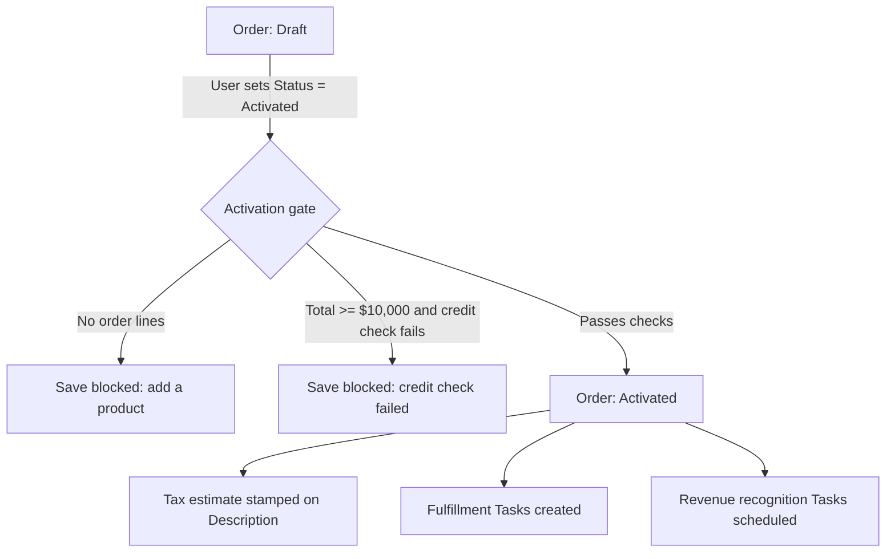

## Overview

This feature covers what happens the moment a sales or order-management user moves an Order from **Draft** to **Activated**. Salesforce automatically checks that the order has at least one product, runs a credit check for large orders, estimates tax, kicks off fulfillment tasks, and schedules revenue recognition — all without any manual follow-up. Separately, every order line the user adds or edits is checked against its product family's margin floor, and lines sold at or below floor are flagged to sales ops. This keeps finance, fulfillment, and sales ops in sync the instant an order is confirmed, instead of relying on someone to remember to notify them.



## Prerequisites

```callout
type: note
Activation checks only run when the Status field actually changes **into** Activated on that save — editing an already-Activated order again does not re-run the gate, fulfillment, or revenue recognition.
```

- Ability to edit the Order Status field (standard Order edit access)
- At least one Order Product (line item) added to the order before activation
- Named Credentials `Credit_Bureau` and `Tax_Engine` configured for the outbound callouts
- Product2.Family populated on products used in orders (Hardware, Software, Subscription, Services) so margin floors and revenue recognition timing apply correctly

## Steps to Navigate

1. Open the Order record.
2. Add one or more Order Products under **Order Products** if none exist yet.
3. Click **Edit** on the order.
4. Change the **Status** field to **Activated**.

```screenshot
id: order-activation-fulfillment-margin-status-edit
alt: Order edit panel with the Status field set to Activated
step: Open an Order record with at least one product, click Edit, and set Status to Activated
url_pattern: /lightning/r/Order/{recordId}/view
```

5. Click **Save**.
6. If the save succeeds, open the **Activity** related list to see the new fulfillment and revenue-recognition Tasks.

```screenshot
id: order-activation-fulfillment-margin-tasks
alt: Order Activity related list showing provisioning, delivery-confirmation, and revenue recognition Tasks
step: Open the Activity related list on a recently activated Order
url_pattern: /lightning/r/Order/{recordId}/view
```

7. To see all open orders at a glance, add the **Open Orders** component to a Home page, App page, or Order record page.

```screenshot
id: order-activation-fulfillment-margin-tracker
alt: Open Orders lightning card listing order number, status, and total amount for Draft and Activated orders
step: View the Open Orders component on a Home or App page
url_pattern: /lightning/page/home
```

## Use Cases

### Standard activation (small order)

1. User sets Status to Activated on an order under the $10,000 credit-check threshold.
2. No credit check callout is made; the tax callout still runs and the estimated tax is prepended to the order **Description** (e.g. "Estimated tax at activation: 45.00").
3. On save, two fulfillment Tasks per line item context are created against the order: "Provision order [number]" (due tomorrow, High priority) and "Confirm delivery details for order [number]" (due in 3 days).
4. Revenue recognition Tasks are created for each order line: non-Subscription lines get a single "Recognize [amount] on activation" Task dated today; Subscription lines get monthly "Recognize [amount] (month X of 12)" Tasks for the first 3 months of the 12-month term.

### Large order requiring credit check

1. User activates an order whose line items total $10,000 or more.
2. Before the save completes, Salesforce calls the credit bureau with the account and order total.
3. If the callout returns approved, activation proceeds exactly as in the standard case (tax estimate, fulfillment, revenue recognition).
4. If the callout returns not approved, the save is blocked with the error "Credit check failed for this order total ([total])" and the order stays in Draft. The failure is logged to the sales ops audit trail for follow-up.

### Blocked activation: no line items

1. User attempts to activate an order that has zero Order Products.
2. The save is blocked with the error "An order needs at least one product before activation." No credit check, tax estimate, fulfillment, or revenue recognition occurs.
3. User adds a product to the order and retries activation.

### Tax service unavailable

1. User activates an order and the tax engine callout times out or errors.
2. Rather than blocking the order, the system falls back to a flat 10% conservative tax estimate, which is stamped into the Description the same way a live estimate would be.

### Margin floor flagged on an order line

1. User adds or edits an Order Product with a Unit Price at or below the margin floor for its product's family (60% of list price by default; 75% for Services, 55% for Hardware).
2. A "Order line at margin floor ([X]% of list)" Task is created against the order automatically, dated for the next business day and marked High priority, so sales ops can review the deal.
3. This check runs independently of order Status — it fires on any Order Product insert or update, even while the order is still in Draft.

### Bulk order activation

1. A user or integration activates multiple orders in one operation (e.g. a list view mass action or a data load).
2. The activation gate, credit checks, tax estimates, fulfillment task creation, and revenue recognition scheduling all process the full batch together — each order is evaluated independently, so one order failing its credit check or missing line items does not block the others from activating.

## Validations & Business Rules

- Activation gate runs in a **before-update** trigger, so a failed check blocks the save itself and the order remains in its prior Status.
- Validation: an order must have at least one Order Product before it can move to Activated.
- Validation: orders with a line-item total of $10,000 or more (`OrderActivationService.CREDIT_CHECK_MINIMUM`) must pass an external credit check before activating.
- Automation: on activation, an estimated tax amount is calculated (live callout, or a 10% fallback rate if the tax service is unavailable) and prepended to the order's Description field.
- Automation: on activation, two fulfillment Tasks are created per order ("Provision order..." and "Confirm delivery details for order...").
- Automation: on activation, revenue recognition Tasks are created per order line — monthly over the first 3 months for Subscription-family products, or a single Task on activation date for all other families.
- Automation: a failed credit check is recorded to the sales ops audit trail (`SalesOpsAuditService`) in addition to blocking the save.
- Automation: any Order Product insert or update recalculates its margin percentage against `PriceRuleEngine`'s family-based floor (Services 75%, Hardware 55%, all other families 60%) and creates a High-priority Task on the order when the line is at or below floor.
- All of the above trigger logic can be bypassed via `TriggerControl` (used for data loads/migrations); when bypassed, no activation gate, fulfillment, revenue recognition, or margin flagging runs.
- The **Open Orders** component (`orderTracker`) is a read-only view of all Draft and Activated orders (most recent 50 by Effective Date) and does not itself trigger any of the automation above.

## Related Features

- Order lifecycle and status transitions
- Quote pricing, discounting, and approval (feeds the pricing that margin calculation checks against)
- Sales ops audit trail
