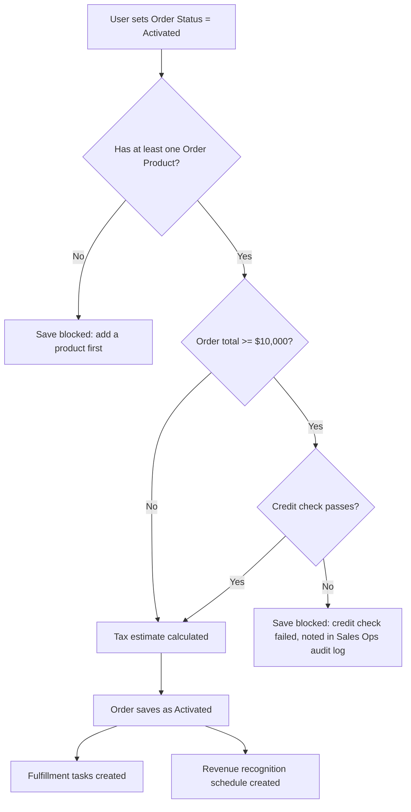

## Overview

This is the automation that runs the moment a sales rep or integration moves an Order from
**Draft** to **Activated**. Before the activation is allowed to save, Salesforce checks that the
order has product lines and, for large deals, runs a live credit check against the finance
provider — a failed check blocks activation outright. Once an order successfully activates,
Salesforce automatically opens fulfillment tasks for the operations team, schedules revenue
recognition entries for finance, and estimates the order's tax for the record. Separately, any
time an order line is added or changes price, Salesforce checks whether it was sold at or below
its product family's minimum margin and flags it to sales ops if so.



```callout
type: note
The credit check and tax estimate are skipped automatically in a test/sandbox execution context
(`Test.isRunningTest()`), so automated tests never depend on the external services being reachable.
```

## Prerequisites

- The Order must have at least one Order Product (line item) before it can be activated
- Named Credentials for the finance credit bureau (`Credit_Bureau`) and tax engine (`Tax_Engine`) must be configured for the credit check and tax estimate callouts to run
- 'Activate Orders' permission (or equivalent) to change an Order's Status field

```callout
type: before
Activation, fulfillment, and revenue scheduling all happen automatically as part of saving the
Order — there is no separate "Activate" button to configure. The only user action is changing
the Order's Status field to Activated and saving.
```

## Steps to Navigate

1. Open the **Order** record you want to activate.
2. Click **Edit**.
3. Set the **Status** field to **Activated**.
4. Click **Save**.

```screenshot
id: order-activation-fulfillment-revenue-status-edit
alt: Order edit panel with the Status field set to Activated
step: Open an Order record, click Edit, and set Status to Activated
url_pattern: /lightning/r/Order/{recordId}/view
```

5. If the save succeeds, open the **Related** tab on the Order to see the newly created fulfillment tasks and revenue recognition tasks.

```screenshot
id: order-activation-fulfillment-revenue-related-tasks
alt: Order Related tab showing provisioning and revenue recognition Tasks created after activation
step: After activating an order with lines, open the Related tab and view the Tasks list
url_pattern: /lightning/r/Order/{recordId}/related/OpenActivitiesTasks/view
```

6. To see all currently open orders in one place, add the **Open Orders** component (Order Tracker) to a Lightning page — it lists every Draft or Activated order by most recent effective date.

```screenshot
id: order-activation-fulfillment-revenue-open-orders
alt: Open Orders card listing order number, status, and total amount for Draft and Activated orders
step: View a Lightning page with the Open Orders component
url_pattern: /lightning/n/Home
actions:
  - goto: /lightning/n/Home
```

## Use Cases

### Standard activation of a small order

1. A user sets an Order with product lines and a total under $10,000 to **Activated** and saves.
2. Because the total is below the credit-check threshold, no credit check callout runs.
3. The tax engine is called to estimate tax on the order total; the result is written to the top of the Order's **Description** field as `Estimated tax at activation: <amount>` (existing description text is kept below it, truncated to 32,000 characters overall).
4. The save completes with Status = Activated.
5. Two fulfillment Tasks are created on the order: "Provision order &lt;number&gt;" due tomorrow, and "Confirm delivery details for order &lt;number&gt;" due in 3 days.
6. A revenue recognition Task is created for each order line: subscription-family lines get one schedule Task per month for the first 3 months (a stand-in for a 12-month schedule), each recognizing 1/12 of the line's total; all other lines get a single "Recognize &lt;amount&gt; on activation" Task dated today.

### Large order requiring a credit check

1. A user sets an Order whose total across its lines is $10,000 or more to **Activated** and saves.
2. Salesforce calls the credit bureau with the order's Account and total.
3. If the credit bureau approves the amount, activation proceeds exactly as the standard path — tax estimate, Status change, fulfillment tasks, and revenue recognition all follow.
4. If the credit bureau declines (or the callout errors), the save is blocked with the error "Credit check failed for this order total (&lt;amount&gt;)." on the Order, and an audit entry is logged for Sales Ops noting the account and amount. No tasks or tax estimate are created since the save never completes.

### Activation blocked for missing product lines

1. A user attempts to activate an Order that has zero Order Products.
2. The save is blocked with the error "An order needs at least one product before activation." on the Order.
3. No credit check, tax estimate, fulfillment tasks, or revenue schedule are created — the record stays in its prior status until at least one product line is added.

### Re-saving an already-Activated order

1. A user edits an already-Activated Order (for example, correcting the shipping address) and saves without changing Status.
2. Because the order's Status was already Activated before this save, it is not treated as a new activation — the credit check, tax estimate, fulfillment tasks, and revenue recognition schedule do not run again.
3. The edit saves normally with no additional Tasks created.

### Order line sold at or below the margin floor

1. A sales rep adds or edits an Order Product on any Order (Draft or Activated) and sets its unit price at or below the margin floor price for that product's family (a percentage of list price, e.g. 75% for Services, 55% for Hardware, 60% for everything else).
2. After the line saves, Salesforce automatically creates a high-priority Task on the parent Order: "Order line at margin floor (&lt;margin %&gt;% of list)", due tomorrow.
3. Lines priced above the floor, or lines with no list price set, are not flagged and create no Task.

## Validations & Business Rules

- Activation only runs when Status changes from something other than `Activated` to `Activated`; other field edits on an already-Activated order do not re-trigger it.
- An Order must have at least one Order Product to activate — enforced by `addError` on the record, which blocks the save with a page-level error.
- Orders totaling **$10,000 or more** require a passing credit check (`CreditCheckCalloutService`) before they can activate; a failed or errored check blocks the save and logs an audit note under category `OrderActivation` (visible via the Sales Ops audit log).
- Every activating order gets a tax estimate (`TaxCalculationCalloutService`) written into its Description field, regardless of order size; if the tax engine callout fails, the service falls back to a flat 10% of the order total rather than blocking the save.
- Fulfillment tasks and revenue recognition are only created for orders that just transitioned into Activated in that same save — both run in the after-update phase, once activation has already been committed.
- Revenue recognition treats `Subscription`-family product lines differently from all others: subscription lines get monthly recognition tasks (currently the first 3 of 12 months are scheduled); non-subscription lines recognize in full on the activation date. Lines with no price or a zero price are skipped entirely.
- Margin-floor flagging runs on every Order Product insert or update (not just at order activation) and compares the sold unit price against `PriceRuleEngine`'s margin floor for the product's family; a line at or below that floor generates a high-priority Task on the order, but does not block the save.
- All Order and Order Product automation can be bypassed via `TriggerControl` (used for data loads/migrations) — when bypassed, none of the activation gating, fulfillment, revenue scheduling, or margin flagging runs.
- The credit check and tax estimate callouts are skipped automatically in test execution contexts, so they never require live external services during automated tests.

## Related Features

- [Order Activation Confirmation](order-activation-confirmation.md) — a separate record-triggered flow that also watches for Order Status becoming Activated.
- [Order Status API](order-status-api.md) — an external REST entry point that can set an Order's Status to Activated, which runs through this same activation, fulfillment, and revenue recognition logic.
