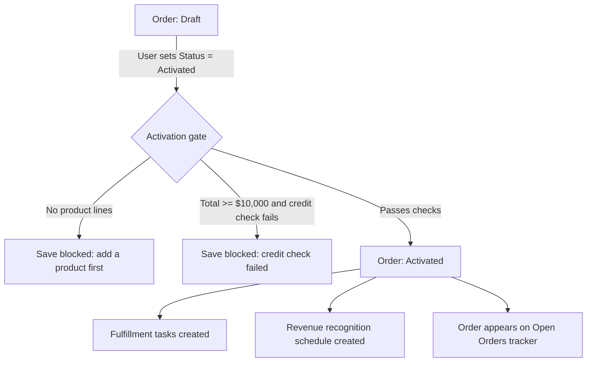

## Overview

Activating an Order is the moment a deal becomes something the business will fulfill and recognize
revenue against, so it's gated by an automatic check before the record is even allowed to save. When
a user flips an Order's status to **Activated**, Salesforce first confirms the order has at least one
product line and, for larger orders, that the customer clears a credit check — only then does the
status change stick. Once it does, fulfillment tasks are created automatically, a revenue recognition
schedule is generated for finance, and the order shows up on the **Open Orders** tracker component.
Separately, every time an order line is added or updated, its margin is checked against the product
family's floor and sales ops is flagged if a line is selling at or below that floor.



## Prerequisites

- The order must already have one or more Order Product lines before it can be activated.
- For orders totaling $10,000 or more, the connected credit bureau callout must be reachable — if it
  cannot be reached, the credit check is treated as failed and activation is blocked.
- The tax estimation callout should be configured; if it's unavailable, a flat 10% fallback rate is
  used instead of blocking the order.

## Steps to Navigate

1. Open the Order record you want to activate.
2. Confirm at least one product line has been added under **Order Products**. If none exist, add one
   first — activation will otherwise be rejected.
3. Click **Edit** on the order, or use the **Activate** action if your page layout exposes it.
4. Change **Status** to **Activated** and click **Save**.

```screenshot
id: order-activation-fulfillment-revenue-status-edit
alt: Order edit form with the Status field set to Activated
step: Open an Order with at least one product line, edit it, and set Status to Activated
url_pattern: /lightning/r/Order/{recordId}/view
actions:
  - open_record: Order
  - click_button: Edit
  - fill_field: { field: Status, value: Activated }
```

5. If the order qualifies for a credit check ($10,000 total or more) and it passes, the save completes
   and the order's **Description** field is updated with the estimated tax at activation.
6. If the save is blocked, review the error banner — it tells you exactly which check failed (see
   Use Cases below for what to do next).

```screenshot
id: order-activation-fulfillment-revenue-tracker
alt: Open Orders tracker component listing Draft and Activated orders with their totals
step: Open the Open Orders tracker component (e.g. on the Orders home tab)
url_pattern: /lightning/n/Open_Orders
```

## Use Cases

### Standard activation (order has lines, credit check not required or passes)

1. User sets an order's **Status** to **Activated** and saves.
2. The system counts product lines on the order — since at least one exists, this check passes.
3. If the order total is under $10,000, no credit check is performed.
4. If the order total is $10,000 or more, the system calls the credit bureau; approval passes.
5. The order's **Description** is updated with the estimated tax for the order total and billing state
   (or a flat 10% fallback if the tax service call fails).
6. The order saves as **Activated**. Two fulfillment Tasks are created automatically ("Provision order
   ..." due tomorrow, "Confirm delivery details ..." due in 3 days), and a revenue recognition schedule
   is generated (see below). The order now appears in the **Open Orders** tracker.

### Blocked: no product lines

1. User sets **Status** to **Activated** on an order with zero Order Products and saves.
2. The save is rejected with the error "An order needs at least one product before activation."
3. The order's status stays unchanged (still Draft). No fulfillment tasks or revenue schedule are
   created.
4. User adds at least one product line to the order, then retries activation.

### Blocked: credit check fails on a large order

1. User activates an order totaling $10,000 or more for an account that fails the credit bureau check
   (or the credit bureau callout errors out).
2. The save is rejected with an error naming the order total, e.g. "Credit check failed for this order
   total (12500)."
3. A record of the failure is logged to the sales ops audit trail for follow-up.
4. The order remains in its prior status. Sales or finance typically resolves the underlying credit
   issue with the customer before the order can be reactivated.

### Bulk activation

1. A user (or an integration) updates **Status** to **Activated** on multiple orders in one operation,
   e.g. via a list view mass edit or a Data Loader update.
2. Each order is evaluated independently against the same line-count and credit-check rules — some
   orders in the batch may activate successfully while others in the same batch are rejected.
3. Fulfillment tasks and revenue schedules are only created for the orders that actually activate;
   rejected orders in the batch produce no tasks or schedule and keep their prior status.

### Revenue recognition: subscription vs. one-time lines

1. Once an order activates, every order line is checked against its product family.
2. Lines whose product family is **Subscription** are scheduled to recognize in equal monthly amounts
   (line total ÷ 12), with a recognition Task created for each of the first 3 months.
3. All other lines are scheduled to recognize in full on the activation date, with a single Task
   created immediately.
4. Lines with a zero or blank total are skipped and produce no recognition schedule.

### Margin floor flag on order lines

1. A user adds or edits an Order Product (quantity, unit price, or product) on any order, activated or
   not.
2. The system calculates the line's margin percentage (unit price ÷ list price) and compares it to the
   product family's margin floor (e.g. 75% for Services, 55% for Hardware, 60% for everything else —
   see [[margin-floor-and-pricing-rules]]).
3. If the line's price is at or below the floor, a high-priority Task ("Order line at margin floor
   (X% of list)") is created on the order for sales ops to review.
4. Lines priced above the floor, or lines with no list price set, are not flagged.

## Validations & Business Rules

- Automation: `OrderTriggerHandler` runs `OrderActivationService.gateActivation` in **before update**,
  so a failed gate blocks the save with `addError` — the order status never actually changes.
- Rule: an order can only activate if it has at least one Order Product line.
- Rule: orders totaling **$10,000 or more** (`CREDIT_CHECK_MINIMUM`) must pass an external credit
  check (`CreditCheckCalloutService`) before activation; a non-200 response, a rejected check, or a
  callout exception all count as a failure.
- Rule: activation blocked by a failed credit check is recorded to the sales ops audit log
  (`SalesOpsAuditService`) for traceability.
- Automation: on a successful activation, the order's **Description** field is stamped with an
  estimated tax line via `TaxCalculationCalloutService`; if the tax callout fails, a flat 10% fallback
  rate is used instead — activation is never blocked by a tax service outage.
- Automation: `OrderTriggerHandler` runs fulfillment kickoff and revenue scheduling in **after
  update**, only for orders whose status just changed to Activated (not on every save of an already-
  activated order).
- Automation: `OrderFulfillmentService.kickoffFulfillment` creates two Tasks per newly activated
  order (provisioning, due +1 day; delivery confirmation, due +3 days).
- Automation: `RevenueRecognitionService.scheduleRecognition` recognizes **Subscription**-family
  lines monthly (line total ÷ 12) across the first 3 months, and all other lines in full on the
  activation date. Zero/blank-total lines are skipped.
- Automation: `OrderItemTriggerHandler` runs on every Order Product insert/update (not just at
  activation) and flags any line at or below its family's margin floor with a high-priority Task on
  the parent order.
- The **Open Orders** tracker component (`orderTracker`) reads `OrderFulfillmentService.getOpenOrders`
  and shows only orders with status **Draft** or **Activated**, most recent 50 by Effective Date.
- All activation-time callouts (credit check, tax estimate) are skipped in test context
  (`Test.isRunningTest()`), so unit tests never depend on the external services being reachable.

## Related Features

- Order lifecycle and record page navigation
- Margin floor and pricing rules (`PriceRuleEngine`) — the discounting logic that determines the
  unit prices being checked here
- Sales ops audit log — where credit check failures are recorded for follow-up
