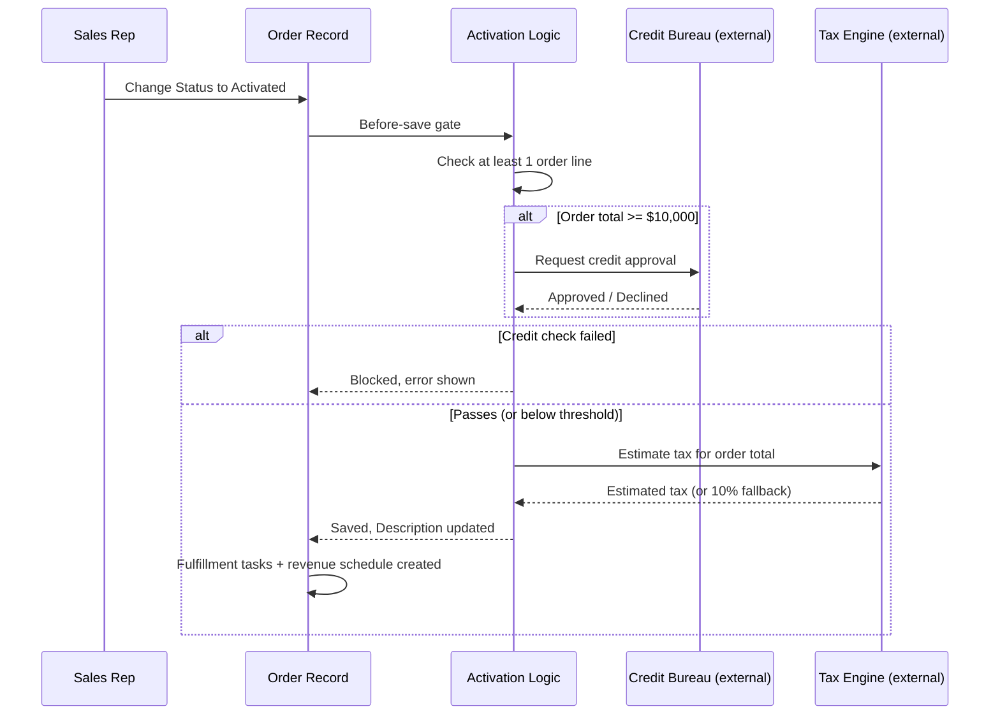

## Overview

Once a customer accepts a quote, an order is created against that quote's account and pricebook. Activating
the order isn't just a status change: orders worth $10,000 or more must pass an automated credit check before
they're allowed to activate, and every activated order gets an estimated tax amount stamped on it. Activation
also kicks off provisioning tasks, schedules revenue recognition (spread over 12 months for subscription
products, immediate for everything else), and flags any line sold at or below its margin floor for sales ops
to review.



## Prerequisites

- Standard User (or higher) profile with access to Orders and Order Products
- An Accepted Quote to generate the order from — see [[quote-generation-approval]]
- At least one Order Product line before attempting activation

## Steps to Navigate

1. Open the Order created from an accepted quote.
2. Confirm the **Order Products** related list has at least one line.
3. Change **Status** to **Activated**.
4. Click **Save**.

```screenshot
id: order-activation-status-change
alt: Order record page with Status field being changed to Activated
step: Open an Order with product lines and change Status to Activated
url_pattern: /lightning/r/Order/{recordId}/view
actions:
  - open_record: Order
```

## Use Cases

### Activate a standard (small) order

1. Open a Draft order with at least one product line and a total under $10,000.
2. Change **Status** to **Activated** and click **Save**.
3. No credit check runs (below the threshold). The order's **Description** is prepended with **"Estimated tax at activation: {amount}"**, calculated from the order total and billing state.
4. Fulfillment tasks and a revenue-recognition schedule are created automatically (see below).

### Activate a large order that passes credit check

1. Open a Draft order with product lines totaling $10,000 or more.
2. Change **Status** to **Activated** and click **Save**.
3. A credit check runs against the account and the order total; if approved, activation proceeds exactly as the standard case — tax is stamped, fulfillment tasks and revenue recognition are scheduled.

### Activate a large order that fails credit check (blocked)

1. Open a Draft order totaling $10,000 or more where the account's credit check comes back declined (or the credit check service can't be reached).
2. Change **Status** to **Activated** and click **Save**.
3. The save is blocked with: **"Credit check failed for this order total ({total})."**
4. The failure is logged as an audit note (see [[nightly-sales-operations]]) so sales ops can follow up on financing or a different order size.

### Activate an order with no products (blocked)

1. Open a Draft order that has no Order Product lines.
2. Change **Status** to **Activated** and click **Save**.
3. The save is blocked with: **"An order needs at least one product before activation."**

### Subscription line revenue recognition schedule

1. An order with a Subscription-family product line is successfully activated.
2. Three tasks are created for that line: **"Recognize {monthly amount} (month 1 of 12)"**, "...month 2 of 12", "...month 3 of 12" — due 1, 2, and 3 months out, where the monthly amount is the line total divided by 12.
3. Finance uses these tasks as a stand-in revenue ledger for the first quarter of the subscription term.

### Non-subscription line recognized on activation

1. An activated order has a line from any family other than Subscription (for example, Hardware).
2. A single task **"Recognize {line total} on activation"** is created immediately, due today — the full amount recognized at once rather than spread out.

### Order line flagged at margin floor

1. An Order Product line is added or updated where the sold Unit Price is at or below the product family's margin floor (75% of list for Services, 55% for Hardware, 60% for other families).
2. A Task is created on the order: **"Order line at margin floor ({pct}% of list)"**, due the next day, Priority High.
3. Sales ops reviews the flagged line to confirm the discount was intentional.

### Track open orders

1. An admin adds the **Open Orders** component to a Home page, record page, or app page.
2. Anyone viewing that page sees up to 50 orders in **Draft** or **Activated** status, most recent effective date first, as OrderNumber — Status (Total Amount).

```screenshot
id: order-activation-open-orders-tracker
alt: Open Orders component listing Draft and Activated orders
step: Open a Home page that has the Open Orders component added
url_pattern: /lightning/page/home
```

## Validations & Business Rules

- Automation: `OrderTriggerHandler` before-update runs the activation gate whenever Status is changing to `Activated`; after-update kicks off fulfillment tasks and revenue-recognition scheduling for orders that just activated.
- Validation: activation is blocked with **"An order needs at least one product before activation."** when the order has no Order Product lines.
- Validation: for orders totaling $10,000 or more, activation calls an external credit check; a decline (or an unreachable service, which fails closed) blocks activation with **"Credit check failed for this order total ({total})."**
- Automation: on successful activation, an estimated tax amount (from an external tax service, or a flat 10% fallback if that service is unavailable) is prepended to the order's Description as **"Estimated tax at activation: {tax}"**.
- Automation: activation creates two fulfillment tasks — **"Provision order {OrderNumber}"** (due next day, High priority) and **"Confirm delivery details for order {OrderNumber}"** (due in 3 days).
- Automation: revenue recognition tasks are created per order line — Subscription-family lines get 3 monthly tasks (line total ÷ 12, for months 1–3 of a 12-month term); all other families get one task for the full line total, due today.
- Automation (`OrderItemTriggerHandler`): any order line whose margin (`Unit Price ÷ List Price`) is at or below its family's floor percentage gets a High-priority "at margin floor" task logged against the order.
- Order lines mirror the accepted quote's prices exactly when the order is first created; activation does not reprice them.

```callout
type: warning
Both the credit check and tax estimate are external callouts. The tax estimate silently falls back to a flat
10% if the tax service is unreachable, so activation still completes — but the credit check fails **closed**:
if that service can't be reached, activation is blocked as if credit had been declined. If reps report
activation failing on an order they expect to pass, check whether the credit service is having an outage
before assuming the customer's credit is the issue.
```

## Related Features

- [[quote-generation-approval]] — an Accepted quote is the source for the order's account, pricebook, and line items.
- [[nightly-sales-operations]] — audit notes from failed credit checks are logged to the same sales-ops audit trail as discount-approval blocks.
- [[opportunity-renewal-cloning]] — once this order has been Activated for about 11 months, it becomes eligible to have its source opportunity auto-cloned into a renewal.
