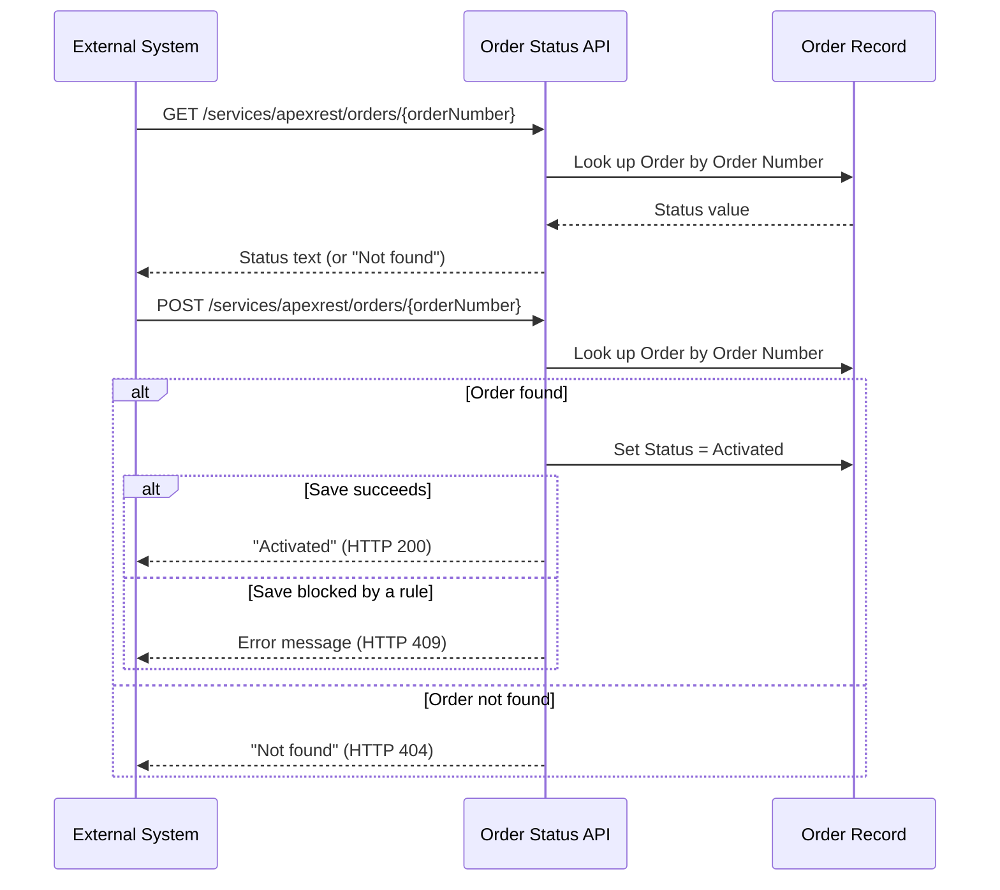
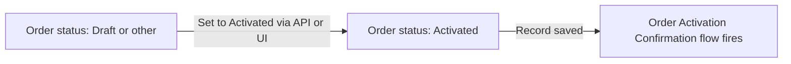

## Overview

This feature gives outside systems — such as a customer portal or a partner integration — a way to check
on and activate orders without a person clicking through Salesforce. A REST endpoint lets a calling system
look up an order's current status by its Order Number, or flip a draft order to **Activated**. Whenever an
order's status is changed to **Activated** — whether through this API or by a user editing the record
directly — a background flow fires to confirm the activation.



## Prerequisites

```callout
type: note
This is an integration feature — there is no dedicated Salesforce tab or button for it. It is used by
calling the REST endpoint directly, or observed indirectly by editing an Order's Status field.
```

- An integration/API user profile with **API Enabled** and read/edit access to the Order object
- The Order record must already exist with a populated, unique **Order Number**
- The Order Activation Confirmation flow must be **Active** in Setup

## Steps to Navigate

1. From Setup, use Quick Find to search for **Apex Classes**, then open **OrderStatusRestResource** to
   confirm the REST endpoint is deployed. Its endpoint path is `/services/apexrest/orders/{orderNumber}`.

```screenshot
id: order-activation-apex-class
alt: Apex Classes setup list showing OrderStatusRestResource
step: Open Setup and view the Apex Classes list
url_pattern: /lightning/setup/ApexClasses/home
```

2. From Setup, use Quick Find to search for **Flows**, then open **Order Activation Confirmation** and
   confirm its status is **Active**.

```screenshot
id: order-activation-flow-detail
alt: Flows setup list showing Order Activation Confirmation as Active
step: Open Setup and view the Flows list
url_pattern: /lightning/setup/Flows/home
```

3. To see the same result without calling the API, open an Order record, click **Edit**, change **Status**
   to **Activated**, and click **Save**. This uses the same field update the API performs and fires the
   confirmation flow.

```screenshot
id: order-activation-status-edit
alt: Order edit form with the Status field being set to Activated
step: Open an Order record, click Edit, and set Status to Activated
url_pattern: /lightning/r/Order/{recordId}/view
actions:
  - open_record: Order
  - click_button: Edit
  - fill_field: { field: Status, value: Activated }
```

## Use Cases

### Check an order's status (GET)

1. The calling system sends a `GET` request to `/services/apexrest/orders/{orderNumber}`.
2. Salesforce looks up the Order by its Order Number and returns the current **Status** value as plain text.
3. If no Order matches that number, the response body is the text `Not found` — note this is still returned
   with a normal success status code, so callers should check the response body, not just the HTTP status.

### Activate an order via API (happy path)

1. The calling system sends a `POST` request to `/services/apexrest/orders/{orderNumber}`.
2. Salesforce looks up the Order by Order Number and sets its **Status** to **Activated**.
3. The update saves successfully, and the endpoint returns the text `Activated` with HTTP 200.
4. Because the Order's Status changed to Activated, the **Order Activation Confirmation** flow fires
   automatically in the background.

### Activate an order that doesn't exist

1. The calling system sends a `POST` request with an Order Number that doesn't match any Order record.
2. No update is attempted. The endpoint returns the text `Not found` with HTTP 404.

### Activation blocked by another rule on the Order

1. The calling system sends a `POST` request for a real Order Number.
2. Salesforce attempts to set **Status** to **Activated**, but the save fails — for example, another
   validation rule or piece of automation on the Order object rejects the change.
3. The endpoint returns HTTP 409 along with the specific error message from that failed save, so the
   calling system can surface the real reason activation was blocked.

### Order activated directly in the UI

1. A user opens an Order record and manually changes **Status** to **Activated**, then saves.
2. This is the same trigger condition the API relies on, so the **Order Activation Confirmation** flow
   fires the same way it would for an API-driven activation — activation confirmation is not limited to
   the API path.

## Validations & Business Rules



- The `activate` endpoint sets **Status** to **Activated** unconditionally — it does not check the order's
  current status first, so re-activating an already-Activated order still returns a success response.
- If the save is rejected (for example by another validation rule on the Order object), the endpoint
  returns HTTP 409 with the underlying DML error message rather than a generic failure.
- If no Order matches the given Order Number, `activate` returns HTTP 404; `getStatus` instead returns the
  text `Not found` without changing the HTTP status code.
- Automation: **Order Activation Confirmation** is a record-triggered flow that runs after save whenever an
  Order's **Status** is (or becomes) `Activated` — via the API or any other update path. As currently built,
  the flow's trigger condition is defined but it contains no downstream actions yet, so it fires without
  performing any visible confirmation (such as sending an email or notification); this is a hook for that
  logic to be added rather than a fully wired confirmation.
- The REST class runs `with sharing`, so the calling user's org-wide sharing and field-level access still
  apply — an integration user without access to a given Order will not see or be able to activate it.

## Related Features

This is currently the only documented Orders feature. Related order lifecycle and fulfillment pages will
be cross-linked here as they are added.
