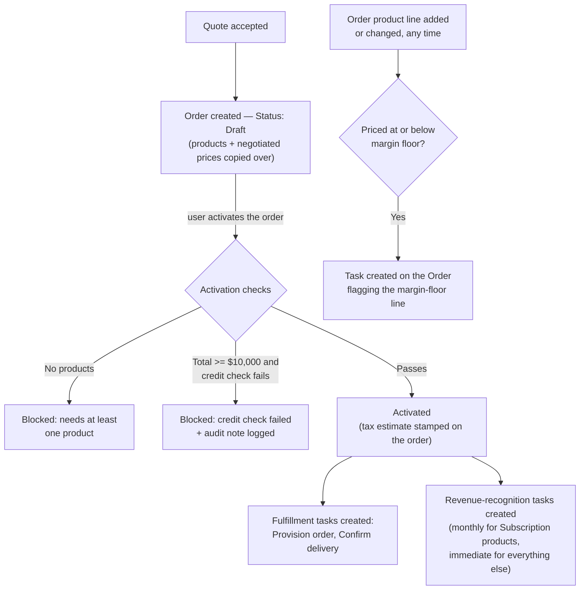

## Overview

Once a customer accepts a quote, its products and negotiated prices are carried over into a new Order. Before
that Order can be activated, it's checked for products and — for larger orders — run through an automatic
credit check against an external credit bureau; every activating order also gets a live tax estimate stamped
onto it. The moment an order activates, follow-up work is kicked off automatically: provisioning and delivery
tasks for whoever handles fulfillment, and a set of revenue-recognition tasks so finance has a record of when
to recognize the revenue. Individual order lines that are priced at or below their margin floor are flagged
for review as soon as they're added, independent of activation.



## Prerequisites

- The source Quote must have Status = Accepted before an Order can be created from it
- The Order must have at least one product line before it can be activated

## Steps to Navigate

1. Click the **App Launcher** and search for **Orders**.
2. Open the Order record to see its **Status**, product lines, and — once activated — the estimated tax note
   added to its **Description**.

```screenshot
id: order-fulfillment-record-page
alt: Order record page showing Status, product lines, and the tax estimate note in Description
step: Open an Order record to view its Status and Description
url_pattern: /lightning/r/Order/{recordId}/view
actions:
  - open_record: Order
```

3. To see all currently open (Draft or Activated) orders across the org at a glance, view a page with the **Open Orders** tracker component placed on it.

```screenshot
id: order-fulfillment-tracker
alt: Open Orders tracker component listing Draft and Activated orders org-wide
step: View a page that has the Open Orders tracker component placed on it
url_pattern: /lightning/page/home
```

## Use Cases

### An order is created from an accepted quote

1. A quote reaches **Accepted** status.
2. A new Order is created in **Draft** status, carrying over the Account, the related Opportunity, and the
   Pricebook, with an Effective Date of today.
3. Every line on the quote becomes an Order product line at the same negotiated unit price the quote had —
   not the original list price.

### Activating an order with no products

1. A user tries to set an Order's Status to **Activated**, but it has no product lines.
2. The save is blocked: *"An order needs at least one product before activation."*

### Activating a large order that fails its credit check

1. A user activates an Order whose product lines total **$10,000 or more**.
2. An automatic credit check runs against the account. If it's declined — or the credit check service is
   unreachable/times out — activation is blocked: *"Credit check failed for this order total (`<total>`)."*
   An audit note is logged either way.
3. Orders under $10,000 skip the credit check entirely and activate without this step.

### Activating a large order that passes its credit check

1. A user activates a $10,000+ order and the credit check succeeds.
2. The order activates normally, and — like every successfully-activating order — gets a tax estimate stamped
   into its Description (see below).

### Every activation gets a tax estimate

1. Any order that clears the checks above and activates has an estimated tax line added to the top of its
   **Description** field (e.g. "Estimated tax at activation: `<amount>`"), based on its total and Billing
   State. Existing text already in Description is preserved underneath, not erased.
2. If the tax estimate service is unavailable, a flat **10%** fallback estimate is used instead so activation
   isn't blocked by an outage.

### Fulfillment follow-up after activation

1. An order activates successfully.
2. Two Tasks are automatically created: one to **provision** the order (due the next day, high priority), and
   one to **confirm delivery details** with the customer (due in 3 days).

### Revenue recognition after activation

1. An order with **Subscription** product lines activates.
2. Three monthly recognition Tasks are created for each subscription line (covering the first three months),
   rather than a full twelve-month schedule.
3. Any **non-subscription** line instead gets a single Task to recognize its full amount immediately.
4. These are Task-based bookkeeping entries only — there's no separate revenue ledger record created, and
   finance should treat these Tasks as the system of record for "when to recognize this."

### An order line is priced at or below its margin floor

1. A product line is added to, or its price changed on, an Order — at any time, whether or not the order is
   activated.
2. If that line's unit price is at or below its product family's margin floor (the same floors used for
   quotes and opportunity pricing), a high-priority Task is created on the parent Order flagging the line and
   its margin percentage.

### Checking open orders across the org

1. A user views a page with the **Open Orders** tracker component.
2. It lists the 50 most recently effective Draft or Activated orders **org-wide** — it does not filter to the
   account or record it happens to be placed on, so it should be used as a general pipeline view rather than
   an account-specific one.

## Validations & Business Rules

- **Order creation from a quote** only succeeds if the source Quote's Status is exactly Accepted; otherwise
  it's rejected outright.
- **Activation requires** at least one Order product line.
- **Credit check threshold:** orders totaling $10,000 or more must pass an external credit check tied to the
  Account before they can activate. A check failure, timeout, or outage all block activation the same way
  (fails closed) — there's no automatic retry.
- **Tax estimate:** every order that activates gets an estimated tax amount written into its Description,
  based on its total and Billing State; if the tax service is unavailable, a flat 10% fallback is used
  instead so activation still completes.
- **Fulfillment and revenue-recognition automation both run automatically** the moment Status becomes
  Activated — there's no separate "kick off fulfillment" step for a user to trigger.
- **Revenue recognition for Subscription products only covers 3 months** in this system, despite Task labels
  referencing "month N of 12" — finance should not expect a full 12-month task series from this automation.
- **Margin-floor flags on order lines are independent of order status** — they fire on any product line
  insert/update, whether the order is Draft or already Activated.
- **The Open Orders tracker shows the same data org-wide regardless of placement** — an admin dropping it on
  an Account or Opportunity page should not expect it to filter to that record.
- This feature shares its activation gate with the [Order Status & Activation API](order-status-api) — an
  order activated through that external API goes through the exact same product-count check, credit check,
  and tax-estimate stamping described here, plus the same fulfillment and revenue-recognition follow-up.

## Related Features

- Order Status & Activation API — the external-facing REST endpoint that runs through this same activation gate.
- Quote Builder — the accepted quote that this feature turns into an order.
