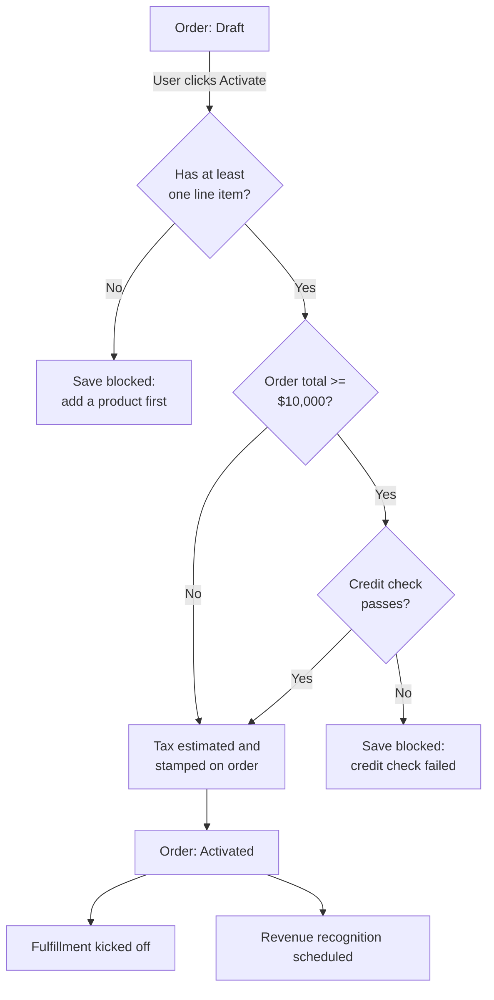

## Overview

Every time an Order or an Order Product is saved, Salesforce automatically runs a set of business
checks behind the scenes — no button click required beyond the normal Save or Activate action. When
a user moves an order from Draft to Activated, the system verifies the order has at least one
product, runs a credit check for large orders, and stamps an estimated tax amount onto the order for
finance to reference. Separately, whenever an order line is saved, the system checks whether it was
sold at or below its product family's minimum margin and, if so, automatically creates a follow-up
task for sales ops. This automation exists so reps and managers don't have to remember to run these
checks manually — they happen consistently on every save.



## Prerequisites

- Standard 'Activate' access on Order records (Order Owner or a role with Edit on Order)
- At least one Order Product added to the order before activation is attempted
- Credit_Bureau and Tax_Engine named credentials/callouts must be configured for activation to complete normally

```callout
type: note
This automation cannot be triggered manually — it runs automatically whenever an Order or Order
Product record is saved. This page documents what happens behind the scenes so support and admin
staff can explain unexpected blocks or values.
```

## Steps to Navigate

These behaviors run automatically as part of the standard order editing flow. There is no separate
setup screen to open — the relevant actions are the normal Order edit/save and Activate steps.

1. Open an Order record.
2. Add or edit Order Products as normal, then **Save**. This is what triggers the margin check on each line.

```screenshot
id: order-lifecycle-automation-order-record
alt: Order record page showing the Order Products related list and Status field
step: Open an existing Order record
url_pattern: /lightning/r/Order/{recordId}/view
```

3. On the order, click **Activate** (or edit the **Status** field to `Activated` and Save, depending
   on page layout). This is what triggers the activation gate described below.

```screenshot
id: order-lifecycle-automation-activate-button
alt: Order record page with the Activate button highlighted in the header
step: Click the Activate button on an order in Draft status
url_pattern: /lightning/r/Order/{recordId}/view
```

## Use Cases

### Standard activation of a small order

1. User adds one or more Order Products to a Draft order and saves.
2. User clicks **Activate**.
3. The system confirms the order has at least one line item.
4. Because the order total is below $10,000, no credit check is performed.
5. The system calls the tax estimation service and prepends `Estimated tax at activation: <amount>`
   to the order's **Description** field (existing description text is kept below it).
6. The order's **Status** becomes `Activated`. Fulfillment is kicked off and revenue recognition is
   scheduled for this order automatically.

### Activation blocked — no line items

1. User clicks **Activate** on an order that has no Order Products.
2. The save is blocked with the error **"An order needs at least one product before activation."**
3. User must add at least one Order Product and activate again.

### Activation of a large order — credit check required

1. User clicks **Activate** on an order whose Order Product total is $10,000 or more.
2. The system calls the credit check service for the order's account before allowing activation.
3. **If the credit check passes:** activation continues, the tax estimate is stamped onto the
   Description as in the standard case, and the order becomes `Activated`.
4. **If the credit check fails or the credit service is unreachable:** the save is blocked with the
   error **"Credit check failed for this order total (\<amount\>)."** The failure is also recorded to
   the sales ops audit log for follow-up. The user must resolve the credit issue before the order can
   be activated.

### Tax service unavailable at activation

1. During activation, the tax estimation callout fails or the tax engine returns a non-200 response.
2. Rather than blocking activation, the system falls back to a flat estimate of 10% of the order
   total so the order can still be activated.
3. The stamped Description note still reads `Estimated tax at activation: <amount>` — support staff
   should be aware this figure may be the fallback rate rather than an engine-calculated one if the
   callout was down at the time.

### Order line sold at or below margin floor

1. A rep adds or edits an Order Product and sets a **Unit Price** at or below the minimum margin
   floor defined for that product's family.
2. On save, the system automatically creates a **Task** on the order (due the next day, High
   priority) titled `Order line at margin floor (<margin %>% of list)`.
3. Sales ops sees this task on the order and follows up — no action is required from the rep beyond
   the normal save.
4. Editing the same line back above the margin floor and saving again does not remove a
   previously-created task; each save that lands at or below the floor creates a new flag task.

## Validations & Business Rules

- **Line-item gate**: an order cannot move to `Activated` unless it has at least one Order Product.
  Enforced in before-update automation, so the save itself is blocked with an error on the order.
- **Credit check threshold**: orders activating with a total of $10,000 or more must pass an external
  credit check (`CreditCheckCalloutService`) for the order's account before activation is allowed.
  Orders below this threshold skip the credit check entirely.
- **Credit check failure is audited**: a failed credit check is recorded to the sales ops audit log
  (`SalesOpsAuditService`) in addition to blocking the save.
- **Tax estimate on activation**: every order that successfully activates has an estimated tax amount
  prepended to its **Description** field via `TaxCalculationCalloutService`. If the external tax
  engine call fails, a flat 10% fallback rate is used instead — activation is never blocked by a tax
  service outage.
- **Automation runs only on Activated transitions**: all of the above (line check, credit check, tax
  stamp) fire only when an order's **Status** changes from something else *to* `Activated` — edits to
  an already-activated order, or to an order that stays in Draft, do not re-trigger them.
- **Post-activation side effects**: once an order is activated, fulfillment kickoff and revenue
  recognition scheduling run automatically in after-update automation.
- **Margin floor flagging**: any Order Product saved with a **Unit Price** at or below its product
  family's margin floor (`MarginCalculationService` / `PriceRuleEngine`) generates a High-priority
  Task on the order for sales ops, on every insert or update of that line.
- **Bypass**: all Order automation can be disabled via `TriggerControl` bypass settings for the
  `Order` object (used for data loads/migrations); when bypassed, none of the checks above run.

## Related Features

- Order activation and the credit check gate are the entry point that drives fulfillment kickoff and revenue recognition scheduling.
- Margin floor pricing rules referenced here are defined by the product pricing/price rule engine feature.
