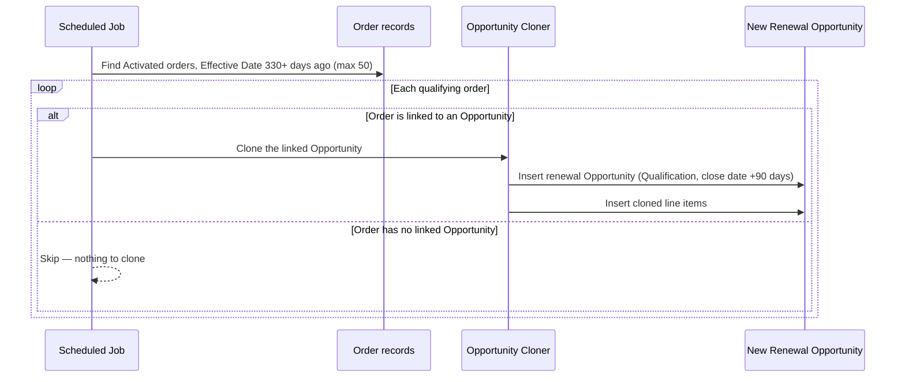

## Overview

This feature keeps the sales pipeline stocked with next year's revenue by automatically creating a
renewal Opportunity for orders that are coming up on their anniversary. A scheduled job runs
periodically, finds Orders that have been **Activated** for about 11 months, and — where the order is
still linked to its originating Opportunity — clones that Opportunity into a fresh renewal deal at the
**Qualification** stage with a close date a quarter out. No one has to remember to start the renewal
conversation manually; it shows up in the pipeline on its own.

```callout
type: note
This automation only runs if it has been scheduled in Setup. It is not wired to any button, flow, or
trigger in the org today — someone must schedule `OrderRenewalSchedulable` for it to take effect.
```



## Prerequisites

- The `OrderRenewalSchedulable` class must be scheduled (Setup > Apex Classes > Schedule Apex) — nothing
  in the org triggers it automatically.
- The running user needs create access to Opportunity and Opportunity Line Item.
- Orders must have `Status = Activated` and a populated `EffectiveDate` — orders that are still Draft, or
  that have no effective date, are never picked up.

## Steps to Navigate

Renewal opportunities appear automatically once the job is scheduled; there are no clicks a sales user
takes to trigger one. An admin sets up the schedule once:

1. Click the gear icon in the top-right, then click **Setup**.
2. In the Quick Find box, type **Apex Classes** and select it.
3. Click **Schedule Apex**.
4. Enter a job name (e.g. "Order Renewal Job"), select **OrderRenewalSchedulable** as the Apex class, choose
   a frequency (e.g. **Weekly** or **Monthly**), and click **Save**.

```screenshot
id: order-renewal-automation-schedule-apex
alt: Schedule Apex page in Setup with OrderRenewalSchedulable selected as the class to run
step: Open Setup > Apex Classes > Schedule Apex and select OrderRenewalSchedulable
url_pattern: /lightning/setup/ScheduledJobs/home
```

5. Once scheduled, a sales user simply opens the **Opportunities** tab at their normal cadence and finds
   any new renewal opportunities already sitting in **Qualification**.

```screenshot
id: order-renewal-automation-renewal-opportunity
alt: A newly created renewal Opportunity record, at the Qualification stage, named "<Original Opportunity> (renewal)"
step: Open the most recently created Opportunity after the scheduled job has run
url_pattern: /lightning/r/Opportunity/{recordId}/view
actions:
  - open_record: Opportunity
```

## Use Cases

### Standard renewal: an activated order approaches its anniversary

1. An Order sits with `Status = Activated` and an `EffectiveDate` that is now 330+ days in the past (roughly
   11 months), and it is still linked to the Opportunity it originated from.
2. The next time the scheduled job runs, it picks up the order and calls the cloning service on its
   linked Opportunity.
3. A new Opportunity is inserted named "**\<original name\> (renewal)**", staged at **Qualification**, with
   a **Close Date** 90 days out from today.
4. Every Opportunity Line Item on the source Opportunity (quantity, unit price, price book entry) is copied
   onto the new renewal Opportunity.
5. Sales works the renewal Opportunity like any other pipeline deal — the original Order and Opportunity
   are left untouched.

### Exception path: order has no linked Opportunity

1. Some Orders are created without ever being tied back to an Opportunity (`OpportunityId` is blank).
2. When the job finds one of these among the expiring orders, it skips it — `OpportunityCloneService` is
   never called, and no renewal Opportunity is created for that order.
3. There is no error, log entry, or flag raised for this case; the order is simply silently skipped on
   every future run of the job as well, since nothing marks it as "already checked."

### Edge case: source Opportunity has no line items

1. If the linked Opportunity has no Opportunity Line Items (e.g. a services-only deal entered as a flat
   Amount), the clone still runs.
2. The renewal Opportunity is created at Qualification with the 90-day close date, but with zero line
   items — sales will need to add line items manually before the renewal deal reflects real pricing.

### Bulk path: more than 50 orders are due for renewal at once

1. The job's query is capped at **50 orders per run** (`LIMIT 50`).
2. If more than 50 Activated orders cross the 330-day threshold before the job next runs, only the first
   50 returned by the query get a renewal Opportunity this run.
3. The remaining orders are still eligible — since nothing marks them as processed, they (and any newly
   -eligible orders) are picked up on the following scheduled run.

## Validations & Business Rules

- **Eligibility filter**: only Orders with `Status = 'Activated'` and `EffectiveDate <= Today - 330 days`
  are considered.
- **Batch size**: at most 50 orders are processed per execution of the job (`LIMIT 50` in the query) —
  large backlogs are worked off gradually over multiple scheduled runs.
- **Renewal naming**: the new Opportunity's name defaults to `<source name> (renewal)`; the underlying
  `OpportunityCloneService.deepClone` method accepts an explicit name, but the scheduled job always calls
  it with a blank name, so the default naming always applies here.
- **Renewal stage and timing**: the cloned Opportunity is always set to **Qualification** with a
  **Close Date** of today + 90 days, regardless of what stage or close date the source Opportunity was at.
- **Line item copy**: only `Quantity`, `UnitPrice`, and `PricebookEntryId` are copied to the new line
  items — no discounts, schedules, or custom fields on the line item are carried over.
- **No duplicate protection**: the automation does not write anything back to the source Order or
  Opportunity to mark it as renewed. If the job is scheduled to run more often than the 330-day window
  moves, or if an order's Effective Date/Status doesn't change, the same order can generate a new renewal
  Opportunity on every run. Admins should account for this when choosing the schedule frequency.
- **Requires manual scheduling**: `OrderRenewalSchedulable` implements `Schedulable` but nothing in the
  org schedules it automatically — it only runs once an admin schedules it via Setup.

## Related Features

- Order Activation and Status API — governs how Orders reach the `Activated` status that this renewal
  job watches for.
