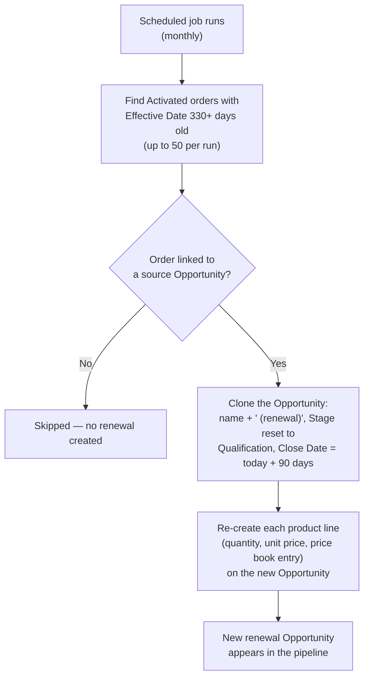

## Overview

Once an order has been active for about eleven months, this feature assumes it's coming up for renewal and does
the pipeline work automatically: it clones the order's original Opportunity — including its product lines —
into a brand-new Opportunity sitting at Qualification with a close date three months out. This means an account
owner doesn't have to remember to manually re-create a renewal deal; as long as the original order is linked to
an Opportunity, next year's revenue shows up in the pipeline on its own. There is no button or manual "clone"
action for this — it runs entirely as a background scheduled job.



## Prerequisites

- The Order must be **Activated**
- The Order's **Effective Date** must be at least ~330 days (roughly 11 months) in the past
- The Order must have its **Opportunity** field populated — orders created without a source Opportunity are never renewed

## Steps to Navigate

Since this feature runs on its own schedule with no manual trigger, "navigating" it means finding the
renewal Opportunity it created rather than clicking through a wizard.

1. Click the **App Launcher** and search for **Opportunities**.
2. Look for a new Opportunity named after the original deal with **" (renewal)"** appended, sitting in the
   **Qualification** stage.

```screenshot
id: order-renewal-opportunity-record
alt: A cloned renewal Opportunity record showing its name suffixed with "(renewal)" and Stage set to Qualification
step: Open the renewal Opportunity record to view its name, Stage, and Close Date
url_pattern: /lightning/r/Opportunity/{recordId}/view
actions:
  - open_record: Opportunity
```

3. Open the **Products** related list on the renewal Opportunity to confirm the same quantities, unit prices,
   and price book entries carried over from the original deal's order.

## Use Cases

### An expiring order with a linked Opportunity gets renewed

1. An Order is Activated and its Effective Date has aged past ~330 days.
2. The monthly scheduled job picks it up (as long as it's within that run's first 50 matching orders — see
   below) and clones its source Opportunity.
3. The new Opportunity is named `<Original Name> (renewal)` (unless cloned with an explicit name), starts at
   **Qualification** regardless of what stage the original deal ended at, and gets a **Close Date 90 days out**
   from today.
4. Every product line from the original Opportunity is copied onto the new one with the same quantity, unit
   price, and price book entry — the renewal starts pre-loaded with the same deal shape, not blank.

### An expiring order has no linked Opportunity

1. An Order is Activated and old enough to match the renewal sweep, but its **Opportunity** field is blank
   (it wasn't created from a quote tied to an Opportunity, for example).
2. The job skips it silently — no renewal Opportunity is created, and nothing flags that it was skipped.

### More than 50 orders are due for renewal in the same run

1. More than 50 Activated orders are simultaneously old enough to qualify in a single run.
2. Only the **first 50** (as returned by the query) are cloned in that run; the rest carry over and are picked
   up on the **next scheduled run**, so a large backlog renews gradually across multiple runs rather than all
   at once.

## Validations & Business Rules

- **Eligibility:** an Order must have `Status = Activated` and `EffectiveDate` at least 330 days in the past to
  be considered for renewal.
- **Per-run cap:** at most **50** eligible orders are processed in a single run of the job.
- **No source Opportunity, no renewal:** orders without a populated Opportunity lookup are skipped with no
  error and no record of the skip.
- **Renewal Opportunity defaults:** Stage is always reset to **Qualification** (never inherits the source
  deal's stage), and Close Date is always set to **90 days from today** — never inherited from the source
  Opportunity's own Close Date.
- **Naming:** the renewal Opportunity is named `<source name> (renewal)` when no explicit name is supplied.
- **Product lines are copied, not linked:** each renewal product line is a brand-new record carrying over only
  Quantity, Unit Price, and Price Book Entry — it does not stay in sync with the original Opportunity's lines
  afterward, and does not go through the automatic repricing logic described in Opportunity Pipeline
  Guardrails until it's next edited.
- **No repeat-protection:** the job's query has no way of recognizing an order that was already renewed in a
  previous run. As long as an order stays Activated and its Effective Date keeps satisfying the 330-day
  threshold, it will match again on every subsequent run — support/admins investigating **duplicate renewal
  Opportunities** for the same order should check whether the job has simply run against it more than once.

## Related Features

- Order Fulfillment & Activation — an order only becomes eligible for this renewal sweep once it's Activated there.
- Opportunity Pipeline Guardrails — the renewal Opportunity is subject to the same stage, product, and Closed-Won rules as any other Opportunity once it exists.
- Nightly Sales Ops Jobs & Audit Trail — a separate scheduled process; this renewal sweep runs on its own monthly schedule and is not part of that nightly chain.
