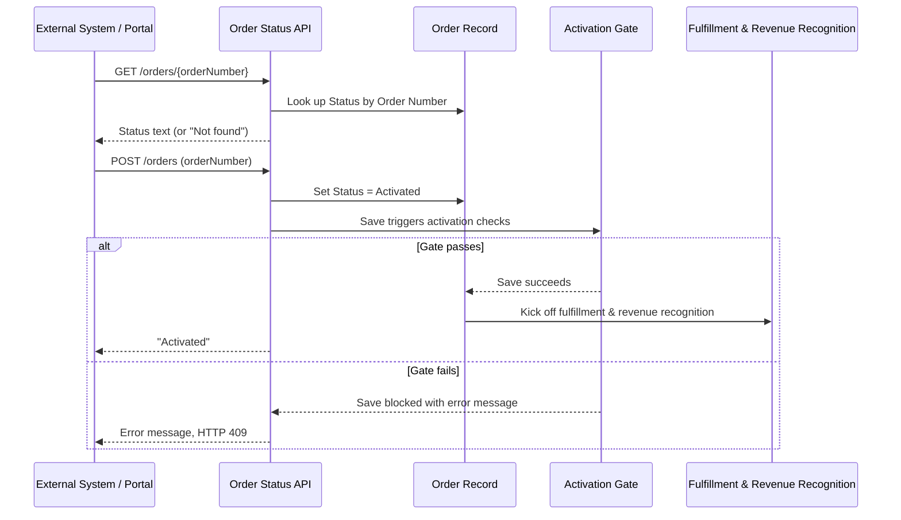

## Overview

This feature exposes an Order's status to systems outside Salesforce — most notably the customer
portal — over a REST API, and lets those same systems activate a draft order without a person
opening the order record in Salesforce. A customer-facing portal typically calls it to show
"where is my order" and to offer a self-service **Activate** button. Because activation runs
through the same order-activation trigger logic used by the Salesforce UI, an order submitted
through the API is held to the exact same rules (minimum one line, credit check, tax estimate)
as one activated by hand.



## Prerequisites

```callout
type: note
This is a system-to-system integration, not a page inside Salesforce. There are no Lightning
screens for the API itself — the steps below cover how an admin tests it and how to confirm the
result on the Order record.
```

- The calling system must authenticate as a Salesforce user (integration/portal user) with **API Enabled** on their profile.
- That user needs Read access to Order for status lookups, and Read + Edit access to Order (plus Read on Order Product / OrderItem) for activation calls to succeed.
- The Order must already exist in Salesforce with a populated **Order Number** — this is the only lookup key the API accepts.

## Steps to Navigate

Testing and verifying this integration is done from a REST client (e.g. Workbench or Postman), then checked on the order record in Salesforce.

1. Sign in to Workbench (or another REST client) as the integration user.
2. To check status, send a **GET** request to `/services/apexrest/orders/{OrderNumber}` — the response body is the order's current Status value, or the text `Not found` if no order matches.
3. To activate an order, send a **POST** request to `/services/apexrest/orders` with an `orderNumber` parameter in the request body.
4. Read the response: `Activated` on success, `Not found` with HTTP 404 if the order number doesn't exist, or an error message with HTTP 409 if activation was blocked by a business rule.
5. Confirm the result in Salesforce by opening the Order record and checking the **Status** field.

```screenshot
id: order-status-api-record-status
alt: Order record page showing the Status field set to Activated after an API call
step: Open an Order record that was activated via the API and view its Status field
url_pattern: /lightning/r/Order/{recordId}/view
actions:
  - open_record: Order
```

## Use Cases

### Look up an order's status

1. The portal sends `GET /services/apexrest/orders/{OrderNumber}`.
2. The API returns the order's current Status value (e.g. `Draft`, `Activated`) as plain text with HTTP 200.

### Look up a status for an unknown order number

1. The portal sends a GET request with an order number that doesn't exist in Salesforce.
2. The API returns the text `Not found` with HTTP 200 — the response body is the signal, since no HTTP error status is set on this path.

### Activate an eligible order

1. The portal sends `POST /services/apexrest/orders` with `orderNumber` for a Draft order that has at least one order product.
2. Salesforce sets the Order's Status to `Activated` and saves it, which runs the same activation gate used by the Salesforce UI.
3. If the order total is under the credit-check threshold (or passes the credit check), the save succeeds, fulfillment kicks off, and revenue recognition is scheduled.
4. The API returns `Activated` with HTTP 200.

### Activation blocked by a business rule

1. The portal sends `POST /services/apexrest/orders` for an order with no order products, or a large order that fails its credit check.
2. The activation gate blocks the save and attaches an error message to the order.
3. The API catches the resulting error, sets HTTP 409, and returns the error message text (e.g. "An order needs at least one product before activation.") so the portal can show it to the customer.

### Activate an unknown order number

1. The portal sends `POST /services/apexrest/orders` with an order number that doesn't exist.
2. The API returns `Not found` with HTTP 404 — no save is attempted.

## Validations & Business Rules

- Status lookups and activation are both keyed on **Order Number**, not the Salesforce record Id — the calling system never needs to know the internal Id.
- Activating an order through this API runs the exact same before-update trigger logic as activating it in the UI (`OrderActivationService.gateActivation`), enforced at the database layer regardless of how the update was made:
  - The order must have at least one order product, or activation is blocked.
  - Orders totaling $10,000 or more must pass an external credit check before activation is allowed.
  - Orders at or above that threshold also get an estimated tax amount stamped into the order Description when activation succeeds.
- A blocked activation surfaces as HTTP 409 with the validation message as the response body, so the calling system can relay a meaningful error to the end user rather than a generic failure.
- A successful activation triggers downstream automation after save: fulfillment kickoff and revenue recognition scheduling run the same way they do for orders activated from the Salesforce UI.
- Activated orders also count toward the owning Account's health score — each activated order adds to that score, up to a cap — so activations coming through this API affect Account Health the same as ones done by hand.
- The class runs `with sharing`, so the integration user's sharing access to the Order (and its Account) still applies; a user without visibility to a given order will not be able to retrieve or activate it even with a valid order number.

## Related Features

- Order activation and its business rules (credit check, minimum line items, tax estimate) — the same gate this API relies on.
- Account Health Score — activated orders (including ones activated via this API) feed into the account's score.
- Order fulfillment and revenue recognition — kicked off automatically once an order is activated, whether from the UI or this API.
