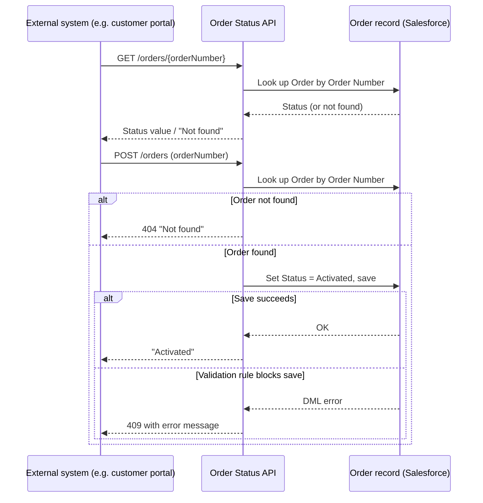

## Overview

The Order Status API is a REST endpoint that lets an external system — most notably the customer
portal — check the status of an order or activate a draft order without anyone needing to log into
Salesforce directly. A customer-facing website, for example, can call this endpoint to show "Your
order is Activated" on an order tracking page, or to trigger activation when a customer confirms a
draft order. It does the same activation work as clicking through the UI, so the same validation
rules and business logic apply.



## Prerequisites

- The external system must authenticate to Salesforce (e.g. via a Connected App / OAuth) with a user or integration account that has read/edit access to the Order object
- The Order record must already exist in Salesforce with a value in the Order Number field

```callout
type: note
This is a system-to-system integration, not a page inside Salesforce. There is no Lightning UI to
click through — the "navigation" here is the external caller sending an HTTP request to the
endpoint. The steps below describe the request shape rather than mouse clicks.
```

## Steps to Navigate

There is no Salesforce UI for this feature — it is called directly by an external system over HTTPS.
The steps below describe how a caller uses the endpoint.

1. The external system sends an authenticated `GET` request to `/services/apexrest/orders/{orderNumber}`, where `{orderNumber}` is the Order Number of the order to check.
2. Salesforce returns the order's current Status value as plain text (for example, `Draft` or `Activated`), or the text `Not found` if no order matches that number.
3. To activate a draft order, the external system sends an authenticated `POST` request to `/services/apexrest/orders` with an `orderNumber` parameter identifying the order.
4. Salesforce responds with `Activated` on success, or an error message and a non-200 status code if the order could not be found or activated.

```screenshot
id: order-status-api-connected-app
alt: Setup page for a Connected App used to authenticate external callers of the Order Status API
step: Navigate to Setup > App Manager and open the Connected App used for portal integration
url_pattern: /lightning/setup/NavigationMenus/home
```

## Use Cases

### Check an order's status

1. The external system sends `GET /services/apexrest/orders/{orderNumber}`.
2. Salesforce queries for an Order with that Order Number.
3. If found, the response body is the order's Status field value (e.g. `Draft`, `Activated`).
4. If no order matches, the response body is the text `Not found` (the endpoint does not set an error status code for this case — callers should treat the literal string `Not found` as "no such order").

### Activate a draft order

1. The external system sends `POST /services/apexrest/orders` with the `orderNumber` parameter set.
2. Salesforce finds the matching Order record and sets its Status to `Activated`, then saves it.
3. On success, the response body is `Activated` with an HTTP 200 status.
4. The same activation logic and validation rules that apply when a user activates an order from the Salesforce UI apply here — this endpoint does not bypass them.

### Order number not found

1. The external system sends `POST /services/apexrest/orders` with an `orderNumber` that does not match any Order record.
2. Salesforce responds with HTTP status code 404 and the body `Not found`.
3. No record is created or modified.

### Activation blocked by a validation rule

1. The external system sends `POST /services/apexrest/orders` for an order that exists but fails a validation rule when its Status is changed to `Activated` (for example, an order missing required fields, or one already in a status that cannot transition to Activated).
2. The save fails with a DML exception.
3. Salesforce responds with HTTP status code 409 and the underlying validation error message in the response body, so the caller can surface a meaningful error to the customer.
4. The order's Status is left unchanged.

## Validations & Business Rules

- The `GET` endpoint returns the literal text `Not found` (HTTP 200) when no Order matches the given Order Number — it does not return a 404 for the GET case, only for the POST/activate case.
- The `POST` (activate) endpoint sets `Status = 'Activated'` directly and relies on the Order object's existing validation rules and automation to accept or reject that change — this endpoint does not duplicate or re-implement activation eligibility logic.
- If the update fails (e.g. a validation rule blocks the Draft-to-Activated transition), the endpoint returns HTTP 409 with the DML error message rather than a generic failure, so integrators can display the specific reason.
- Both methods look up the Order by `OrderNumber`, taking the first match (`LIMIT 1`) — Order Numbers are expected to be unique.
- The class runs `with sharing`, so the integration/portal user calling this endpoint must have record-level access to the Order being queried or updated; otherwise the query simply returns no rows and the caller sees `Not found` rather than a permissions error.

## Related Features

- Order activation as performed from the standard Salesforce Order record page (see the Orders category for the manual activation flow, if documented).
