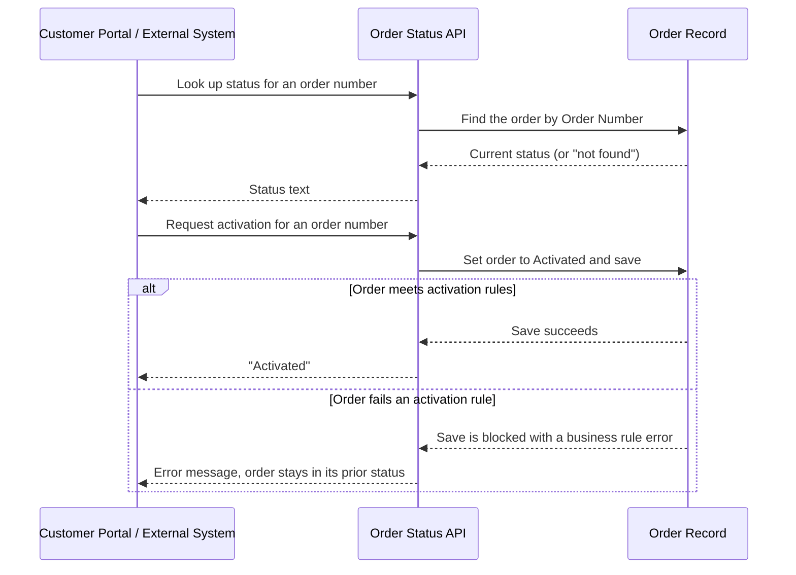

## Overview

The Order Status API is a lightweight integration endpoint that lets the customer portal — or any other
external system — check where an order stands, and activate a draft order, without giving that system
direct access to Salesforce records. A customer looking up their order sees the same status text an
internal user would see on the Order record. Activating an order through the API runs through the exact
same business rules as activating it by hand in Salesforce, so an external caller can't skip a check that
an internal user would have to satisfy.



## Prerequisites

- The calling system must be authenticated to call Salesforce REST APIs (e.g. via the customer portal's connected app or session)
- The order must already exist in Salesforce with an Order Number the caller knows

## Steps to Navigate

Support staff can confirm what an external caller will see by checking the same order record directly in Salesforce:

1. Click the **App Launcher** and search for **Orders**.
2. Open the order record that matches the Order Number the external system is asking about.
3. Compare the **Status** field on the record to what the API returned — they always match, since the API reads this same field.

```screenshot
id: order-status-api-record-page
alt: Order record page showing the Status field that the API reports back to external callers
step: Open an Order record to view its Status field
url_pattern: /lightning/r/Order/{recordId}/view
actions:
  - open_record: Order
```

## Use Cases

### Look up an order's status

1. An external system calls the status endpoint with an order number.
2. Salesforce finds the order by its Order Number and returns the value of its Status field as plain text (e.g. `Draft`, `Activated`).

### Order number doesn't match any order

1. An external system calls the status endpoint with an order number that doesn't exist in Salesforce.
2. The API returns the text `Not found` instead of a status.

### Activate a draft order via the API

1. An external system calls the activation endpoint with an order number.
2. Salesforce finds the matching order, sets its status to Activated, and saves it — the same save that would happen if a user changed the Status field on the record and clicked Save.
3. If the save succeeds, the API returns `Activated` and the order's Status field is now Activated.

### Activation is rejected by business rules

1. An external system requests activation for an order number that exists but doesn't meet one of the standing rules for activation in Salesforce (for example, an order with no product lines yet).
2. The save is blocked exactly as it would be for an internal user, and the order's status does not change.
3. The API returns the specific business-rule error message so the calling system (and ultimately the customer) knows why activation didn't go through.

### Order number not found on activation

1. An external system requests activation for an order number that doesn't exist.
2. The API responds that the order was not found, and nothing is changed.

## Validations & Business Rules

- Status lookups and activation requests are both matched by exact **Order Number** — there is no fuzzy or partial matching.
- A status lookup for an order number with no match returns the text `Not found` rather than an error.
- An activation request for an order number with no match is rejected outright before any save is attempted.
- Activating an order through this API runs the same save — and therefore the same activation rules and automation — that apply when a user activates an order from the Salesforce UI. If those rules block the save, the API surfaces the resulting error message back to the caller instead of silently failing.
- The order's status only changes when the save actually succeeds; a rejected activation leaves the order exactly as it was.
- Activation through this API is subject to the **same hidden checks** described in detail in Order Fulfillment & Activation: orders need at least one product, orders totaling $10,000 or more must pass a live external credit check (a check failure or outage blocks activation), and every order that successfully activates gets an estimated tax figure written into its Description. An external caller activating a large order is silently subject to that credit check even though this API doesn't advertise it.
- A successful activation through this API also triggers the same downstream automation a UI activation would — fulfillment follow-up tasks and revenue-recognition tasks are created automatically, even though the API response itself is just the word `Activated`.

## Related Features

- Order Fulfillment & Activation — documents the credit check, tax estimate, and fulfillment/revenue-recognition automation that this API's activation endpoint runs through.
