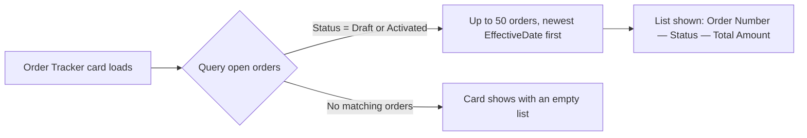

## Overview

The Order Tracker is a small card that lists every **Draft** or **Activated** order — up to the 50 most
recently effective — so a sales or fulfillment user can see what's still open without running a report.
It isn't tied to a specific record; an admin can drop it onto a Home page, an App page, or a record page
(for example, on the Account page so a rep sees that account's context alongside open orders company-wide).
The list refreshes automatically whenever the underlying Order data changes, since it's powered by a wired
Apex call rather than a one-time query.



## Prerequisites

- Read access to the Order object and its `OrderNumber`, `Status`, `TotalAmount`, `EffectiveDate`, and
  `Account.Name` fields (falls back to standard object-level security — no custom permission set is required).
- An admin must first add the **Open Orders** component to a Home page, App page, or Record page via
  Lightning App Builder. It does not appear anywhere by default.

## Steps to Navigate

1. Click the gear icon in the top-right, then click **Edit Page** (or **Setup > Lightning App Builder** to edit an existing Home/App page).
2. In the Lightning App Builder component palette, find **Open Orders** and drag it onto the page layout.
3. Click **Save**, then **Activate** if this is the first time the page has been activated, and assign it to the desired app, record type, and profiles.
4. Navigate to the page the component was added to — the **Open Orders** card appears and lists open orders automatically.

```screenshot
id: order-tracker-app-builder
alt: Lightning App Builder showing the Open Orders component being dragged onto a page
step: Open Lightning App Builder for a page and drag the Open Orders component onto the layout
url_pattern: /lightning/setup/FlexiPageList/home
```

```screenshot
id: order-tracker-card-view
alt: Open Orders card on a Lightning page listing draft and activated orders with their status and total amount
step: View a page that has the Open Orders component placed on it
url_pattern: /lightning/n/Home
```

## Use Cases

### View open orders on a page

1. Navigate to any page (Home, App, or record page) where an admin has placed the **Open Orders** component.
2. The card lists every order with **Status** of Draft or Activated, newest by Effective Date first, showing order number, status, and total amount.
3. As orders are activated, edited, or move to a closed status elsewhere in the org, the list reflects the change the next time the component's data is re-fetched.

### No open orders exist

1. If there are no orders currently in Draft or Activated status, the **Open Orders** card still renders with its title and icon, but the list area is empty — there is no explicit "no open orders" message.
2. This is expected behavior, not an error; a user seeing a blank card under the title should check the Orders list view to confirm whether any orders are actually open.

### Placing the component on multiple page types

1. An admin can add the same **Open Orders** component to more than one page type — Home, App, or Record page — since it isn't bound to a specific record.
2. On a record page (for example, an Account), the component still shows open orders across the whole org, not just orders related to that record — it is not filtered by the record it's placed on.
3. To scope the list to a single account or record, the component would need additional configuration; today it always runs the same org-wide query regardless of where it's placed.

## Validations & Business Rules

- Query logic lives in `OrderFulfillmentService.getOpenOrders()`: returns Orders where `Status IN ('Draft', 'Activated')`, ordered by `EffectiveDate DESC`, capped at 50 records.
- The component does not filter by the record page it's placed on — it always shows the same org-wide list of open orders.
- The component has no explicit error handling: if the underlying Apex call fails (e.g. the running user lacks field-level access), the card renders with an empty list rather than an error message.
- List size is hard-capped at 50 orders; if more than 50 orders are open, the oldest-effective-date ones beyond that cap are not shown.

## Related Features

- Orders become eligible to appear here once they reach Draft or Activated status — see the order activation and fulfillment flow.
