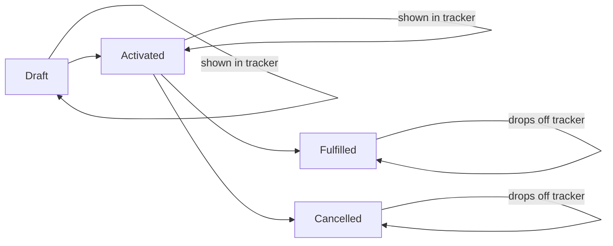

## Overview

The Order Tracker is a small card that lists every order currently in **Draft** or **Activated** status,
showing its order number, status, and total amount. It gives sales and fulfillment users a quick,
always-current view of orders that are still in flight, without having to open a list view or run a report.
The card only appears where an admin has placed it on a page — it is not part of any standard layout today.

```callout
type: note
This component is not currently placed on any page in the org. An admin must add it to a Home, App, or
record page before users can see it — see **Prerequisites**.
```

## Prerequisites

- Read access to the Order object and its Status, TotalAmount, EffectiveDate, and Account.Name fields
- The Order Tracker component added to a Home, App, or record page via the Lightning App Builder

## Steps to Navigate

1. Go to any page where an admin has placed the **Order Tracker** component (for example, a Home page or an Account record page).
2. The **Open Orders** card loads automatically and lists every order with Status **Draft** or **Activated**, most recently effective first.
3. Read each row for the order number, current status, and total amount.

```screenshot
id: order-tracker-card
alt: Open Orders card showing a list of Draft and Activated orders with number, status, and total
step: View a page that has the Order Tracker component placed on it
url_pattern: /lightning/n/Home
```

## Use Cases

### View open orders at a glance

1. Open a page with the Order Tracker component.
2. The card lists up to 50 open orders (Draft or Activated), ordered by Effective Date, most recent first.
3. Each row shows `Order Number — Status (Total Amount)` so the user can see fulfillment status without opening the record.

### No open orders

1. If there are no orders in Draft or Activated status, the card renders with no rows listed — there is no separate empty-state message today.
2. This is expected once every order in the org has moved to Fulfilled, Cancelled, or another closed status.

### Order moves out of the tracked list

1. When an order is activated, [Order Fulfillment](order-lifecycle.md) automation creates provisioning tasks for it, and the order remains visible here (Status = Activated) until fulfillment completes and its status changes.
2. Once an order's status changes to something other than Draft or Activated, it drops out of the Order Tracker list automatically on the next refresh — there is no manual removal step.

## Validations & Business Rules



- Query logic: the card only ever shows orders with `Status IN ('Draft', 'Activated')`, sorted by `EffectiveDate DESC`, capped at 50 records — older or additional open orders beyond the 50 most recent by effective date are not shown.
- The data is read-only and cacheable (`@AuraEnabled(cacheable=true)`); the card does not offer any way to edit an order or change its status.
- The list refreshes based on the standard Lightning Data Service cache — it does not auto-poll, so a user may need to revisit or refresh the page to see very recent changes.

## Related Features

- Order fulfillment automation that runs when an order is activated (creates the provisioning tasks tracked here)
