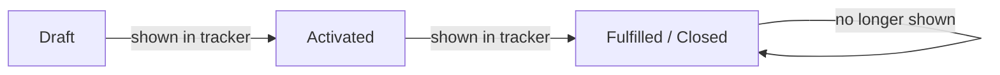

## Overview

Order Tracking is a small Lightning component that lists every order still in flight — anything in
**Draft** or **Activated** status — so a user can glance at fulfillment progress without running a
report or opening each order individually. It shows the order number, current status, and total
amount for up to 50 of the most recently effective open orders. It's meant to be dropped onto a
record page, app page, or Home page by an admin wherever that visibility is useful.

```callout
type: note
This component is not placed on any standard page today. It only appears where an admin has
added it to a Lightning page via the Lightning App Builder.
```

## Prerequisites

- Read access to the Order object and its Account lookup (field-level security and sharing rules apply as normal)
- An admin must add the **Order Tracking** component to a Record Page, App Page, or Home Page using Lightning App Builder — it is not visible anywhere until placed

## Steps to Navigate

1. Go to the Lightning page where an admin has placed the **Open Orders** component (for example, a Home page or an Account record page).
2. The component loads automatically and lists each open order as: order number, status, and total amount.

```screenshot
id: order-tracking-card
alt: Open Orders card showing a list of orders with their order number, status, and total amount
step: Open the Lightning page where the Order Tracking component has been placed
url_pattern: /lightning/page/home
```

### Adding the component to a page (admin task)

1. Click the gear icon in the top-right, then click **Edit Page** (or open **Lightning App Builder** from Setup for the target page).
2. Drag the **orderTracker** component (labeled "Open Orders" on the page) onto the layout.
3. Click **Save**, then **Activate** if prompted, and choose the assignment (org default, app, or profile).
4. Navigate to the page as an end user to confirm the Open Orders list appears.

## Use Cases

### Check which orders are still open

1. Open the page where the component is placed.
2. Review the list — each line shows `Order Number — Status (Total Amount)`.
3. Orders with **Status = Draft** have not yet been activated; orders with **Status = Activated** are confirmed but not yet shown as fulfilled elsewhere.

### No open orders exist

1. If every order is fully processed (none are Draft or Activated), the list renders empty — the card header still shows, but no line items appear.
2. This is expected once all orders have moved past Activated (for example, to a closed/fulfilled status) or none have been created yet.

### More than 50 open orders

1. The component always queries the 50 most recently effective open orders and does not paginate further.
2. If an org has more than 50 orders in Draft or Activated status, the oldest (by Effective Date) drop off the bottom of the list. Users needing the full set should run a report instead of relying on this component.

## Validations & Business Rules



- The component only ever displays orders with `Status` of **Draft** or **Activated**; any other status (e.g. fulfilled/closed) drops off the list automatically.
- Results are limited to 50 records, sorted by `EffectiveDate` descending — there is no "load more" or pagination control.
- The component is read-only: it has no buttons or actions to change an order's status. Status changes must be made from the Order record itself.
- Data is served by `OrderFulfillmentService.getOpenOrders()`, an `@AuraEnabled(cacheable=true)` Apex method, so the list may briefly show cached data until Lightning Data Service refreshes it.

## Related Features

- Order fulfillment: when an order is activated, `OrderFulfillmentService.kickoffFulfillment` creates provisioning and delivery-confirmation tasks — those orders are what appear in this tracker while they remain in Draft or Activated status.
