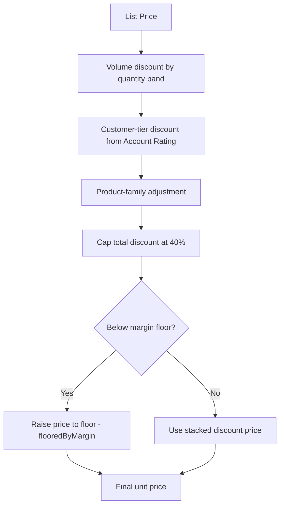

## Overview

The Pricing and Discount Rules Engine is the single place where every sold price in the system gets
calculated — whether a line is added to an Opportunity, a Quote is generated from an Opportunity, or a
margin check runs on an Order. Sales reps and sales ops never set a discount by hand: the engine stacks
a volume discount, a customer-tier discount and a product-family adjustment, caps the total, and then
guarantees the final price never falls below the product family's protected margin. It also decides,
based on the resulting discount and deal size, whether a manager approval is required before an
Opportunity's discount is accepted or a Quote can be presented to the customer.



## Prerequisites

- Standard access to Opportunities, Quotes and Orders — pricing is applied automatically, there is no manual "apply discount" button
- `Product2.Family` populated on every product (`Hardware`, `Software`, `Subscription`, `Services`, or other)
- `Account.Rating` populated as `Hot`, `Warm`, or blank/other — this is read as the customer's discount tier
- A Pricebook with `List Price` entries so the engine has a starting price to discount from

## Steps to Navigate

Pricing is automatic — there's no dedicated page for it. It runs behind the scenes whenever one of the
following happens:

1. Open an **Opportunity** and go to the **Products** related list.
2. Click **Add Products**, select a product, quantity, and sales price screen, then **Save**.
3. The engine reprices every line on the Opportunity in the background, so **Sales Price** on all lines
   (not just the one just added) may update once the save completes — this keeps quantity-based volume
   bands correct as lines accumulate.

```screenshot
id: pricing-rules-engine-opp-products
alt: Opportunity Products related list showing line items with Sales Price populated by the engine
step: Open an Opportunity, go to Products related list, and add a product line
url_pattern: /lightning/r/Opportunity/{recordId}/related/OpportunityLineItems/view
```

4. To see the price the engine would compute for a Quote, use the **Quote Builder** app (accessible from
   the Opportunity's **Quotes** related list or the Quote Builder tab) and generate a quote from the
   Opportunity — every quote line is priced through the same engine at generation time.

```screenshot
id: pricing-rules-engine-quote-builder
alt: Quote Builder screen for generating a quote from an Opportunity with priced lines
step: Open the Quote Builder and generate a quote from an Opportunity
url_pattern: /lightning/n/Quote_Builder
actions:
  - click_tab: Quote Builder
```

## Use Cases

### Standard volume + tier discount (happy path)

1. A rep adds 30 units of a `Hardware` product to an Opportunity for a `Warm`-rated Account.
2. The engine applies the `Hardware` volume band for 25–99 units (**6%**) plus the `Warm` tier discount
   (**4%**), for a stacked discount of **10%** — no family adjustment applies to Hardware.
3. The discount is well under the 40% cap and above the Hardware margin floor (55% of list), so the
   **Sales Price** is simply list price reduced by 10%.

### Large deal hits the margin floor

1. A rep adds 600 units of a `Hardware` product (18% volume band) for a `Hot` account (8% tier), which
   stacks to 26% — still under the 40% cap.
2. If list price minus 26% would fall below 55% of list (the Hardware margin floor), the engine instead
   prices the line at exactly the floor and marks it `flooredByMargin`.
3. The rep sees a price higher than the "raw" stacked-discount math would suggest — this is expected and
   protects family margin; support staff should look at the applied rules list (volume/tier/family plus
   `margin-floor`) rather than treat it as a bug.

### Discount requires manager approval

1. A rep negotiates an Opportunity down to a **35%** blended discount (or a **22%** discount on a deal
   over $100,000).
2. On save, `OpportunityDiscountApprovalService` recalculates the blended discount across all lines and,
   because it crosses the approval matrix, creates a **High priority Task** assigned to the Opportunity
   owner titled "Discount approval needed" and logs the request to the sales ops audit trail.
3. The Opportunity itself is not blocked from saving — the Task exists as a manager follow-up.

```screenshot
id: pricing-rules-engine-approval-task
alt: Discount approval Task on an Opportunity activity timeline
step: Open an Opportunity that crossed the discount approval threshold and view its Activity timeline
url_pattern: /lightning/r/Opportunity/{recordId}/view
```

### Quote presentation blocked pending approval

1. A rep changes a Quote's **Status** to `Presented` while its blended discount still crosses the
   approval matrix and no matching approval Task has been marked **Completed**.
2. The save is rejected with the error "This quote's discount (X%) needs a completed approval task
   first." and the block is logged to the sales ops audit trail.
3. Once the manager completes the "Discount approval" Task on that Quote, the rep can change **Status**
   to `Presented` again and it succeeds.

### Order line flagged at margin floor

1. An Order is created (typically from an accepted Quote) and its Order Product lines are saved.
2. For each line, margin is calculated as sold price ÷ list price; if the sold price is at or below the
   product family's margin floor, a **High priority Task** ("Order line at margin floor") is created on
   the Order for sales ops to review.
3. This is a passive flag only — it does not block the Order from being activated.

## Validations & Business Rules

- **Volume discount** (by `Product2.Family` and line `Quantity`):
  - `Hardware`: 18% at 500+, 12% at 100+, 6% at 25+, otherwise 0%
  - `Software` / `Subscription`: 25% at 1000+, 15% at 250+, 8% at 50+, otherwise 0%
  - All other families: 10% at 100+, 5% at 20+, otherwise 0%
- **Customer-tier discount** (`Account.Rating`): `Hot` = 8%, `Warm` = 4%, anything else = 0%
- **Product-family adjustment**: `Subscription` +2% (land-and-expand), `Services` −3% (margin protected),
  all other families 0%
- **Discount cap**: the sum of volume + tier + family adjustment is capped between 0% and 40% before the
  margin floor is applied
- **Margin floor**: final unit price can never go below a percentage of list price — `Services` 75%,
  `Hardware` 55%, all other families 60% (`DEFAULT_MARGIN_FLOOR_PCT`). If the stacked discount would
  breach the floor, the price is raised to exactly the floor and the line is marked `flooredByMargin`.
- **Approval matrix** (`requiresApproval`): a discount needs manager approval if it exceeds **30%**
  outright, or exceeds **20%** on a deal (Opportunity Amount / Quote GrandTotal) over **$100,000**
- **Automation — reprice on line add**: `OpportunityLineItemTriggerHandler` reprices every line on the
  Opportunity whenever any line is inserted or updated, so quantity-based volume bands stay accurate
- **Automation — quote generation**: `QuoteGenerationService` prices every mirrored Quote line through
  the engine at the moment a Quote is generated from an Opportunity
- **Automation — approval gate on presentation**: `QuoteApprovalService` blocks a Quote's Status from
  moving to `Presented` while its blended discount requires an incomplete approval
- **Automation — order margin surveillance**: `OrderItemTriggerHandler` flags any Order Product line
  sold at or below its family's margin floor with a Task for sales ops
- All discount/approval decisions are written to the sales ops audit trail via `SalesOpsAuditService`

## Related Features

- Opportunity line item pricing and reprice-on-save behavior
- Quote generation from an Opportunity
- Quote approval and presentation gating
- Order margin surveillance and sales ops flagging
