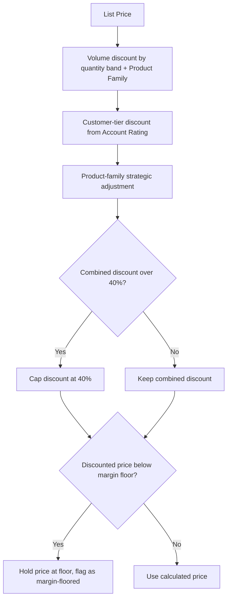
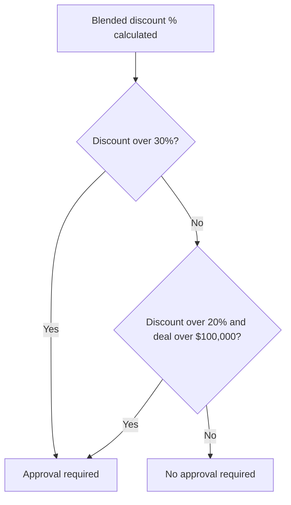
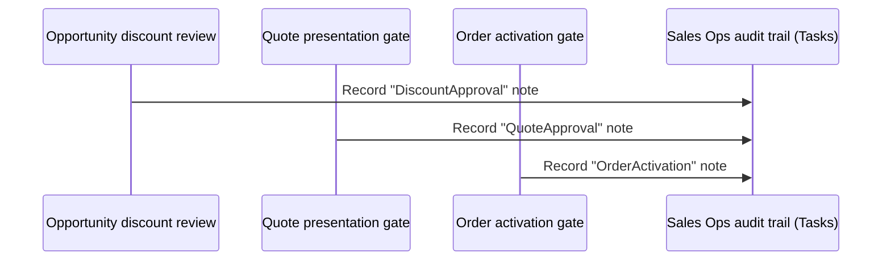

## Overview

This is the shared pricing brain behind every dollar amount a customer or rep sees in Lead-to-Cash.
Whenever an Opportunity Line Item, Quote Line Item, or Order Item is priced, the calculation — volume
discount, customer-tier discount, product-family adjustment, a hard discount cap, and a margin floor —
runs through one engine so the same quantity and account always produce the same price no matter which
object triggered it. On top of the price itself, the engine defines the single rule for when a discount
is steep enough to require management approval, and a companion audit service writes every approval
request, presentation block, and activation failure to a shared Task-based trail so sales operations has
one place to see what governance did.

```callout
type: note
This page documents shared calculation and audit logic, not a screen a user configures. Opportunity,
Quote, and Order pages describe how their own trigger points call into this engine — this page is the
reference for the math and thresholds themselves.
```



## Prerequisites

- **Product2.Family** must be set to Hardware, Software, Subscription, or Services on every priced
  product — it determines the volume-discount band and the margin-floor percentage.
- **Account.Rating** of `Hot` or `Warm` should be set on accounts that should receive a customer-tier
  discount; any other value (including blank) gets no tier discount.
- No special permission is required to trigger pricing or governance — it runs automatically wherever
  Opportunity, Quote, or Order lines are priced or a deal's discount is reviewed.

## Steps to Navigate

There is no setup screen for this engine — it runs automatically. To see its output and its audit
trail:

1. Open any **Opportunity**, **Quote**, or **Order** that has product lines.
2. Go to the **Products** / **Line Items** related list and view a line's **Sales Price** — this is the
   output of the shared pricing engine, not a value reps typically type in.

```screenshot
id: pricing-discount-governance-line-price
alt: Opportunity Products related list showing a line item's calculated Sales Price
step: Open an Opportunity (or Quote/Order) and view a line item's Sales Price on the Products related list
url_pattern: /lightning/r/Opportunity/{recordId}/view
```

3. Click the **App Launcher** and search for **Tasks**.
4. Open the Tasks list view and filter or search **Subject** for entries starting with `AUDIT/` to see
   every discount approval, blocked quote presentation, and order-activation credit failure the
   governance automation has logged.

```screenshot
id: pricing-discount-governance-audit-tasks
alt: Task list view showing completed Tasks with Subject values starting with AUDIT
step: Open the Tasks tab and search for Subject values starting with AUDIT/
url_pattern: /lightning/o/Task/list
```

## Use Cases

### Standard multi-rule discount stack

1. A rep prices a line for a Hardware product at $1,000 list, quantity 150, for a `Hot`-rated account.
2. The engine applies the 12% volume discount for 100+ Hardware units, then adds the 8% `Hot` tier
   discount — Hardware has no strategic family adjustment, so the stack stops there at 20%.
3. 20% is under the 40% cap and the resulting price is above the 55% Hardware margin floor, so the
   discounted price is used as calculated, with both applied rules recorded on the result.

### Discount capped at the policy maximum

1. A rep prices a Subscription line at quantity 1,200 for a `Hot`-rated account: the volume discount
   alone is 25% (1,000+ band), plus 8% tier, plus the 2% Subscription strategic adjustment — 35% raw.
2. If further stacking on another line would push the combined percentage over 40%, the engine caps the
   discount at 40% regardless of how the individual rules added up.
3. The capped 40% is then still checked against the margin floor before it is finalized.

### Margin floor protects against over-discounting

1. A rep prices (or manually discounts) a Services line low enough that the stacked discount would drop
   the unit price below 75% of list — the margin floor Services carries specifically because its margin
   is protected.
2. The engine detects the proposed price falls below that floor and holds the price at the floor price
   instead, no matter what the volume/tier/family math said.
3. The result is marked `flooredByMargin = true` and the effective discount percentage is recalculated
   from the floored price, so downstream reporting (margin analysis on Order Items) can flag the line as
   a margin exception rather than a normal discount.

### Deal flagged for approval governance

1. A blended discount is calculated for an Opportunity, Quote, or deal total (each calling context
   computes its own blended list-vs-sold percentage, then asks the engine whether that percentage needs
   approval).
2. Approval is required if the discount exceeds 30% outright, **or** if it exceeds 20% on a deal worth
   more than $100,000 — smaller discounts on smaller deals never require approval.
3. The calling process (opportunity discount review, or the quote presentation gate) creates an approval
   Task and records an audit note; a quote specifically cannot move to **Presented** until that approval
   Task is completed.



### Audit trail records governance actions across objects

1. Three independent processes call the same audit service when governance acts: an Opportunity discount
   approval request, a blocked Quote presentation, and a failed Order-activation credit check.
2. Each call passes a category (`DiscountApproval`, `QuoteApproval`, `OrderActivation`) and one or more
   notes; the service writes one completed **Task** per note, with the Subject prefixed `AUDIT/<category>`
   so every entry sorts and filters together regardless of which object triggered it.
3. Because the audit service runs `without sharing`, the entry is written even if the user who triggered
   the governance action doesn't otherwise have visibility into the record it references — sales ops can
   always see the full trail.



## Validations & Business Rules

- Volume discount bands (`volumeDiscountPct`), by product family and quantity:
  - Hardware: 6% at 25+, 12% at 100+, 18% at 500+.
  - Software / Subscription: 8% at 50+, 15% at 250+, 25% at 1,000+.
  - Any other family: 5% at 20+, 10% at 100+.
- Customer-tier discount (`tierDiscountPct`), from `Account.Rating`: `Hot` = 8%, `Warm` = 4%, anything
  else = 0%.
- Product-family strategic adjustment (`familyAdjustmentPct`): Subscription +2% (land-and-expand),
  Services −3% (margin protected), all other families 0%.
- Combined discount is capped at 40% (`capDiscount`) before the margin floor is checked.
- Margin floor (`marginFloorPrice`), as a percentage of list price: Services 75%, Hardware 55%, all other
  families 60% (the default). The final price never goes below this floor regardless of stacked
  discounts.
- Approval requirement (`requiresApproval`): required when the discount exceeds 30%, or when it exceeds
  20% **and** the deal amount exceeds $100,000. These thresholds are the single source of truth used by
  both the Opportunity discount-review automation and the Quote presentation gate.
- `accountTierFor` looks up `Account.Rating` by Id; an account with no Rating (or a missing account)
  yields no tier discount, not an error.
- Audit trail (`SalesOpsAuditService.record`): each note becomes a completed **Task** with
  `Subject = 'AUDIT/' + category` and `ActivityDate = today`; descriptions longer than 32,000 characters
  are truncated. The service runs `without sharing`, so audit entries are written regardless of the
  triggering user's record access. Categories currently in use: `DiscountApproval`, `QuoteApproval`,
  `OrderActivation`.

## Related Features

- Opportunity pricing, forecasting, and approval gates — the Opportunity-side trigger points that call
  this engine when lines are added or when stage moves into Negotiation/Review.
- Quote expiry alert — a separate Quote-status automation on the same object this engine prices.
- Order activation and status — the Order-side activation gate whose credit-check failures are logged
  through the same audit trail.
