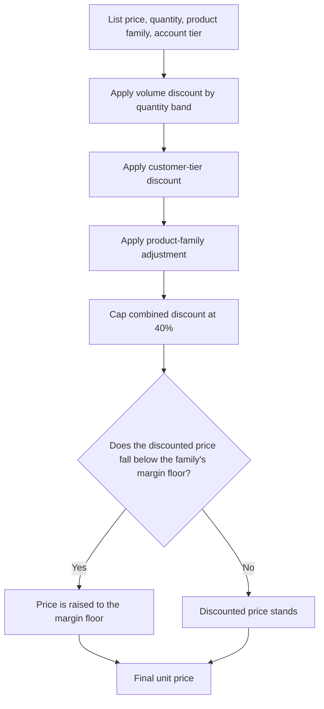
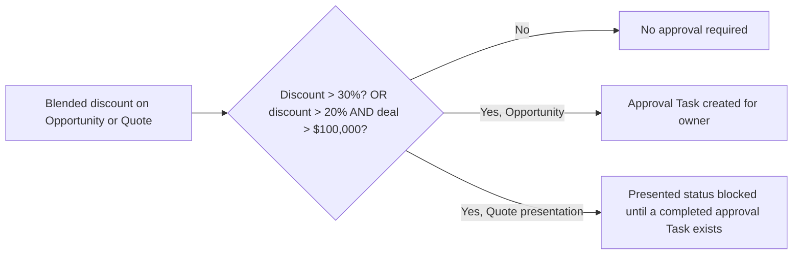

## Overview

This feature is the one place every price in the sales cycle gets calculated: opportunity products, quote
lines, and (indirectly, for margin surveillance) order lines. Instead of each object having its own
discounting logic, they all route through the same rule engine, so a given quantity, product family and
customer tier always produces the same discount no matter where it's priced. On top of discounting, the
engine enforces a margin floor per product family — no stacked discount can push a price below that floor —
and flags any deal whose blended discount is large enough that a manager needs to approve it before it can
be presented to the customer. Sales reps, deal desk, and sales ops all rely on this to know what a price
should be, whether a deal needs sign-off, and to see an audit trail of every discount that was reviewed.



## Prerequisites

```callout
type: note
There is no dedicated tab for this feature — it runs automatically whenever opportunity, quote, or order
lines are priced or an opportunity moves to Negotiation/Review. The steps below show where to observe and
configure it, not a standalone app to open.
```

- Line items must reference a Product2 with a populated **Family** (Hardware, Software, Subscription,
  Services, or other) — this drives the volume band and margin floor used
- The Account tied to an opportunity should have a **Rating** (Hot, Warm, or blank) so the customer-tier
  discount can apply
- A user with edit access to Opportunities, Quotes and Orders, since these rules fire from those objects'
  own triggers rather than a page a user opens directly

## Steps to Navigate

1. Open an **Opportunity** record that has products added.

```screenshot
id: pricing-discounting-margin-rules-opportunity-record
alt: Opportunity record page showing the Products related list with list price and discounted unit price columns
step: Open an Opportunity record with line items
url_pattern: /lightning/r/Opportunity/{recordId}/view
actions:
  - open_record: Opportunity
```

2. Scroll to the **Products** related list. Each line's **Sales Price** is the value the pricing engine
   calculated the last time the opportunity's lines were repriced — quantity, product family and the
   account's tier all feed into it.
3. To see a discount get gated, edit the opportunity's **Stage** to **Negotiation/Review** and save.

```screenshot
id: pricing-discounting-margin-rules-stage-negotiation
alt: Opportunity edit form with Stage being set to Negotiation/Review
step: Open an Opportunity, click Edit, and set Stage to Negotiation/Review
url_pattern: /lightning/r/Opportunity/{recordId}/view
actions:
  - open_record: Opportunity
  - click_button: Edit
  - fill_field: { field: StageName, value: Negotiation/Review }
```

4. If the blended discount across the opportunity's lines is large enough, a new **Task** appears on the
   opportunity owner's task list titled "Discount approval needed" — open the **Activity** related list on
   the opportunity to see it.

```screenshot
id: pricing-discounting-margin-rules-approval-task
alt: Opportunity Activity related list showing a Discount approval needed task
step: Open the Activity related list on the same Opportunity record
url_pattern: /lightning/r/Opportunity/{recordId}/view
```

## Use Cases

### Standard discounting on an opportunity

1. A rep adds products to an opportunity with a quantity and list price.
2. When the opportunity's lines are repriced, each line's price is computed by stacking, in order: a
   volume discount based on quantity and product family, a discount based on the account's tier (Hot or
   Warm), and a strategic adjustment for that product family (for example, Subscription lines lean in by
   2%, Services lines are protected by -3%).
3. The combined discount is capped at 40% regardless of how many individual discounts would otherwise add
   up to more.
4. The rep sees the resulting **Sales Price** on each line — no manual price entry is required for the
   standard case.

### Discount would push below the margin floor

1. A line's stacked discount, if applied as calculated, would drop the unit price below that product
   family's margin floor (75% of list for Services, 55% for Hardware, 60% for everything else).
2. Instead of applying the full stacked discount, the engine raises the price back up to the margin floor
   price, and the effective discount percentage shown is recalculated from that floored price — it is
   always lower than what the stacked rules alone would have produced.
3. There is no separate error or warning on the line itself; the floor is applied silently as part of
   pricing. Margin floor breaches are instead surfaced later, on order lines (see below).

### Blended discount triggers approval on an opportunity

1. An opportunity moves to the **Negotiation/Review** stage (the trigger condition for review — moving to
   any other stage does not check discounts).
2. Sales ops logic totals up the list value and sold value across all of the opportunity's line items and
   calculates the blended discount percentage.
3. If that blended discount is over 30%, or over 20% on a deal worth more than $100,000, a **Task** titled
   "Discount approval needed (X%): [Opportunity Name]" is created and assigned to the opportunity owner,
   due the next day.
4. The review is also written to the shared sales-ops audit trail (see Validations & Business Rules).
5. Moving the opportunity back out of Negotiation/Review and back in again re-runs the review and can
   create another approval Task if the discount is still over the threshold.

### Presenting a quote with an unapproved discount (blocked)

1. A quote generated from the opportunity carries over the same discounted prices.
2. When a user tries to change the quote's **Status** to **Presented**, its blended discount is checked
   against the same approval thresholds used for opportunities.
3. If the discount requires approval and there is no completed "Discount approval" Task on that quote yet,
   the status change is rejected with an error naming the discount percentage, and the block is recorded to
   the sales-ops audit trail.
4. Once an approval Task tied to the quote is marked **Completed**, the same status change to Presented is
   allowed to go through.

### Order line sold at or below the margin floor

1. After an order is created (typically from an accepted quote) and its order items are saved, each line's
   actual margin — sold **Unit Price** divided by **List Price** — is compared to the same family margin
   floor used during pricing.
2. Any line whose margin is at or below the floor is flagged with a **Task** on the order, titled "Order
   line at margin floor (X% of list)", so sales ops can review it after the fact rather than blocking the
   save.
3. This is a detection step, not a gate — the order itself still saves; nothing prevents an order line
   from being priced at or below the floor.

## Validations & Business Rules



- **Discount stacking order**: volume discount (by product family and quantity band), then customer-tier
  discount (Hot +8%, Warm +4%, no rating +0%), then a product-family adjustment (Subscription +2%,
  Services -3%, others +0%) — always in that order, and the combined result is capped at 40%.
- **Volume bands** differ by family: Hardware discounts at 25+/100+/500+ units (6%/12%/18%); Software and
  Subscription discount at 50+/250+/1000+ units (8%/15%/25%); every other family discounts at 20+/100+
  units (5%/10%).
- **Margin floor** is enforced after all discounts and the 40% cap are applied: Services can never be sold
  below 75% of list, Hardware never below 55% of list, and every other family never below 60% of list. The
  floor always wins over the stacked discount, even if that means the effective discount is smaller than
  what was calculated.
- **Approval threshold**: a blended discount over 30% always requires approval; a discount over 20% also
  requires approval if the deal amount exceeds $100,000. Smaller discounts on smaller deals never require
  approval.
- Automation: `OpportunityTriggerHandler` runs the discount review in **after-update**, only when an
  opportunity's Stage changes *into* Negotiation/Review — changing other fields on an already-Negotiation
  opportunity does not re-trigger it.
- Automation: `QuoteApprovalService` runs as a gate on **Quote Status** changes into Presented; it looks
  for a Task on the quote whose Subject starts with "Discount approval" and whose Status is Completed — if
  none exists, the save is blocked with `addError`, not just a warning.
- Automation: `OrderItemTriggerHandler` runs after order items are inserted or updated and only flags lines
  that are already at or below the floor; it does not stop the save.
- Every approval requirement that fires (opportunity review or blocked quote presentation) is written to
  the shared sales-ops audit trail as a completed Task with subject `AUDIT/DiscountApproval` or
  `AUDIT/QuoteApproval` — this is the same audit mechanism used for other governance checks like order
  credit-check failures, so sales ops can query one place for everything governance blocked or flagged.

## Related Features

- [Big Deal Alert](../opportunities/big-deal-alert.md) — flags large opportunities around the same
  Negotiation/Review stage transition
- [Quote Expiry Alert](../quotes/quote-expiry-alert.md) — quote lifecycle automation downstream of the
  prices this engine sets
- [Order Activation and Status API](../orders/order-activation.md) — order-side gate that runs alongside
  the margin-floor flag on order lines and writes to the same audit trail
