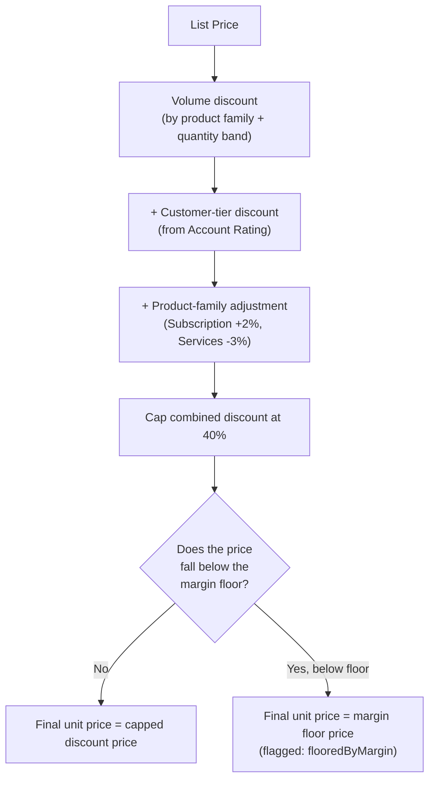
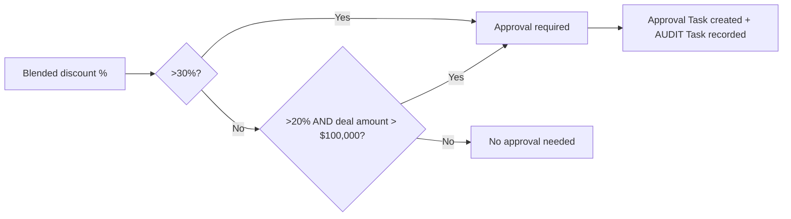

## Overview

Every price shown on an Opportunity line, Quote line, or Order line is computed by one shared
engine so the same discount logic applies no matter where a deal is priced. The engine stacks a
volume discount, a customer-tier discount, and a product-family adjustment, caps the total, and
then makes sure the result never dips below a minimum margin. When a deal's resulting discount is
large enough, an approval Task is created and the request is written to a shared audit trail so
sales operations can see every governance decision — approvals, blocked quote presentations, and
failed credit checks — in one place.



## Prerequisites

```callout
type: note
This page documents shared, back-end pricing rules rather than a single screen. There is no
separate "Pricing" setup page to open — the rules apply automatically wherever line items are
priced or repriced.
```

- Read access to Opportunity, Quote, and Order line items
- Product2.Family must be populated to get the correct volume band, family adjustment, and margin floor
- Account.Rating must be populated to receive a customer-tier discount
- Read access to Tasks on the record to view the audit trail (Subject starting with `AUDIT/`)

## Steps to Navigate

1. Open an **Opportunity**, **Quote**, or **Order** record.
2. Scroll to the **Products** (or **Line Items**) related list to see each line's **List Price** and **Unit Price** — the difference is the discount the pricing engine applied.

```screenshot
id: pricing-rules-audit-trail-line-items
alt: Opportunity Products related list showing List Price and Unit Price columns side by side
step: Open an Opportunity with products and view the Products related list
url_pattern: /lightning/r/Opportunity/{recordId}/view
```

3. To see the audit trail for a discount approval or a blocked presentation, open the **Activity** related list on the Opportunity, Quote, or Order and look for a completed **Task** whose **Subject** starts with `AUDIT/` (for example `AUDIT/DiscountApproval` or `AUDIT/QuoteApproval`).

```screenshot
id: pricing-rules-audit-trail-audit-task
alt: Activity related list on an Opportunity showing a completed Task with subject starting with AUDIT/DiscountApproval
step: Open an Opportunity that has had a discount approval reviewed and expand the Activity related list
url_pattern: /lightning/r/Opportunity/{recordId}/view
```

## Use Cases

### Standard multi-factor discount

1. A rep adds lines to an Opportunity, Quote, or Order and the pricing engine reprices them automatically.
2. The engine looks up the product's **Family** and the line **Quantity** to find the volume discount band (for example, 100+ units of Hardware = 12% off).
3. The engine adds a customer-tier discount based on the Account's **Rating** (Hot = 8%, Warm = 4%, anything else = 0%).
4. The engine adds a fixed product-family adjustment (Subscription lines get +2% to encourage land-and-expand; Services lines get -3% to protect services margin).
5. The three discounts are added together and capped at **40%** combined.
6. The resulting **Unit Price** appears on the line with no further action needed.

### Discount capped by the margin floor

1. On a deal where the stacked discounts from the standard flow above would still leave a healthy margin, pricing proceeds as normal.
2. When the stacked, capped discount would push the price below the product family's margin floor (55% of list for Hardware, 75% of list for Services, 60% of list for everything else), the engine overrides the price to sit exactly at the floor.
3. The rep sees a Unit Price that is higher than the "raw" stacked discount would suggest — this is expected and reflects the margin protection rule, not a data error.

### Deal crosses the approval threshold

1. A rep raises the discount on an Opportunity's line items until the blended discount across all lines exceeds **30%**, or exceeds **20%** on a deal worth more than **$100,000**.
2. When discounts are reviewed, an approval **Task** is created against the Opportunity, assigned to the opportunity owner, due the next day, with subject `Discount approval needed (<pct>%): <Opportunity Name>`.
3. The request is written to the audit trail as an `AUDIT/DiscountApproval` Task.
4. The manager (or approver) reviews the deal and marks the approval Task **Completed** once satisfied.

### Quote presentation blocked pending approval

1. A user changes a Quote's **Status** to **Presented**.
2. The system calculates the quote's blended discount from its line items and checks it against the same approval thresholds used on Opportunities.
3. If the threshold is crossed and there is no completed approval Task on the quote (Subject starting with `Discount approval` and Status `Completed`), the status change is blocked with an error: *"This quote's discount (X%) needs a completed approval task first."*
4. The blocked attempt is written to the audit trail as an `AUDIT/QuoteApproval` Task.
5. Once a completed approval Task exists for the quote, the user can change the Status to **Presented** again and it succeeds.

### Bulk repricing

1. A sales ops user or an automated process reprices many Opportunities at once (for example, after a price book or account-tier change).
2. The engine processes all Opportunity line items across every affected Opportunity in a single pass, looking up each Account's tier once and reusing it for all of that account's lines.
3. Only lines whose computed price actually changed are updated, minimizing unnecessary DML.

## Validations & Business Rules



- **Volume discount bands** (`PriceRuleEngine.volumeDiscountPct`): Hardware — 6% at 25+, 12% at 100+, 18% at 500+; Software/Subscription — 8% at 50+, 15% at 250+, 25% at 1,000+; all other families — 5% at 20+, 10% at 100+.
- **Customer-tier discount** (`PriceRuleEngine.tierDiscountPct`): Hot accounts get 8%, Warm accounts get 4%, all other ratings get 0%.
- **Product-family adjustment** (`PriceRuleEngine.familyAdjustmentPct`): Subscription +2%, Services -3%, all others 0%.
- **Discount cap** (`PriceRuleEngine.capDiscount`): the sum of volume + tier + family discounts is capped at 40% and never allowed below 0%.
- **Margin floor** (`PriceRuleEngine.marginFloorPrice`): Services can never be sold below 75% of list; Hardware never below 55% of list; every other family never below 60% of list. If the stacked discount would breach the floor, the price is set to the floor and the line is flagged `flooredByMargin`.
- **Approval threshold** (`PriceRuleEngine.requiresApproval`): approval is required when the blended discount exceeds 30%, or when it exceeds 20% on a deal amount over $100,000.
- **Automation:** `OpportunityDiscountApprovalService` evaluates the blended discount across an Opportunity's lines and creates an approval Task when the threshold is crossed.
- **Automation:** `QuoteApprovalService` blocks a Quote's Status from being set to **Presented** when the threshold is crossed and no completed approval Task exists, via `addError` on the quote record.
- **Automation:** `OpportunityPricingService` and `QuoteGenerationService` both call the same pricing engine so Opportunity and Quote line prices stay consistent when a quote is generated from an Opportunity.
- **Automation:** `MarginCalculationService` reuses the same margin floor to flag Order lines that were sold at or below floor, for margin reporting.
- **Audit trail:** `SalesOpsAuditService.record` writes every governance decision (discount approvals requested, blocked quote presentations, failed credit checks) as a completed Task with Subject `AUDIT/<category>` and the note in the Task Description, so sales ops has one query for all governance activity.

## Related Features

- Opportunity discount approval — creates the approval Task when an Opportunity's blended discount crosses the threshold.
- Quote approval workflow — blocks Quote presentation until an approval Task is completed.
- Order activation & credit check — reuses the same audit trail for failed credit checks at order activation.
- Quote generation from Opportunity — prices new quote lines using this same engine.
