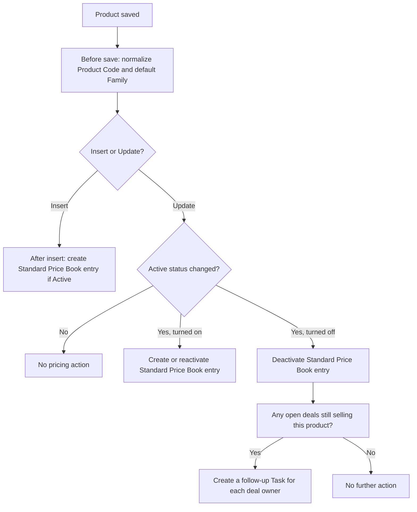

## Overview

Whenever someone creates, edits, or retires a Product in Salesforce, this automation keeps the
catalog tidy and the pricing infrastructure consistent behind the scenes. It cleans up how product
codes are entered, makes sure every active product has a price on the Standard Price Book so it can
actually be quoted, and — if a product is retired while it's still sitting on open deals — flags
those deals for the sales reps so nothing quietly falls through the cracks. There are no screens for
this feature; it runs automatically every time a Product record is saved.



## Prerequisites

- Standard edit access to the Product object (creating or updating a Product is what triggers this automation).
- A Pricebook2 record flagged `IsStandard = true` must exist in the org — without it, the pricing sync step silently does nothing.
- Products should have `Product Code` and `Family` populated where possible, though this automation will fill in reasonable defaults.

## Steps to Navigate

There is no dedicated screen for this feature — it runs automatically in the background every time a
Product record is saved (created or edited).

1. Open the **Product** tab, or navigate to an existing Product record.
2. Click **New** to create a Product, or **Edit** an existing one.

```screenshot
id: product-catalog-and-pricebook-sync-product-edit
alt: Product edit form showing the Product Code, Family, and Active fields
step: Open a Product record and click Edit
url_pattern: /lightning/r/Product2/{recordId}/view
actions:
  - open_record: Product2
```

3. Enter or change the **Product Code**, **Family**, and/or **Active** fields as needed.
4. Click **Save**. The catalog cleanup and pricing sync happen immediately as part of the save — no further action is required.

## Use Cases

### Creating a new active Product

1. Click **New** on the Product tab and fill in **Product Name** and **Product Code** (e.g. enter
   `abc 123`).
2. Leave **Active** checked and click **Save**.
3. Before the record saves, the Product Code is automatically trimmed, uppercased, and has any spaces
   replaced with hyphens — `abc 123` becomes `ABC-123`. If **Family** was left blank, it's set to
   `General`.
4. After the record saves, a Standard Price Book entry is automatically created for the product with
   a unit price of `0` so it immediately shows up as sellable on the standard price book. A sales rep
   can now find it when building a quote (the price will still need to be set to something usable).

### Editing a Product without changing its Active status

1. Open an existing Product and edit a field such as **Product Name** or **Description** — leave
   **Active** as-is.
2. Click **Save**.
3. The Product Code and Family normalization still run on every save, but because the Active status
   didn't change, no price book entries are created or updated.

### Reactivating a previously retired Product

1. Open a Product where **Active** is unchecked.
2. Check **Active** again and click **Save**.
3. Because the Active status changed, the automation re-checks the Standard Price Book: if an entry
   already exists for this product, it's switched back to active; if none exists yet, a new entry is
   created with a unit price of `0`. Either way, the product becomes quotable again.

### Retiring a Product that has open deals attached

1. Open a Product where **Active** is checked and that is currently a line item on one or more
   open (not-Closed) Opportunities.
2. Uncheck **Active** and click **Save**.
3. The product's Standard Price Book entry is deactivated, so it can no longer be added to new quotes
   or orders.
4. Because this product is still on at least one open deal, a follow-up **Task** is automatically
   created and assigned to the owner of each affected Opportunity — subject "Product on this deal was
   retired — swap or requote", due in 3 days. Reps see this on their own Task list and know to swap in
   a replacement product or requote the deal.

### Retiring a Product with no open deals attached

1. Open a Product where **Active** is checked and that is not on any open Opportunity.
2. Uncheck **Active** and click **Save**.
3. The Standard Price Book entry is deactivated as usual, but since no open deals reference this
   product, no follow-up Task is created.

### Bulk-updating Products (e.g. via Data Loader or a list view mass edit)

1. Update **Active** on a batch of Products at once (for example, deactivating an entire product
   line).
2. All of the same logic applies per record across the whole batch — code normalization, price book
   entry creation/deactivation, and retirement Tasks — and is bulk-safe, so it works the same whether
   one Product or hundreds are saved together.

## Validations & Business Rules

- Automation: `ProductTrigger` (before insert, before update, after insert, after update on
  `Product2`) delegates to `ProductTriggerHandler`.
- Before save (insert or update): `ProductCatalogService.normalizeProductCodes` trims whitespace,
  uppercases, and replaces internal spaces with hyphens in **Product Code**; if **Family** is blank
  it's set to `General`.
- After insert: every new Product gets a Standard Price Book entry created automatically if it's
  Active, with **Unit Price** defaulted to `0`.
- After update: price book sync only runs for Products whose **Active** value actually changed on
  this save.
  - Turning a Product **on**: creates a new Standard Price Book entry (unit price `0`) if one doesn't
    exist yet, or reactivates the existing entry.
  - Turning a Product **off**: deactivates the existing Standard Price Book entry so it can't be
    selected on new quotes/orders.
- If the org has no Price Book flagged as the Standard Price Book, the pricing sync step is skipped
  entirely (no error, no entry created).
- Retirement check: only runs for Products being deactivated (Active turned off), and only looks at
  Opportunities that are **not Closed**. It creates at most one Task per affected Opportunity, even if
  the same Opportunity has multiple line items referencing the retired product.

## Related Features

- Product Retirement Notice — a separate flow-based automation that watches for the same
  Active-unchecked event on Product2, intended to notify stakeholders (currently has no actions
  configured).
