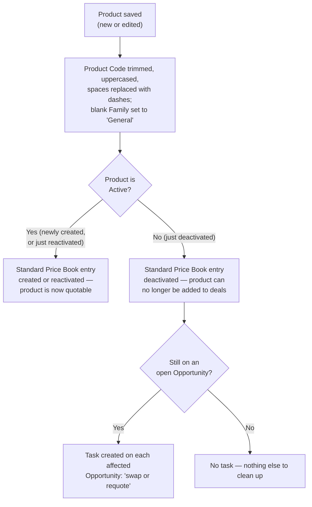

## Overview

This feature keeps the product catalog clean and safe to sell from without any manual bookkeeping. Every
time a product is saved, its Product Code is automatically reformatted into a consistent style and given a
default Family if one wasn't set, so the catalog doesn't accumulate inconsistent codes over time. Whenever a
product becomes active, it's automatically given a Standard Price Book entry so it can immediately be added
to quotes and opportunities; whenever it's deactivated, that entry is deactivated right along with it so it
stops being quotable. If a product gets retired while it's still sitting on an open deal, the reps who own
those deals are automatically notified with a follow-up task instead of finding out only when a quote fails.



## Prerequisites

- Access to Product2 records to create or edit products
- A Standard Price Book must already exist in the org — pricebook entries are synced against it specifically

## Steps to Navigate

1. Click the **App Launcher** and search for **Products**.

```screenshot
id: product-catalog-app-launcher
alt: App Launcher open with "Products" typed into the search box
step: Open the App Launcher and search for Products
url_pattern: /lightning/app/AppLauncher
actions:
  - open_app_launcher
  - search_app_launcher: Products
```

2. Open a Product record to see its **Product Code**, **Product Family**, and **Active** checkbox, along
   with its **Price Books** related list showing the synced Standard Price Book entry.

```screenshot
id: product-catalog-record-page
alt: Product record page showing Product Code, Family, Active checkbox, and the Price Books related list
step: Open a Product record to view its details
url_pattern: /lightning/r/Product2/{recordId}/view
actions:
  - open_record: Product2
```

## Use Cases

### A new active product is created

1. A user creates a Product2 record, enters a Product Code (e.g. with stray spacing or lowercase letters),
   and leaves it **Active**.
2. On save, the Product Code is automatically trimmed, uppercased, and any internal whitespace is collapsed
   into dashes (e.g. `"  wgt 100 "` becomes `"WGT-100"`). If Family was left blank, it's set to **General**.
3. Because the product is Active, a Standard Price Book entry is created for it automatically (starting at a
   $0 list price) so it immediately shows up as quotable — sales ops still needs to set the real list price.

### An existing product's code or family is edited

1. A user edits the Product Code or Family on an existing product, without changing its **Active** checkbox.
2. The code is normalized the same way as on creation, and Family defaults to General if cleared.
3. No Price Book entry is created or changed by this edit — pricebook sync only reacts to the product's
   Active flag changing (or to a brand-new product being inserted), not to other field edits.

### A product is deactivated while it has open pipeline

1. A user unchecks **Active** on a product that's currently a line item on one or more Opportunities that
   aren't closed yet.
2. Its Standard Price Book entry is automatically deactivated, so the product can no longer be added to new
   quotes or opportunities.
3. One Task is created on **each** open Opportunity still carrying that product — titled "Product on this
   deal was retired — swap or requote", assigned to the opportunity owner, due in 3 days — prompting the rep
   to swap in a replacement product or requote before the deal progresses.

### A product is deactivated with no open pipeline

1. A user unchecks **Active** on a product that isn't on any open Opportunity (or is only on already-closed
   ones).
2. Its Standard Price Book entry is deactivated as above, but no Task is created — there's no open deal to
   flag.

### A previously retired product is reactivated

1. A user re-checks **Active** on a product that had been deactivated.
2. Its existing Standard Price Book entry is reactivated (not recreated), making the product quotable again.
   No retirement Task logic runs on reactivation — the Task-creation path only fires when a product goes
   from Active to Inactive.

## Validations & Business Rules

- **Product Code normalization:** on every insert or update, `ProductCode` is trimmed, uppercased, and any
  run of whitespace is replaced with a single dash. This happens silently before save — there's no error or
  confirmation shown to the user.
- **Family default:** if `Family` is left blank on save, it's set to **General** automatically.
- **Standard Price Book entry sync:** runs whenever a product is newly inserted, or whenever an existing
  product's **Active** checkbox changes value (either direction). It does *not* re-run for other field edits
  (e.g. changing Name or Description alone).
  - If a product is Active and has no existing Standard Price Book entry, one is inserted (`UnitPrice = 0`,
    active).
  - If an entry already exists and its active flag doesn't match the product's current Active value, the
    entry is updated to match.
  - If no Standard Price Book exists in the org at all, this sync is silently skipped.
- **Retirement warning:** only fires when a product's Active flag flips from true to false (not on creation
  as inactive). It looks for Opportunity Line Items referencing that product on Opportunities that aren't
  closed, and creates exactly **one** Task per affected Opportunity (not one per line), due in 3 days,
  assigned to that Opportunity's owner.
- **The retirement Task is advisory only** — deactivating the product is never blocked by having open
  pipeline; the Task is the only signal a rep gets.

## Related Features

- Quote Builder — can only quote products that currently have an active Standard Price Book entry.
- Opportunity Pipeline Guardrails — the open-pipeline check behind the retirement warning looks at the same
  Opportunity Line Items this feature guards against deactivating out from under a deal.
- Order Fulfillment & Activation — orders are created from accepted quotes, which in turn depend on products
  having been quotable (active) at the time they were quoted.
