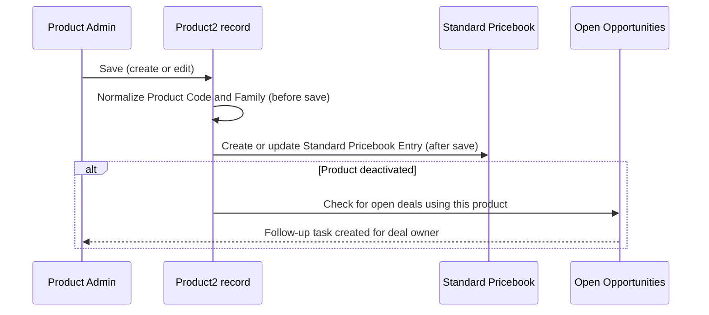

## Overview

Every time a product is created or edited, Salesforce automatically cleans up the data and keeps
related records in sync — no manual follow-up steps required. Product codes are reformatted into a
consistent style, a blank product family defaults to "General," the product's entry on the Standard
Pricebook is created or toggled to match whether the product is active, and if a product is
deactivated while it's still sitting on an open deal, the deal owner gets a follow-up task so the
opportunity doesn't quietly go stale. This keeps the product catalog, the pricebook, and open sales
pipeline consistent without anyone needing to remember a checklist.



## Prerequisites

- Manage Products / Customize Application permission (or equivalent) to create and edit Product2 records
- A Standard Pricebook must exist and be active in the org — if none is found, pricebook sync is skipped silently
- Products are usually attached to Opportunities as line items, which is what drives the retirement warning

```callout
type: note
This automation runs on every Product2 save (insert and update) — there is no setting to turn it off page-by-page. It applies uniformly across the catalog.
```

## Steps to Navigate

1. Click the App Launcher and search for **Products**.
2. Click **New** to create a product, or open an existing product record and click **Edit**.
3. Fill in the product fields, including **Product Name** and **Product Code**.

```screenshot
id: product-catalog-maintenance-new-product
alt: New Product form with Product Name and Product Code fields visible
step: Open the App Launcher, search for Products, and click New
url_pattern: /lightning/o/Product2/new
actions:
  - open_app_launcher
  - search_app_launcher: Products
  - click_app_launcher_result: Products
  - click_new
```

4. Click **Save**.
5. Salesforce automatically reformats the **Product Code** and sets **Product Family** if it was left blank — this happens before the record is saved.
6. Reopen the record. If the product is active, a Standard Pricebook Entry now exists (or is updated) automatically.

```screenshot
id: product-catalog-maintenance-record-page
alt: Saved product record showing normalized Product Code and a related Standard Pricebook Entry
step: Save the new product and view the record page
url_pattern: /lightning/r/Product2/{recordId}/view
```

## Use Cases

### Create a new active product

1. Enter a **Product Code** with mixed case and stray spaces, for example `abc 123`.
2. Leave **Product Family** blank.
3. Check **Active**, then click **Save**.
4. The code is trimmed, uppercased, and spaces are replaced with dashes — it saves as `ABC-123`. Product Family defaults to `General`.
5. Because the product is active, a Standard Pricebook Entry is automatically inserted with `UnitPrice = 0` and `IsActive = true`, so the product can be added to a pricebook-driven quote right away (the price still needs to be set before it's usable on a real deal).

### Reactivate a previously deactivated product

1. Open a product whose Standard Pricebook Entry is currently inactive.
2. Check **Active** and click **Save**.
3. The existing Standard Pricebook Entry is updated to `IsActive = true` rather than a new entry being created — there is never more than one Standard Pricebook Entry per product from this automation.

### Deactivate a product with no open pipeline

1. Open an active product that has never been added to an open Opportunity (or all its Opportunities are closed).
2. Uncheck **Active** and click **Save**.
3. The product's Standard Pricebook Entry is deactivated so it can no longer be added to new quotes or orders.
4. No follow-up task is created, since no open deal is affected.

### Deactivate a product that's on an open deal

1. Open an active product that is currently a line item on one or more Opportunities that are **not** closed.
2. Uncheck **Active** and click **Save**.
3. The Standard Pricebook Entry is deactivated as usual.
4. For each distinct open Opportunity still carrying that product, a **Task** is created for the Opportunity owner: subject "Product on this deal was retired — swap or requote," due in 3 days.
5. The owning rep sees the task on their Home page or in the Opportunity's activity timeline and knows to swap the line item or requote before the deal can close.

```screenshot
id: product-catalog-maintenance-retirement-task
alt: Task on an Opportunity record with subject "Product on this deal was retired — swap or requote"
step: Deactivate a product that is used on an open Opportunity, then open that Opportunity
url_pattern: /lightning/r/Opportunity/{recordId}/view
```

### Bulk deactivate products (e.g. via Data Loader or a list view mass update)

1. Update **Active** to `false` on multiple products in one operation.
2. All logic runs in bulk: pricebook entries are queried and updated in a single pass, and open-pipeline checks are evaluated across all deactivated products together.
3. Each distinct open Opportunity across the whole batch gets at most one retirement task, even if it carries more than one of the deactivated products.

## Validations & Business Rules

- **Code normalization (before save):** `ProductCode` is trimmed, uppercased, and internal whitespace runs are replaced with a single dash. Blank `Family` is defaulted to `General`. This runs on every insert and update, before the record is committed.
- **Pricebook sync (after insert, and after update only when `IsActive` changes):** if no Standard Pricebook exists in the org, sync is skipped with no error. If a product becomes active and has no Standard Pricebook Entry yet, one is inserted with `UnitPrice = 0`. If a product's entry already exists and its `IsActive` no longer matches the product, the entry is updated to match — entries are never deleted.
- **Retirement warning (after update only, when a product goes from active to inactive):** looks for `OpportunityLineItem` records referencing the deactivated product(s) where the related Opportunity is not closed. One Task is created per affected Opportunity (not per line item), assigned to the Opportunity owner, due 3 days out.
- Reactivating a product, or editing a product without changing `IsActive`, never creates a retirement task.
- Because pricebook sync only fires on `IsActive` changes during update (not on every edit), editing unrelated fields like description or price does not touch the pricebook entry.

## Related Features

- Pricebook and pricing management — the Standard Pricebook Entries this feature maintains
- Opportunity line items — the open-pipeline exposure this feature checks before warning on retirement
