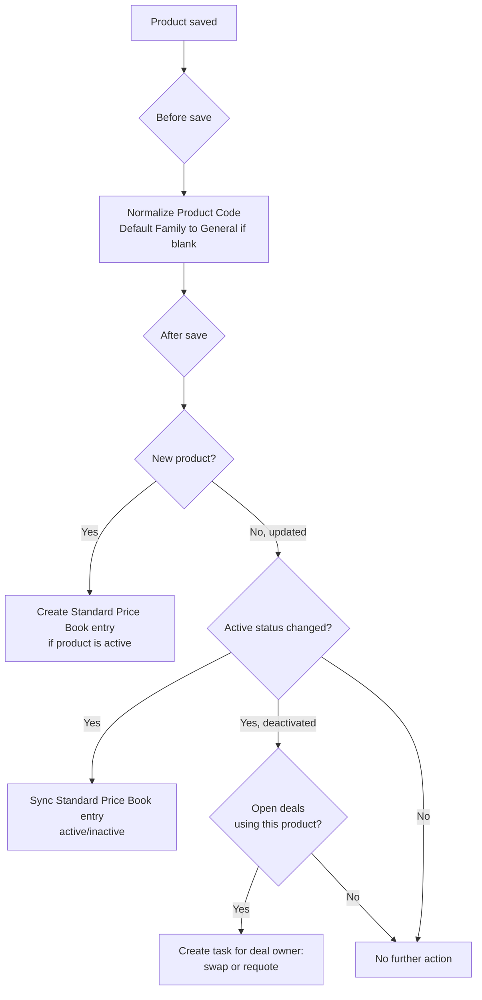

## Overview

This feature keeps the product catalog clean and consistent without any manual follow-up work. Every time
a product is created or edited, its Product Code is automatically tidied up and, if left blank, its Product
Family defaults to "General." Behind the scenes, the standard price book stays in sync automatically — active
products get a price book entry, and entries are switched off the moment a product is deactivated so it can
no longer be added to quotes. If a product is retired while it's still sitting on an open deal, the system
automatically creates a follow-up task for the deal owner so nothing falls through the cracks.



## Prerequisites

```callout
type: note
This behavior runs automatically in the background whenever a product is saved — there is nothing to turn
on or configure. The prerequisites below only affect who can edit products and whether syncing can find a
price book to update.
```

- Ability to create or edit Product records (Product2), typically via the "Manage Products" permission or a Product Catalog Manager permission set
- A Standard Price Book must exist in the org — if none is found, price book syncing is silently skipped (see Validations & Business Rules)

## Steps to Navigate

1. Click the App Launcher and search for **Products**.
2. Click **New** to create a product, or open an existing product record and click **Edit**.

```screenshot
id: product-catalog-management-app-launcher
alt: App Launcher open with "Products" typed into the search box
step: Open the App Launcher and search for Products
url_pattern: /lightning/app/AppLauncher
actions:
  - open_app_launcher
  - search_app_launcher: Products
```

3. Enter the product details, including **Product Name** and **Product Code**.
4. Check or uncheck **Active** to control whether the product is available for quoting.
5. Click **Save**.

```screenshot
id: product-catalog-management-record-page
alt: Product record page showing the normalized Product Code and Family fields
step: Open a saved Product record
url_pattern: /lightning/r/Product2/{recordId}/view
actions:
  - open_record: Product2
```

## Use Cases

### Create a new product with a messy code

1. On the New Product form, enter a Product Code with inconsistent spacing or lowercase letters, e.g. `  widget pro  `.
2. Leave **Product Family** blank.
3. Click **Save**.
4. The record saves with the code automatically trimmed, uppercased, and spaces converted to dashes (e.g. `WIDGET-PRO`), and Family set to **General**.
5. Because the product is active, a Standard Price Book entry is created automatically with a $0 unit price, ready for a pricing team to update.

### Deactivate a product with no open deals

1. Open an existing active product and click **Edit**.
2. Uncheck **Active**.
3. Click **Save**.
4. The product's Standard Price Book entry is automatically deactivated so it can no longer be added to new quotes or opportunities.
5. No follow-up task is created, since no open opportunities reference this product.

### Deactivate a product that's on an open deal

1. Open a product that is currently a line item on one or more open (not-closed) opportunities.
2. Uncheck **Active** and click **Save**.
3. The Standard Price Book entry is deactivated as above.
4. For each open opportunity that still has this product on it, a **Task** is automatically created and assigned to the opportunity owner, subject "Product on this deal was retired — swap or requote," due in 3 days.

```screenshot
id: product-catalog-management-retirement-task
alt: Task record showing the auto-generated "Product on this deal was retired" follow-up
step: Open the Tasks related list on an affected opportunity after deactivating a product tied to it
url_pattern: /lightning/r/Opportunity/{recordId}/view
```

### Reactivate a previously deactivated product

1. Open a deactivated product and click **Edit**.
2. Check **Active** again and click **Save**.
3. If a Standard Price Book entry already exists for the product, it is reactivated. If none exists yet, a new active entry is created.

### Bulk product updates (e.g. data load or mass edit)

1. Update or import multiple product records at once, changing codes, families, or active status across the batch.
2. Every record in the batch gets its Product Code normalized and Family defaulted the same way as a single edit.
3. Price book entries are synced for every product whose active status changed in the batch, and retirement tasks are created for every affected open opportunity across the whole batch — not just the first record.

## Validations & Business Rules

- Automation: a before-save step trims and uppercases `ProductCode`, replacing internal whitespace with dashes; this happens on every insert and update, not just when the code changes.
- Automation: if `Family` is blank on save, it defaults to `"General"`.
- Automation: after a product is inserted, an active product automatically gets a Standard Price Book entry created with `UnitPrice = 0` and `IsActive = true`.
- Automation: after a product's `IsActive` value changes on update, its existing Standard Price Book entry (if any) is updated to match the new active status.
- If the org has no Standard Price Book, price book syncing is skipped entirely — no entries are created or updated, and no error is shown.
- Automation: when a product is deactivated, the system checks for open (not-closed) opportunities with that product as a line item. One task is created per affected opportunity (not per line item), assigned to the opportunity owner, due 3 days out.
- New Standard Price Book entries are always created at a $0 unit price — pricing must be set manually afterward.

## Related Features

- Pricebook Management — for setting actual prices on the entries this feature creates
- Opportunity Line Items — the source of the "open pipeline" check when a product is retired
