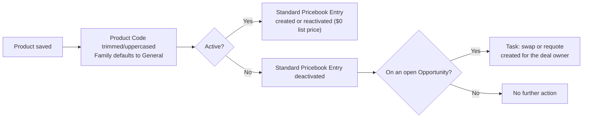

## Overview

The product catalog is the source of truth for everything reps quote and sell. To keep it consistent, saving
a product automatically cleans up its Product Code and fills in a default Family, and activating or
deactivating a product keeps its Standard Pricebook entry in lockstep — so what reps can quote always matches
which products are actually active. Retiring a product that's still sitting on an open deal doesn't fail
silently: the affected reps get a Task telling them to swap the line or requote, so nothing falls through the
cracks mid-sale.



## Prerequisites

- Profile or permission set with edit access to Products (Product2) — see [[opportunity-pipeline-guardrails]] for how those products get added to deals
- An active Standard Pricebook configured for the org, since only the Standard Pricebook is kept in sync automatically

## Steps to Navigate

1. Click the App Launcher, then search for and select **Products**.
2. Click **New** to create a product, or open an existing product record.
3. Enter **Product Name**, and optionally **Product Code** and **Product Family**.
4. Check **Active** to make the product available for quoting.
5. Click **Save**.

```screenshot
id: product-catalog-new-product-form
alt: New Product form with Product Name, Product Code, Family, and Active fields visible
step: Open the Products tab and click New to start a product record
url_pattern: /lightning/o/Product2/new
actions:
  - open_app_launcher
  - search_app_launcher: Products
  - click_app_launcher_result: Products
  - click_new
```

## Use Cases

### Create and activate a new product

1. From the Products tab, click **New**.
2. Enter a Product Name and a Product Code such as `  widget 100  `.
3. Check **Active** and click **Save**.
4. The Product Code is auto-formatted to `WIDGET-100` (trimmed, uppercased, internal spaces become dashes), and Family defaults to **General** if left blank.
5. A Standard Pricebook Entry is created automatically for the product, with a **$0** Unit Price and marked Active — pricing/sales ops must edit the entry to set a real list price before the product is quoted correctly.

```screenshot
id: product-catalog-pricebook-entry
alt: Standard Price Book related list on a Product record showing an auto-created active entry
step: Open a newly activated product and view its Price Books related list
url_pattern: /lightning/r/Product2/{recordId}/view
actions:
  - open_record: Product2
```

### Reactivate a previously deactivated product

1. Open a product that was previously deactivated and already has a Standard Pricebook Entry.
2. Check **Active** and click **Save**.
3. Its existing Standard Pricebook Entry is reactivated (flipped back to Active) rather than a new entry being created.

### Deactivate a product with no open pipeline

1. Open an active product that isn't currently a line item on any open Opportunity.
2. Uncheck **Active** and click **Save**.
3. The product's Standard Pricebook Entry is set to Inactive immediately, so it can no longer be added to new quotes or opportunities. No Task is created.

### Deactivate a product still on open deals

1. Open an active product that appears as a line item on one or more open (not Closed) Opportunities.
2. Uncheck **Active** and click **Save**.
3. The Standard Pricebook Entry is deactivated as above, and a Task — **"Product on this deal was retired — swap or requote"** — is created on each affected open Opportunity, assigned to the Opportunity owner and due in 3 days.
4. Only one Task is created per Opportunity, even if the retired product appears on multiple line items of the same deal.

### Bulk product deactivation

1. Multiple products are deactivated in the same operation, for example a list view mass update or a data import.
2. Every deactivated product's pricebook entry is synced, and every one is checked for open-pipeline exposure in the same transaction — reps across all affected open Opportunities each get their own retirement Task.

## Validations & Business Rules

- Automation (`ProductTrigger` before insert/update -> `ProductCatalogService.normalizeProductCodes`): Product Code is trimmed, uppercased, and internal whitespace replaced with dashes; Family defaults to **General** when left blank.
- Automation (`ProductTrigger` after insert -> `PricebookSyncService.syncStandardEntries`): every newly-inserted Active product gets a Standard Pricebook Entry created at **$0** Unit Price, Active.
- Automation (after update, when the Active flag changes): affected products are re-synced — a product activated for the first time gets a new $0 entry created; a product being reactivated or deactivated has its existing entry's Active flag flipped to match.
- Automation (`ProductCatalogService.warnOpenPipelineOnRetirement`): when a product is deactivated, any open Opportunity with a line item referencing that product gets a Task — **"Product on this deal was retired — swap or requote"** — assigned to the Opportunity owner, due in 3 days. One Task per Opportunity, not per line item.

```callout
type: warning
New pricebook entries are always created at a $0 list price. A product isn't correctly quotable until
pricing/sales ops edits the Standard Pricebook Entry to set a real Unit Price — activating a product alone
does not price it.
```

- Only the org's Standard Pricebook is kept in sync automatically; custom or segmented pricebooks are not touched by this automation and must be maintained manually.

## Related Features

- [[opportunity-pipeline-guardrails]] — products retired mid-deal surface as a Task on the same open Opportunity that this guardrail logic also governs, and reaching Proposal/Price Quote still requires at least one active product line.
- [[quote-generation-approval]] — quotes and their line items pull pricing from the Standard Pricebook entries this automation keeps in sync.
