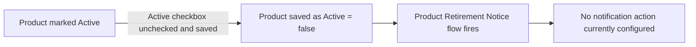

## Overview

Product Retirement Notice is a background automation that watches for products being retired. It fires
automatically whenever a **Product** record is saved with **Active = false**, which is the standard way a
product is marked as no longer sellable. As currently configured in the org, the flow's trigger criteria are
defined but no downstream notification action (email, Chatter post, field update, etc.) has been built into
it yet — so today, deactivating a product does not produce any visible alert to users. This page documents
the trigger behavior so admins know when the flow runs and can extend it once a notification action is added.



## Prerequisites

- "Edit access to the Product2 record (Products) to change its Active status"
- "The Product Retirement Notice flow must be active in Setup > Flows"

```callout
type: note
This flow currently has no actions defined beyond its entry criteria. It is documented here because it is
an active, user-triggered automation — not because it currently produces a visible notification.
```

## Steps to Navigate

The flow itself has no dedicated screen — it runs silently in the background after a Product record is
saved. To trigger it, a user edits a product's Active status from the Product record page.

1. Click the **App Launcher** and search for **Products**.
2. Open the product record that is being retired.
3. Click **Edit**.
4. Uncheck the **Active** checkbox.
5. Click **Save**.

```screenshot
id: product-retirement-notice-active-field
alt: Product record edit panel showing the Active checkbox being unchecked
step: Open a Product record, click Edit, and uncheck the Active checkbox
url_pattern: /lightning/r/Product2/{recordId}/view
actions:
  - open_record: Product2
```

## Use Cases

### Standard retirement (Active unchecked and saved)

1. An admin or product manager opens an existing, active product.
2. They uncheck **Active** and save the record.
3. The Product Retirement Notice flow fires on the after-save update because `IsActive` is now `false`.
4. No further action is currently taken by the flow — the product's Active field is simply updated, and any
   list views or reports filtered on Active status reflect the change.

### Reactivating a retired product

1. A user opens a product that was previously marked inactive.
2. They re-check **Active** and save.
3. Because the flow's entry criteria only match when `IsActive` becomes `false`, reactivating a product does
   **not** trigger this flow — there is no equivalent "un-retirement" notice.

### Bulk deactivation

1. An admin deactivates multiple products at once (for example, via a Data Loader update or a list view
   inline edit across several rows).
2. The flow evaluates independently for each Product2 record saved with `IsActive = false`, since it is an
   after-save, record-triggered flow rather than a batch process.
3. As with the single-record case, no notification action currently fires for any of the records.

## Validations & Business Rules

- **Object:** `Product2`
- **Trigger type:** Record-triggered flow, fires **after save** (`RecordAfterSave`) on **Update** only — it
  does not fire on product creation or deletion.
- **Entry condition:** `{!$Record.IsActive} = false` — the flow only runs when a product is saved with its
  Active checkbox unchecked. Saving a product that is already inactive with no change to Active does not
  re-trigger it (Salesforce record-triggered flows only fire on updates where the record is saved).
- **Current behavior:** the flow contains a trigger definition only; no screen, email alert, or record
  update elements are configured. Any expected "notice" to end users (email, banner, related record flag)
  will need to be added to this flow before it produces a user-facing effect.

## Related Features

- Products (Product2) list views and record pages, where the Active field is edited.
