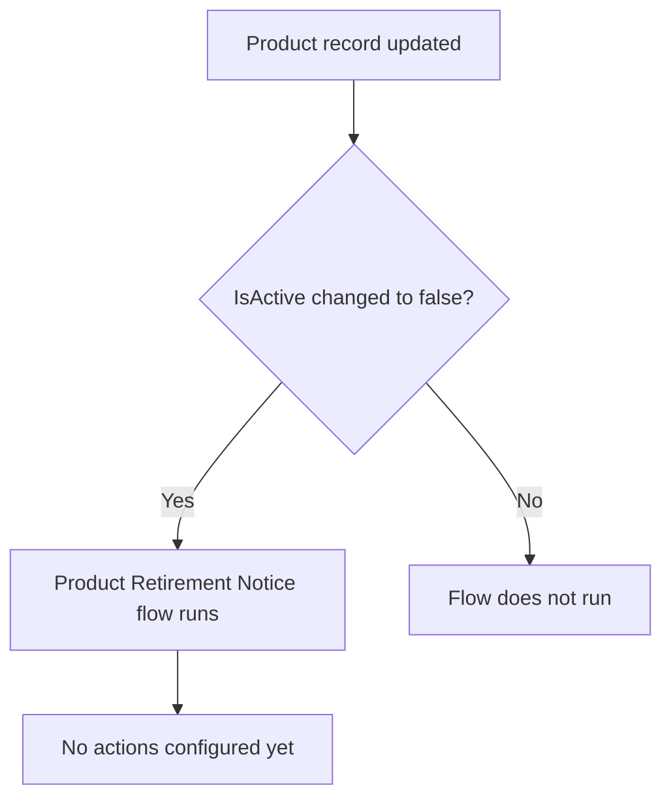

## Overview

The Product Retirement Notice flow watches for the moment a product is retired from the catalog — that is,
when someone unchecks **Active** on a Product record. It is intended to give sales, order management, and
support teams a heads-up that a product they may still be quoting, ordering, or supporting has been taken
out of service.

```callout
type: warning
This flow currently only defines **when** it should run (a product being deactivated). It does not yet
send an email, post a Chatter alert, or take any other action — nothing in the org calls or extends it
today. Treat any "notice" as not yet delivered to users until an action is added to the flow.
```

## Prerequisites

- 'Manage Products' or equivalent permission to open and edit a Product2 record
- The product being retired must already exist in the catalog with **Active** currently checked

## Steps to Navigate

1. From the App Launcher, search for and open **Products**.
2. Open the product record you want to retire.
3. Click **Edit**.
4. Uncheck the **Active** checkbox.
5. Click **Save**.

```screenshot
id: product-retirement-notice-active-field
alt: Product record edit panel with the Active checkbox highlighted
step: Open a Product record, click Edit, and locate the Active checkbox
url_pattern: /lightning/o/Product2/list
```

## Use Cases

### Retire a single product

1. An admin or product manager opens the Product record for an item that is being discontinued.
2. They uncheck **Active** and save the record.
3. The record update fires the Product Retirement Notice flow in the background. No confirmation or
   banner is shown to the user today, since the flow has no configured actions yet.

### Reactivate a previously retired product

1. If a product is un-retired, an admin opens the record and re-checks **Active**.
2. Saving with **Active** set to true does **not** trigger this flow — its entry criteria only match
   when a product is being turned off (`IsActive` changes to `false`), not when it is turned back on.

## Validations & Business Rules

- Trigger: the flow is an auto-launched, record-triggered flow on **Product2**, running **after save** on
  **update** only (it does not run on insert or delete).
- Entry criteria: the flow only fires when the updated record's `IsActive` field evaluates to `false`.
- Reactivating a product (`IsActive` becoming `true`) does not meet the entry criteria and will not run
  this flow.
- No downstream actions (email alerts, field updates, record creation) are currently defined in the flow —
  it is effectively a placeholder for future retirement-notification logic.



## Related Features

- Product Catalog — where products are created, priced, and maintained before retirement
