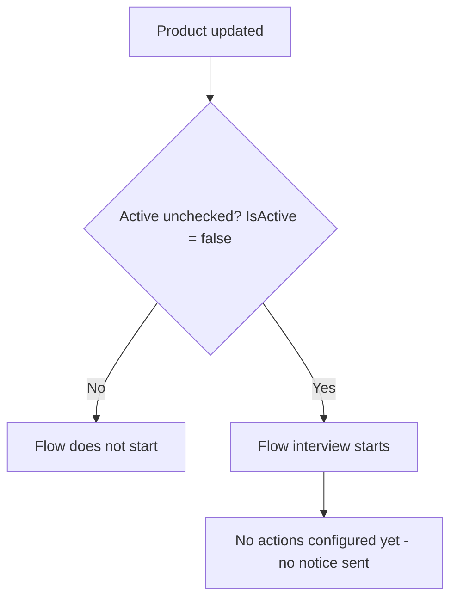

## Overview

Product Retirement Notice is a background automation intended to alert relevant users whenever a
Product is retired from the catalog. It watches Product records for a change in status, and its
entry criteria fire whenever a Product is updated and its **Active** checkbox is unchecked (set to
false) — the standard way a product is marked as no longer sellable.

```callout
type: warning
This flow currently defines only its entry criteria — the trigger fires, but no notification, email
alert, Chatter post, or other action has been configured inside it yet. Deactivating a Product will
not currently produce a visible notice to any user. Treat this page as documentation of the intended
trigger condition until the flow's actions are built out.
```

## Prerequisites

- Standard edit access to the Product object (any user who can update a Product's **Active** status can trigger the entry criteria).
- No other configuration is required — the flow evaluates the Product's own `IsActive` field on every update.

## Steps to Navigate

There is no dedicated screen for this feature — it runs automatically in the background whenever a
Product is saved with **Active** unchecked.

1. Open any Product record.
2. Edit the **Active** checkbox and uncheck it.

```screenshot
id: product-retirement-notice-active-field
alt: Product edit form with the Active checkbox highlighted
step: Open a Product and uncheck the Active field
url_pattern: /lightning/r/Product2/{recordId}/view
actions:
  - open_record: Product2
```

3. Click **Save**.

## Use Cases

### Retiring a Product (deactivating it)

1. Open an existing Product where **Active** is checked.
2. Uncheck **Active**.
3. Click **Save**.
4. The record saves normally. The flow's entry criteria are met (`IsActive` changed to `false`) and
   the flow starts an interview, but since no actions are currently configured inside it, there is no
   visible outcome for the user beyond the normal save — no email, Chatter post, or alert is sent.

### Reactivating a previously retired Product

1. Open an existing Product where **Active** is unchecked.
2. Check **Active** again.
3. Click **Save**.
4. The flow's entry criteria are not met (`IsActive` is `true` after the save), so the flow does not start.

### Updating a Product without changing Active status

1. Edit any other field on the Product (e.g. Product Name or Description) without touching **Active**.
2. Click **Save**.
3. Because the entry criteria only evaluate the saved value of `IsActive`, the flow does not start
   unless this save actually changes the Active status to `false`.

## Validations & Business Rules

- Automation: `Product_Retirement_Notice` is an auto-launched, record-triggered flow on Product2.
- Trigger: fires **after save**, only on **record update** (does not run on Product creation).
- Entry condition: `IsActive = false`.
- As currently built, the flow contains no downstream actions (no email alert, task creation, Chatter
  post, or field update) — it only evaluates the entry criteria. No user-facing retirement notice is
  produced today.



## Related Features

- None documented yet.
