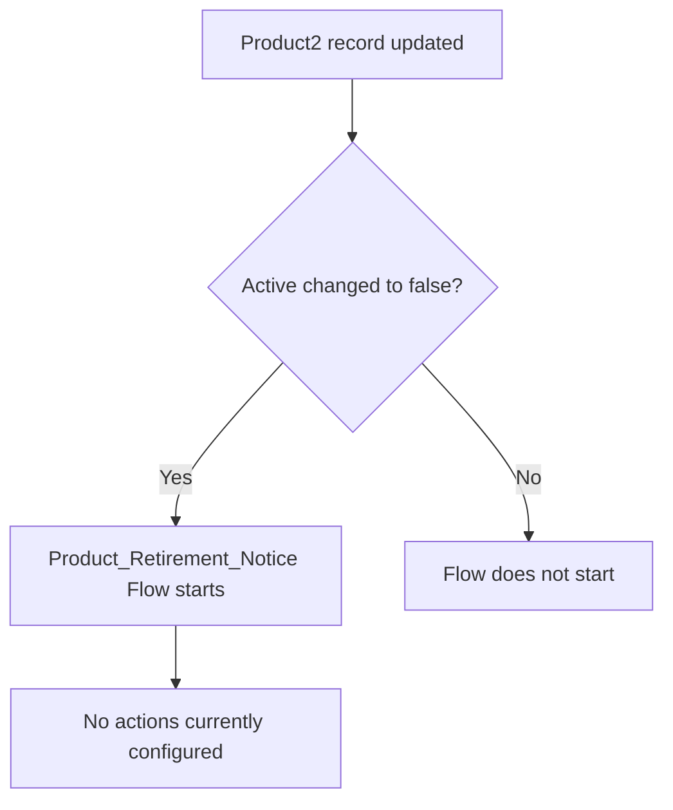

## Overview

This feature is intended to notify users when a Product is being retired, so that sellers and order
teams know it can no longer be used on new opportunities or orders. It is implemented as a
record-triggered Flow that fires immediately after a Product2 record is updated with its
**Active** field turned off.

```callout
type: warning
The **Product_Retirement_Notice** Flow is currently active and will start whenever a Product is
marked inactive, but it has no actions configured yet (no email alert, task, Chatter post, or field
update is created). At this time, deactivating a Product does not produce any visible retirement
notice — this page documents the trigger condition as configured in the org today.
```

## Prerequisites

- The Product's **Active** checkbox must be unchecked (changed from checked to unchecked) on an
  existing Product2 record — the Flow only fires on an update, not on creation.
- No special permission set is required to trigger this Flow — it runs automatically in the
  background whenever a matching Product2 record is saved.

## Steps to Navigate

The retirement notice is not something a user manually navigates to — it is triggered automatically
by editing a Product record. To update a Product so it meets the trigger criteria:

1. Click the **App Launcher** and search for **Products**.
2. Open the Product record you want to retire.
3. Click **Edit**.
4. Uncheck the **Active** field.
5. Click **Save**.

```screenshot
id: product-retirement-notice-active-field
alt: Product record edit form with the Active checkbox unchecked
step: Open an existing Product record and uncheck the Active field
url_pattern: /lightning/r/Product2/{recordId}/view
actions:
  - open_app_launcher
  - search_app_launcher: Products
  - click_app_launcher_result: Products
  - open_record: Product2
```

## Use Cases

### Product marked inactive

1. A user opens an existing, active Product record and unchecks the **Active** field, then saves.
2. Immediately after the record saves, the **Product_Retirement_Notice** Flow evaluates the entry
   condition (`IsActive = false`) and starts an interview.
3. Currently, the Flow performs no further action — no email, task, or Chatter notification is sent.
   The Product is saved normally with no visible difference to the user beyond the unchecked field.

### Product edited but left active

1. A user edits a Product record (e.g. changes its price or description) without changing the
   **Active** field, or saves it with **Active** still checked.
2. The Flow's entry condition is not met, so the Flow does not start for this update.

### Product created as inactive

1. A user creates a brand-new Product record with **Active** unchecked from the start.
2. Because the Flow's trigger type is **Update** (`RecordAfterSave` on an existing record), the
   initial creation of the record does not start the Flow — the retirement logic only evaluates on
   subsequent updates, not on insert.



## Validations & Business Rules

- Automation: **Product_Retirement_Notice** is an auto-launched, record-triggered Flow on the
  Product2 object, configured with `RecordAfterSave` and `Update`-only trigger type.
- Entry condition: the Flow's filter formula is `{!$Record.IsActive} = false` — it only starts when
  an existing Product2 record is saved with **Active** set to false.
- The Flow does not evaluate on Product2 creation (insert), so a Product created as inactive from
  the start will not trigger this Flow.
- As configured, the Flow has no downstream elements (no Decision, Assignment, Create Records, or
  Send Email actions), so no retirement notice is actually delivered to any user today.

## Related Features

- Product and Price Book management screens where Products are marked active or inactive
