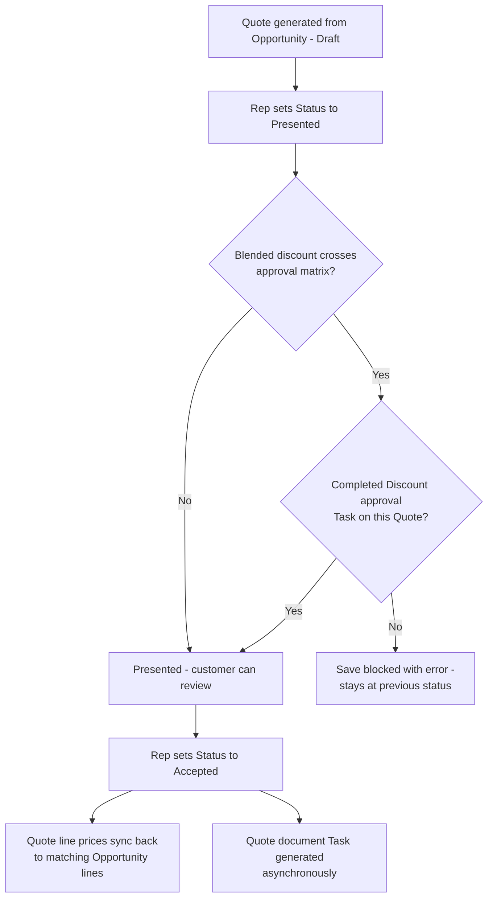

## Overview

This feature covers the full life of a Quote: creating one from an Opportunity's line items, blocking it
from being presented to a customer while a discount is unresolved, generating the quote document once it's
accepted, and pushing accepted quote prices back onto the deal. Sales reps use it to turn a priced
Opportunity into a document they can send, and sales managers rely on the approval gate to make sure
steep discounts get a second look before a customer sees them. It runs automatically as a Quote's
**Status** field changes — reps don't trigger any of the approval, document-generation, or sync steps
directly.



## Prerequisites

- Read access to the Opportunity and its Opportunity Product lines and Pricebook (used to build the Quote)
- Edit access to Quote and Quote Line Item to advance a Quote's **Status**
- A Task with subject starting **"Discount approval"**, related to the Quote, marked **Completed**, before
  a discounted Quote can be moved to **Presented**

## Steps to Navigate

1. Open the Opportunity the quote is for.
2. From the **Quotable Opportunities** component (available on the Home or App page), confirm the
   Opportunity is open and has at least one product line — only opportunities meeting both conditions are
   listed.

```screenshot
id: quote-approval-quotable-opportunities
alt: Quotable Opportunities list component showing open opportunities with products
step: Open the Home or App page that has the Quotable Opportunities component
url_pattern: /lightning/page/home
```

3. A Quote is generated from the Opportunity's line items (Name, Account, Pricebook, and a 30-day
   expiration are set automatically; each Opportunity Product line is copied to a Quote Line Item at its
   priced unit price). The new Quote is created in **Draft** status.
4. Open the new Quote record.

```screenshot
id: quote-approval-quote-record
alt: A newly generated Quote record in Draft status with its Quote Line Items
step: Open the generated Quote record
url_pattern: /lightning/r/Quote/{recordId}/view
```

5. Edit the Quote's **Status** field and set it to **Presented**, then click **Save**.

```screenshot
id: quote-approval-set-presented
alt: Quote edit form with Status being changed to Presented
step: Edit the Quote and set Status to Presented
url_pattern: /lightning/r/Quote/{recordId}/view
actions:
  - open_record: Quote
  - fill_field: { field: Status, value: "Presented" }
  - click_button: Save
```

6. Once the customer accepts, edit the Quote again and set **Status** to **Accepted**, then click **Save**.

```screenshot
id: quote-approval-set-accepted
alt: Quote edit form with Status being changed to Accepted
step: Edit the Quote and set Status to Accepted
url_pattern: /lightning/r/Quote/{recordId}/view
actions:
  - open_record: Quote
  - fill_field: { field: Status, value: "Accepted" }
  - click_button: Save
```

## Use Cases

### Generate a Quote from an Opportunity

1. An Opportunity has at least one Opportunity Product line and is not yet closed — it appears in the
   Quotable Opportunities list.
2. A Quote is generated for that Opportunity: the Quote's Name is the Opportunity's name plus
   " — Quote" (truncated to fit), it's linked to the Opportunity and its Pricebook, its expiration date is
   set to 30 days out, and its Status is **Draft**.
3. Every Opportunity Product line is copied onto the Quote as a Quote Line Item at the same quantity. If
   the source line has a list price, its unit price is recalculated through the pricing engine for the
   account's tier and the product family; otherwise the Opportunity line's existing unit price is used
   as-is.
4. If the Opportunity has no product lines, no Quote Line Items are created — the Quote is generated with
   header data only.

### Present a Quote — discount within approval limits

1. A rep changes a Quote's **Status** to **Presented** and saves.
2. The blended discount across the Quote's lines (based on list price vs. quoted price) is calculated and
   compared against the discount approval matrix.
3. Because the discount doesn't cross the matrix threshold, no approval is required and the save succeeds
   — the Quote is now **Presented**.

### Present a Quote — discount requires approval and none exists

1. A rep changes a Quote's **Status** to **Presented** and saves, but the Quote's blended discount crosses
   the approval matrix.
2. No Task with subject starting **"Discount approval"** exists on the Quote in **Completed** status.
3. The save is rejected with an error naming the exact discount percentage: *"This quote's discount (X%)
   needs a completed approval task first."* The Quote stays at its previous Status, and the block is
   recorded to the sales ops audit trail.
4. A manager reviews and completes the "Discount approval" Task on the Quote. See
   [Pricing and Discount Rules Engine](pricing-and-discount-rules-engine) for how the discount threshold
   itself is defined.
5. The rep sets **Status** to **Presented** again — this time the completed approval Task is found and the
   save succeeds.

### Accept a Quote — prices sync to the Opportunity and a document is generated

1. A rep (or the customer's acceptance being recorded) changes a Quote's **Status** to **Accepted** and
   saves.
2. For each Quote Line Item, the matching Opportunity Product line (same Pricebook Entry) has its unit
   price updated to the accepted Quote's price, only where the price actually differs. The Opportunity
   Amount follows from the Opportunity Product line total.
3. In the background, a document-generation job runs for the accepted Quote and logs a completed Task
   ("Quote document generated: <Quote Name>") summarizing the total and expiration date — this stands in
   for delivering the actual PDF/document to the customer.
4. Because the Opportunity now has an Accepted quote, it becomes eligible to move to **Closed Won** (see
   stage-guard rules on the Opportunity).

### Accept a Quote with no matching Opportunity lines

1. A Quote is accepted, but one or more of its Quote Line Items use a Pricebook Entry that has no matching
   line on the Opportunity (or the Quote isn't linked to an Opportunity at all).
2. Those Quote Line Items are simply skipped during sync — only Opportunity lines with a matching Pricebook
   Entry are updated. If the Quote has no Opportunity, nothing is synced.
3. The quote document Task is still generated regardless of whether any Opportunity lines were updated.

## Validations & Business Rules

- Approval gate: moving a Quote's **Status** to **Presented** is blocked unless its blended discount is
  under the approval-matrix threshold, or a Task on that Quote with subject starting **"Discount
  approval"** is marked **Completed**. The block only fires on the transition into Presented, not on other
  edits.
- Blended discount is calculated per Quote as `(1 − total sold price ÷ total list price) × 100`, based on
  its Quote Line Items' List Price, Unit Price, and Quantity.
- Every blocked presentation attempt is written to the sales ops audit trail with the quote name and
  discount percentage.
- Sync on acceptance: only fires on the transition into **Accepted** status. It updates Opportunity Product
  line Unit Price to match the accepted Quote Line Item's price wherever the Pricebook Entry matches and the
  price differs; the update is done with the Opportunity Product line trigger bypassed to avoid recursive
  automation.
- Document generation: an asynchronous (Queueable) job runs once per newly-Accepted Quote and logs a
  completed Task recording the quote total and expiration date; it does not currently attach a real file.
- All of this automation can be bypassed org-wide for a given object via the trigger bypass utility, which
  is used internally (for example, during the Opportunity-line sync) to prevent one update from re-firing
  another object's trigger.
- Quote generation only offers Opportunities that are open (`IsClosed = false`) and already have at least
  one Opportunity Product line.

## Related Features

- [Pricing and Discount Rules Engine](pricing-and-discount-rules-engine) — defines the discount approval
  matrix and how "Discount approval" Tasks get created on Opportunities.
- [Quote Expiry Alert](quote-expiry-alert) — a separate flow that watches for Quotes moving into
  **Presented** status.
