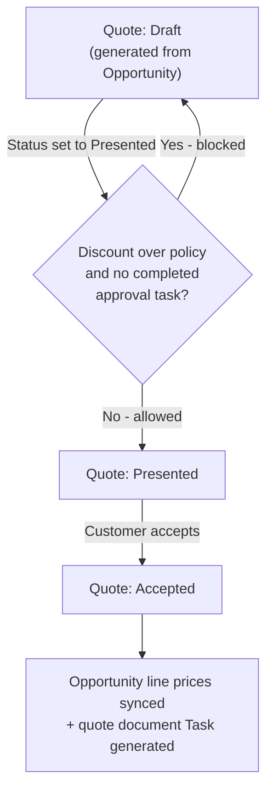

## Overview

This feature covers a Quote's journey from creation to closed deal: generating a priced quote from an
opportunity, blocking any quote with an out-of-policy discount from being presented until a manager signs
off, and keeping the opportunity's pricing in sync once a quote is accepted. Sales reps and sales
operations use this to make sure no discount above policy goes out to a customer without an approval trail,
and to avoid the opportunity and quote pricing drifting apart after a deal is negotiated.



## Prerequisites

- Read access to Opportunity, Quote, QuoteLineItem, and OpportunityLineItem
- Ability to create and complete Tasks (used as the discount approval record)
- A Pricebook and Pricebook Entries already assigned to the opportunity being quoted

```callout
type: note
Quote generation and the accept-and-sync flow in this feature are driven by Apex service calls
(from an orchestration process or an admin action), not by a dedicated button in the Quote Builder
component today. The Quote Builder page currently surfaces which opportunities are ready to be
quoted; the sections below document what happens once a quote exists and moves through its
lifecycle.
```

## Steps to Navigate

1. From the App Launcher, search for and open **Quote Builder**.
2. Review the **Quotable Opportunities** list — it shows open opportunities that already have at least
   one product line, ordered by most recently modified, so you can see at a glance which deals are ready
   to be quoted.
3. Click into an opportunity from the list (or from the Opportunities tab) to open its record page.
4. Open the **Quotes** related list on the opportunity to view any quotes already generated for that
   opportunity, or to open an existing quote and check its status.

```screenshot
id: quote-approval-generation-sync-builder
alt: Quote Builder page showing a list of quotable opportunities with name, stage, and amount
step: Open the App Launcher, search for and open Quote Builder
url_pattern: /lightning/n/Quote_Builder
actions:
  - open_app_launcher
  - search_app_launcher: Quote Builder
  - click_app_launcher_result: Quote Builder
```

```screenshot
id: quote-approval-generation-sync-quote-record
alt: Quote record page showing Status, GrandTotal, and the related Task list
step: Open a Quote record from the Opportunity's Quotes related list
url_pattern: /lightning/r/Quote/{recordId}/view
```

## Use Cases

### Generate a quote from an opportunity

1. An opportunity with at least one product line is selected for quoting (visible in the Quote Builder
   list once it is open, has line items, and hasn't already closed).
2. A new **Quote** is created in **Draft** status, named after the opportunity, linked to the
   opportunity's pricebook, and given an **Expiration Date** 30 days out.
3. Every opportunity line is copied onto the quote as a quote line. Where the source line has a list
   price, the quote line's unit price is recalculated by the discount/pricing engine for the account's
   tier and product family rather than simply copying the opportunity's price.
4. The rep works the quote (adjusts quantities, prices, or products) while it stays in Draft.

### Present a quote within discount policy (standard path)

1. The rep changes the quote's **Status** to **Presented** (or clicks **Present Quote** if your org
   exposes it as a button) once it's ready to send to the customer.
2. The system calculates the quote's blended discount (comparing total list price to total sold price
   across all quote lines).
3. Because the discount is within policy, the status change is allowed and the quote moves to
   **Presented** with no further action needed.

### Present a quote that exceeds discount policy (approval-gated path)

1. The rep changes the quote's **Status** to **Presented**, but the blended discount is either **over
   30%**, or **over 20% on a deal worth more than $100,000**.
2. No completed approval **Task** exists yet for this quote, so the status change is rejected — the rep
   sees an error naming the calculated discount percentage and the quote stays in **Draft**.
3. The block is logged to the sales-ops audit trail so operations can see which quotes have been held up
   for discount review and at what discount level.
4. A manager or approver creates (or is assigned) a Task on the quote whose **Subject** starts with
   **"Discount approval"** and marks it **Completed** once they approve the discount.
5. The rep changes the quote's Status to **Presented** again — this time the completed approval task is
   found and the status change succeeds.

```screenshot
id: quote-approval-generation-sync-blocked-error
alt: Error banner on the Quote record showing the discount-approval-required message after attempting to present the quote
step: Change a Quote's Status field to Presented on a quote whose discount exceeds policy and attempt to save
url_pattern: /lightning/r/Quote/{recordId}/view
```

### Customer accepts the quote

1. Once the customer agrees to the terms, the rep (or an integrated e-signature process) sets the
   quote's **Status** to **Accepted**.
2. For every quote line, any opportunity line sharing the same product/pricebook entry has its unit
   price updated to match the accepted quote line's price — so the opportunity amount reflects exactly
   what was quoted and accepted, not an earlier negotiated price.
3. A background job generates the quote document: it logs a completed Task on the quote ("Quote document
   generated: ...") recording the grand total and expiration date, which serves as the auditable record
   that the document was produced and sent.
4. The accepted quote is now eligible to be converted into an Order (see Related Features).

### Multiple quotes accepted in bulk (e.g. via data load or integration)

1. When several quotes are updated to Accepted in the same transaction (for example, a bulk update or
   an integration accepting multiple quotes at once), the price sync runs once across all of them,
   matching each opportunity's lines to its own accepted quote's lines rather than mixing quotes across
   opportunities.
2. A separate document-generation job is queued for each accepted quote individually, so every quote
   still gets its own completed "Quote document generated" Task.

## Validations & Business Rules

- **Discount approval gate**: changing a Quote's Status to `Presented` is blocked (`addError`) if the
  blended discount exceeds policy — **over 30%**, or **over 20% on deals over $100,000** — unless a Task
  with Subject starting `Discount approval` and Status `Completed` already exists on that quote.
- **Blended discount calculation**: computed per quote as `(1 − total sold price ÷ total list price) ×
  100` across all of that quote's QuoteLineItems; quotes with no list-priced lines aren't evaluated.
- **Audit trail**: every blocked presentation attempt is recorded via the sales-ops audit service, noting
  the quote name and the discount percentage that triggered the block.
- **Price sync on acceptance**: only opportunity lines that share the same Pricebook Entry as an accepted
  quote line are updated, and only when the price actually differs — this update bypasses the standard
  Opportunity Line trigger to avoid recursive automation.
- **Document generation**: quote PDF/document generation is simulated by queuing a job that logs a
  completed Task with the quote's total and expiration date; this only fires the first time a quote's
  Status transitions into `Accepted`.
- **Bypass control**: all of the above quote automation (approval gate, price sync, document queueing)
  is skipped entirely if Quote automation has been bypassed for the transaction (used by admin/data-load
  tooling).

## Related Features

- Discounting and pricing tiers that determine quote line prices and the approval threshold (PriceRuleEngine)
- Converting an accepted quote into an Order
- Opportunity stage guard rules that may require an accepted quote before an opportunity can close
