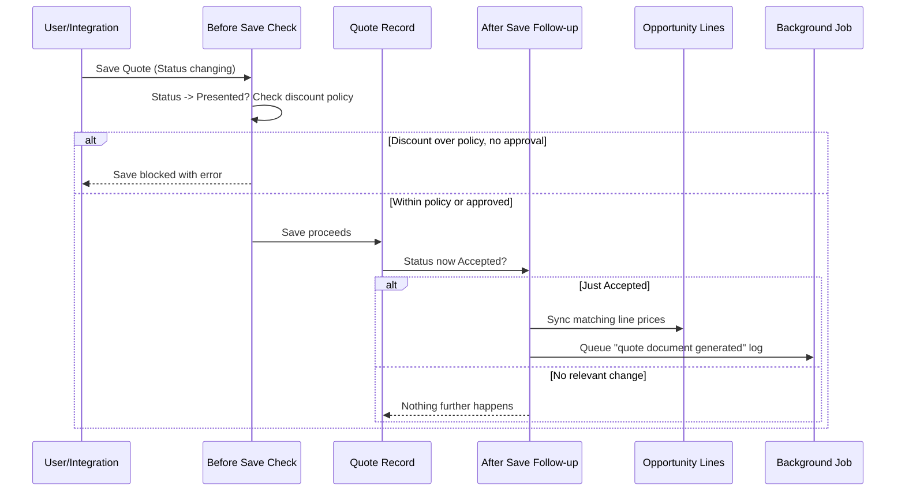

## Overview

Every time a Quote record is saved, Salesforce automatically checks and reacts to what changed — the
user never runs this separately. Before the save completes, it checks whether the quote is being moved
to **Presented** and, if the discount is too steep, blocks the save until a manager has signed off. After
the save completes, if the quote just became **Accepted**, it pushes the accepted prices onto the related
opportunity and kicks off a background job that logs the quote document as generated. This page describes
that automatic wiring itself — what runs, in what order, and how it can be turned off for scripted or
data-load contexts. For the detailed business rules behind the discount policy and the price sync, see
[Quote Lifecycle: Generation, Approval, PDF & Sync](quote-lifecycle-generation-approval-sync).



## Prerequisites

- Ability to edit a Quote record (Status field in particular) — this automation runs for anyone who can
  save a Quote, including integrations and data loads
- No separate permission set enables or disables this behavior; it runs automatically unless explicitly
  bypassed by an admin/integration script

```callout
type: note
This automation can be temporarily bypassed for a given save context (used by scripted data loads and
admin tools) so that a script setting Quote status directly doesn't re-trigger the discount gate, price
sync, or document logging. Day-to-day users in the UI never see or set this bypass.
```

## Steps to Navigate

This automation has no separate screen of its own — it runs in the background whenever a Quote is saved
from its record page.

1. Open the Quote record you want to change.

```screenshot
id: quote-automation-quote-record
alt: Quote record page showing the Status field before a save
step: Open a Quote record
url_pattern: /lightning/r/Quote/{recordId}/view
```

2. Edit the **Status** field (for example, to **Presented** or **Accepted**) and click **Save**.

```screenshot
id: quote-automation-status-save
alt: Quote Status field being edited with the Save button visible
step: Edit the Quote's Status field and click Save
url_pattern: /lightning/r/Quote/{recordId}/view
```

3. If the save goes through, the automation has already run silently — check the Activity timeline for a
   completed "Quote document generated" Task after an acceptance, or check related Opportunity line prices.
   If the save is blocked, an error banner explains why (see Use Cases below).

## Use Cases

### Routine save with no status change

1. A user edits an unrelated field on a Quote (for example, a description) and saves.
2. Neither the before-save discount check nor the after-save sync/PDF logic finds a relevant status
   transition, so nothing else happens — the save completes as a normal record update.

### Moving a quote to Presented within policy

1. A user changes Status from **Draft** to **Presented** and saves.
2. The before-save check calculates the quote's blended discount. Because it's under the policy threshold,
   the save proceeds with no error.

### Moving a quote to Presented over the discount policy (blocked)

1. A user changes Status to **Presented** on a quote whose blended discount exceeds the policy threshold
   and no completed approval Task exists yet.
2. The save is blocked before it commits — the user sees an error on the record naming the exact discount
   percentage, and Status stays unchanged.
3. Once a manager completes the required approval Task, the same user retries the Status change to
   **Presented** and it now saves successfully.

### Accepting a quote (after-save sync and document logging)

1. A user changes Status to **Accepted** and saves.
2. The save itself completes immediately; afterward, the automation updates matching Opportunity line
   prices to the accepted quote's prices, and queues a background job that logs a completed Task recording
   the quote document was generated.
3. Because the price sync and document logging happen after the record is saved, the user doesn't wait on
   them — the Opportunity lines and the logged Task typically appear within moments of the save.

### Bulk or integration saves

1. When many Quotes are updated to **Accepted** in one operation (bulk edit, data load, or integration),
   the same before/after logic runs for the whole batch together — one discount check per quote being
   presented, and one combined pass syncing Opportunity lines for every quote being accepted in that save.
2. A separate background document-logging job is queued per accepted quote, not one job for the whole batch.

### Bypassed context (admin/integration scripts)

1. An admin or integration script explicitly bypasses Quote automation before updating Quote records
   directly (for example, to correct data without re-running the discount gate or re-syncing prices).
2. While the bypass is active, Quote saves in that same transaction skip the discount gate, the price sync,
   and the document-logging job entirely — the record simply saves as given.
3. The bypass is scoped to that transaction; ordinary UI saves elsewhere are unaffected.

## Validations & Business Rules

- **Runs on every Quote update:** the automation fires on both before-save and after-save for any Quote
  record update — it does not run on insert or delete.
- **Before save — discount gate:** only evaluated when Status is changing *to* **Presented**; if the
  quote's discount fails the policy check and no completed approval Task exists, the save is blocked with
  `addError` and the record is not committed.
- **After save — acceptance follow-up:** only evaluated when Status is changing *to* **Accepted**; it syncs
  matching Opportunity line prices and queues one asynchronous document-logging job per newly accepted
  quote. Both are skipped entirely if the status change isn't a transition into Accepted.
- **Bypass respected everywhere:** every part of this automation — gate, sync, and document logging —
  checks a shared bypass flag first and does nothing if that flag is set for Quote in the current
  transaction.
- Full business rules for the discount threshold, the approval Task requirement, and the price-sync
  matching logic are documented on
  [Quote Lifecycle: Generation, Approval, PDF & Sync](quote-lifecycle-generation-approval-sync).

## Related Features

- Quote Lifecycle: Generation, Approval, PDF & Sync — the detailed discount policy, approval process, and
  price sync this automation enforces
- Pricing & Discounting Margin Rules — the rules engine behind the discount and pricing checks
