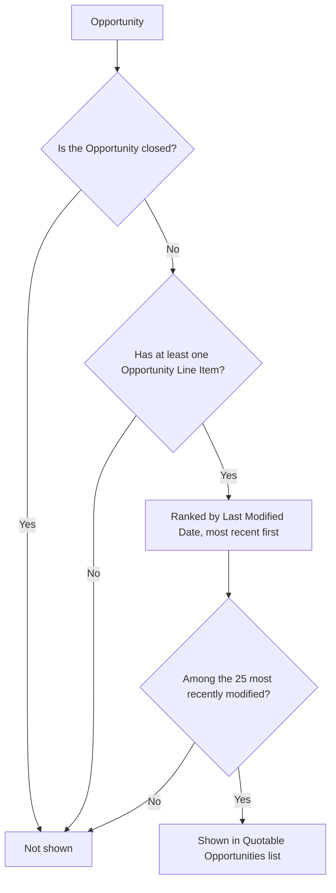

## Overview

The Quote Builder component — labeled **Quotable Opportunities** on the page — gives sales reps and
managers a quick, always-current view of which open deals already have priced products and are ready
for a Quote to be created. Instead of building a list view or hunting through Opportunity records, a
rep can glance at this card wherever an admin has placed it and see the Name, Stage, and Amount of each
candidate deal.

```callout
type: note
This component only **displays** candidate Opportunities. It does not itself create a Quote record.
Actually generating a Quote from an Opportunity — copying products, pricing lines, setting an expiration
date — happens through a separate process. See [[quote-lifecycle-generation-approval]] for how a Quote
is generated, approved, and accepted.
```

## Prerequisites

- Read access to the Opportunity object and its Name, Amount, and Stage fields.
- Read access to Opportunity Line Items (used only to determine whether an Opportunity qualifies).
- The **Quotable Opportunities** component must already be placed on a Home Page, App Page, or
  Opportunity record page by an admin in Lightning App Builder — it does not appear anywhere on its own.

## Steps to Navigate

1. Open whichever page an admin has placed the component on — for example, click the **App Launcher**
   and search for **Home**, or open an Opportunity record page that includes it.
2. Locate the **Quotable Opportunities** card.
3. Review the listed Opportunities — each row shows the Opportunity **Name**, **Stage**, and **Amount**.

```screenshot
id: quote-builder-list
alt: Quotable Opportunities card listing open opportunities with name, stage, and amount
step: Open the Home page (or an Opportunity record page) where the Quotable Opportunities component is placed
url_pattern: /lightning/page/home
```

## Use Cases

### Viewing opportunities ready for quoting (happy path)

1. A rep opens a page with the Quotable Opportunities component.
2. The component loads open Opportunities that already have at least one product line, most recently
   modified first.
3. The rep reads off the Name, Stage, and Amount for each listed deal to decide which one to quote next.

### More qualifying opportunities than the list shows (bulk path)

1. A team or org has more than 25 open Opportunities with products on them at once.
2. The component only shows the 25 most recently modified matches — older, less-recently-touched
   Opportunities that still qualify won't appear until they rise into that most-recent set.
3. A rep looking for a specific older deal won't find it in this card and needs to search or use an
   Opportunity list view instead.

### No qualifying opportunities (empty state)

1. Every Opportunity is either closed or has no product lines yet, so none qualify.
2. The card renders with no rows and no explicit "no opportunities" message — it simply appears empty.

### Opportunity drops off the list

1. An Opportunity that was shown in the list is later marked Closed Won or Closed Lost, or has all of its
   product lines removed.
2. The next time the component loads, that Opportunity no longer qualifies and is no longer shown.



## Validations & Business Rules

- The component wires to `QuoteGenerationService.getQuotableOpportunities`, an Apex method marked
  `cacheable=true`, which queries: `IsClosed = false AND HasOpportunityLineItem = true`, ordered by
  `LastModifiedDate DESC`, limited to 25 rows.
- The component is read-only — it renders the returned list but has no button or action to create a
  Quote. Generating a Quote from an Opportunity is a separate capability; see
  [[quote-lifecycle-generation-approval]].
- Because the underlying wire is cacheable, the list may not immediately reflect changes made elsewhere
  in the same session; there is no manual refresh control on the card, so a full page reload may be
  needed to see the latest set.
- If the Apex call returns an error, the component does not surface any error message to the user — the
  card simply shows no rows.
- The component can be added to Home, App, or Record pages (it is exposed with `isExposed=true` for
  `lightning__RecordPage`, `lightning__HomePage`, and `lightning__AppPage`); which pages actually show it
  depends entirely on where an admin has placed it.

## Related Features

- For how a Quote is actually generated from an Opportunity, gated by discount approval, and accepted,
  see [[quote-lifecycle-generation-approval]].
