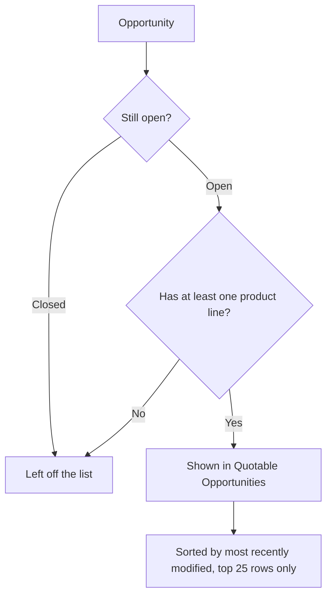

## Overview

Quote Builder (the "Quotable Opportunities" component) is a small, drop-in tile an admin can place on
a Home, App, or Record page in Lightning App Builder. Once placed, it shows anyone viewing that page a
read-only worklist of up to 25 open opportunities that already have at least one product line — in
other words, the deals that are actually ready to be turned into a quote. It's a discovery aid, not a
quoting workflow by itself: the component only displays the list, it doesn't include a button to
generate a quote. Reps still generate the quote from the opportunity record itself, as documented in
[Quote Lifecycle: Generation, Approval, PDF & Sync](quote-lifecycle-generation-approval-sync).

## Prerequisites

- An admin must add the **Quotable Opportunities** component to a Home, App, or Record page using
  Lightning App Builder — it isn't exposed anywhere until placed
- Anyone viewing the page needs read access to the Opportunity object (Id, Name, Amount, StageName);
  without it, the component silently shows no rows

```callout
type: note
This component only lists opportunities — it has no button or action to generate a quote. To actually
create a quote, open one of the listed opportunities and follow the steps in
[Quote Lifecycle: Generation, Approval, PDF & Sync](quote-lifecycle-generation-approval-sync).
```

## Steps to Navigate

1. As an admin, click the gear icon in the top-right, then click **Edit Page** (on a Home page) or open
   **Lightning App Builder** from Setup for the app/record page you want to add it to.
2. Drag the **Quotable Opportunities** component from the component panel onto the page layout.
3. Click **Save**, and **Activate** the page assignment if prompted (org default, app default, or
   specific app/profile/record type).

```screenshot
id: quote-builder-app-builder-add
alt: Lightning App Builder with the Quotable Opportunities component dragged onto a Home page
step: Open Lightning App Builder for a Home page and drag the Quotable Opportunities component onto the layout
url_pattern: /lightning/setup/FlexiPageList/home
```

4. Anyone with access to that page can now open it to see the current worklist.

```screenshot
id: quote-builder-component-view
alt: Quotable Opportunities card on the Home page listing open opportunities with stage and amount
step: Open the Home page (or app/record page) where the Quotable Opportunities component was placed
url_pattern: /lightning/page/home
```

## Use Cases

### View the quoting worklist

1. Open the Home, App, or Record page where the component has been placed.
2. The **Quotable Opportunities** card lists each qualifying opportunity as `Name — Stage (Amount)`,
   most recently modified first, capped at 25 rows.
3. The rows are plain text, not links — clicking a row does nothing. To act on one, find the same
   opportunity through the Opportunities tab, a list view, or global search.
4. To actually generate a quote, open that opportunity record and use the **New Quote** action described
   in [Quote Lifecycle: Generation, Approval, PDF & Sync](quote-lifecycle-generation-approval-sync).

### No opportunities are eligible yet

1. If no open opportunity currently has a product line item, the card renders with no list at all —
   there's no "No opportunities found" message, the body is simply empty below the card title.
2. This is expected once an opportunity gets a Pricebook and at least one product line added — it will
   then appear the next time the page loads.

### Newly qualifying opportunity doesn't show up yet

1. A rep adds the first product line to an opportunity, making it newly eligible.
2. The Quote Builder component doesn't automatically refresh in the background — if it was already open
   in another tab or hasn't been reloaded, the new opportunity won't appear until the page is refreshed
   or reopened.

## Validations & Business Rules



- **Eligibility filter:** the list only ever includes opportunities where `IsClosed = false` and
  `HasOpportunityLineItem = true` — closed opportunities and open ones with no product lines never
  appear, regardless of amount or stage.
- **Row cap:** only the 25 most recently modified qualifying opportunities are shown; older eligible
  opportunities beyond that cap are not listed.
- **No manual or automatic refresh:** the underlying data is fetched once via a cacheable wire — the
  component has no refresh button, so a page reload is the only way to see newly qualifying
  opportunities or drop ones that were just closed.
- **Silent on error:** if the query fails (e.g. a field-level security issue), the component shows an
  empty card with no error message — there's no visible indication that something went wrong versus
  there simply being nothing to show.
- **Read-only:** the component itself performs no DML and has no action to create a quote; quote
  creation, pricing, approval, and acceptance are handled entirely by the flow documented in
  [Quote Lifecycle: Generation, Approval, PDF & Sync](quote-lifecycle-generation-approval-sync).

## Related Features

- Quote Lifecycle: Generation, Approval, PDF & Sync — the actual quote-generation flow a rep uses after
  spotting an eligible opportunity here
