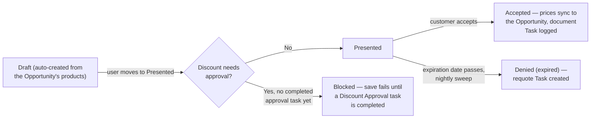

## Overview

Quote Builder turns an Opportunity's products into a priced Quote automatically, applying the same volume,
customer-tier, and product-family pricing rules used elsewhere in the pipeline. Once a quote is ready to send
to the customer, moving it to **Presented** is blocked if its discount is steep enough to need sign-off —
sales ops sees this as an approval Task on the quote. Once a customer accepts a quote, its negotiated prices
become the deal's official prices on the Opportunity, and a completed Task logs that the quote document was
generated. Quotes left sitting unactioned past their expiration date are automatically closed out so they
don't linger as false pipeline.



## Prerequisites

- The Opportunity must already have at least one product (Opportunity Line Item) — a quote's lines are copied from these
- The Opportunity's Account Rating (tier) should be set, since Hot/Warm tiers unlock an extra discount

## Steps to Navigate

1. Click the **App Launcher** and search for **Quotes**, or open the parent Opportunity and use its **Quotes** related list.
2. To see which open opportunities are ready to be quoted (they already have products on them), view a page with the **Quotable Opportunities** component placed on it.

```screenshot
id: quote-builder-quotable-opportunities
alt: Quotable Opportunities card listing open opportunities that already have products
step: View a page that has the Quotable Opportunities component placed on it
url_pattern: /lightning/page/home
```

3. Open a generated Quote record to see its **Status**, **Grand Total**, **Expiration Date**, and product lines.

```screenshot
id: quote-builder-record-page
alt: Quote record page showing Status, Grand Total, and Expiration Date
step: Open a Quote record to view its details
url_pattern: /lightning/r/Quote/{recordId}/view
actions:
  - open_record: Quote
```

## Use Cases

### A quote is generated from an Opportunity

1. A Quote is generated for an Opportunity that already has products on it.
2. The Quote is created in **Draft** status, named "`<Opportunity Name>` — Quote", copied to the same
   Pricebook as the Opportunity, and given an **Expiration Date 30 days out**.
3. Each of the Opportunity's product lines becomes a Quote Line at a recalculated price: a **volume
   discount** based on quantity and product family, plus an extra discount if the account is tiered Hot
   (+8%) or Warm (+4%), plus a small product-family adjustment (Subscription products get +2% more discount;
   Services products get 3% less, to protect services margin) — stacked and capped at **40% off list**, and
   never priced below a family-specific margin floor (75% of list for Services, 55% for Hardware, 60% for
   everything else).

### A quote's discount is small enough to present without approval

1. A rep moves a quote's Status to **Presented** (e.g. after sending it to the customer).
2. The quote's blended discount across all its lines is 20% or less (or the deal is 20–30% off but the
   quote's Grand Total is $100,000 or less).
3. The status change saves normally — no approval is required.

### A quote's discount is steep enough to require approval

1. A rep moves a quote's Status to **Presented**, but the blended discount across its lines is **over 30%**,
   or **over 20% on a quote worth more than $100,000**.
2. The status change is blocked with an error: *"This quote's discount (`<N>`%) needs a completed approval
   task first."*
3. A manager (or whoever the process designates) completes a Task titled **"Discount approval…"** on the
   quote record.
4. The rep tries **Presented** again — this time it succeeds, since a completed approval task now exists.

### A quote is accepted

1. A quote's Status is set to **Accepted** (typically once the customer signs off).
2. Any of its Quote Lines whose product also appears on the parent Opportunity have their **negotiated unit
   price copied onto the matching Opportunity Line** — so the deal's own numbers now match what was actually
   quoted.
3. A completed Task is logged noting the quote's document was generated, including its final total and
   validity date — this is an audit-trail entry, not an emailed file; no actual PDF attachment is produced
   by this step.

### A quote expires unactioned

1. A quote is left in **Presented** status past its **Expiration Date**.
2. An overnight sweep sets its Status to **Denied** — this org uses the standard "Denied" status to represent
   an expired, unactioned quote (there is no separate "Expired" value).
3. A follow-up Task ("Quote expired — requote") is created for the quote's owner, due in 2 days, prompting
   them to requote the customer.

## Validations & Business Rules

- **Volume discount by product family and quantity:** Hardware gets 18% at 500+ units, 12% at 100+, 6% at
  25+; Software/Subscription gets 25% at 1,000+, 15% at 250+, 8% at 50+; all other families get 10% at 100+,
  5% at 20+.
- **Customer-tier discount:** an extra 8% off for accounts tiered Hot, 4% for Warm, 0% for Cold/untiered.
- **Product-family adjustment:** Subscription lines get an extra 2% discount; Services lines get 3% less
  discount (services margin is protected).
- **Discount cap:** the combined discount from the three rules above is always capped between 0% and 40%.
- **Margin floor:** regardless of the discount math, a line's price is never allowed below its family's
  floor — 75% of list for Services, 55% for Hardware, 60% for everything else. If the discount would breach
  the floor, the price is raised back up to the floor price.
- **Presentation approval gate:** moving a Quote's Status to Presented is blocked unless its blended discount
  (computed across all its lines) is 30% or less, and — if over 20% — its Grand Total is $100,000 or less;
  otherwise a completed Task titled "Discount approval…" must already exist on the quote.
- **Expiration sweep:** runs as part of the nightly sales-ops jobs — any quote still in Presented status past
  its Expiration Date is automatically set to Denied and gets a "requote" follow-up Task.
- **Acceptance sync is one-directional and one-time:** accepting a quote pushes its prices onto matching
  Opportunity Lines once; there is no live, ongoing sync while a quote is still being edited, and nothing
  pushes Opportunity price changes back onto the quote.
- **No separate approval permission is enforced in the system** — the approval gate is satisfied by anyone
  completing a "Discount approval…" Task on the quote, so this should be governed by team process (e.g. only
  managers create/complete that Task), not by a Salesforce permission restriction.

## Related Features

- Opportunity Pipeline Guardrails — uses the same pricing engine to reprice an Opportunity's own product lines, and requires an Accepted quote before a deal can be marked Closed Won.
- Order Fulfillment & Activation — an accepted quote is what an Order is created from.
