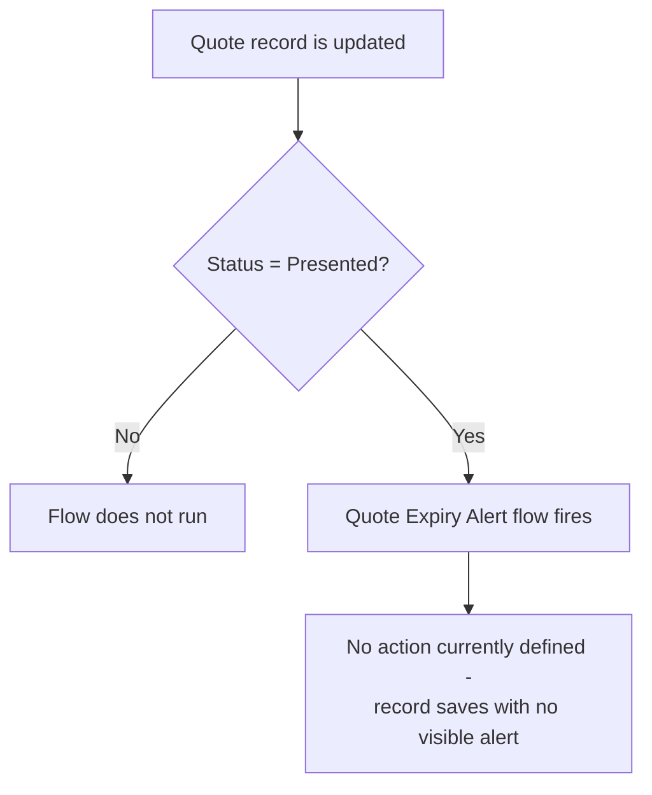

## Overview

Quote Expiry Alert is a record-triggered flow on the Quote object. It is meant to catch the moment a Quote
is marked **Presented** to a customer, so the business can track or act on quotes that are now out for
review and may need follow-up before they lapse.

```callout
type: warning
As currently configured, this flow only defines its **entry criteria** (when it fires). It does not yet
contain any downstream action — no email alert, Task, Chatter post, or field update is created when the
criteria are met. Until an action is added to the flow, saving a Quote into the Presented status will not
produce any visible notification to users.
```

## Prerequisites

- Edit access to the Quote record (the flow runs automatically after a Quote is saved)
- The **Quote Expiry Alert** flow must be Active in Setup > Flows

## Steps to Navigate

This is a background automation — it is not opened or run manually from the UI. It fires automatically
whenever a Quote is updated and its criteria are met.

1. Open any existing Quote record.
2. Edit the **Status** field and set it to **Presented**.
3. Click **Save**.

```screenshot
id: quote-expiry-alert-status-field
alt: Quote edit form with the Status field set to Presented
step: Edit a Quote's Status field to Presented and save
url_pattern: /lightning/r/Quote/{recordId}/view
actions:
  - open_record: Quote
  - fill_field: { field: Status, value: "Presented" }
  - click_button: Save
```

## Use Cases

### Quote is updated into Presented status

1. A user edits an existing Quote and changes the **Status** field to **Presented**.
2. The user clicks **Save**.
3. Because the saved record's Status is Presented, the Quote Expiry Alert flow's entry criteria are met
   and the flow runs in the background.
4. No further action currently occurs — the flow has no configured actions, so the record simply saves
   normally with no visible alert, message, or additional field change.

### Quote is updated but not set to Presented

1. A user edits an existing Quote and sets or leaves the **Status** at any value other than **Presented**
   (for example, Draft or Accepted).
2. The user clicks **Save**.
3. The flow's entry criteria are not met, so the flow does not run at all.

### Quote is created directly as Presented

1. A user creates a new Quote record with **Status** set to **Presented** from the start.
2. Because the flow only triggers on **Update** of an existing Quote, not on creation, the flow does not
   run for this new record.



## Validations & Business Rules

- Entry criteria: the flow runs after save, only on **Update** of a Quote, only when `Status = "Presented"`.
- The flow does not run on Quote **creation** — only on subsequent updates to an existing record.
- The flow currently defines no actions (no email, Task, Chatter post, or field update), so meeting the
  criteria has no observable effect for end users today. Any future expiry-warning behavior (for example,
  an email reminder to the sales rep or a Task to follow up before the quote lapses) would need to be added
  to the flow.

## Related Features

- None documented yet.
