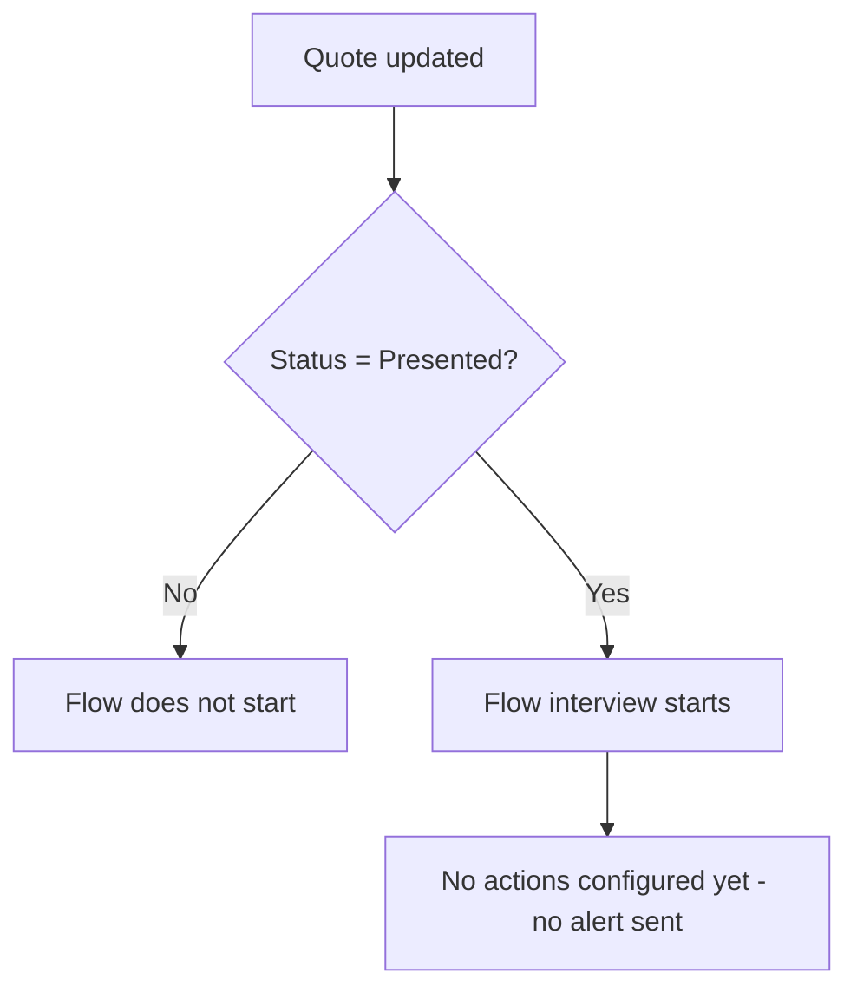

## Overview

Quote Expiry Alert is a background automation that watches Quote records once they have been sent to a
customer. Whenever a Quote is updated and its Status is set to **Presented**, the flow's entry criteria
fire. The intent is to give sales reps a heads-up when a presented Quote is at risk of going stale or
expiring, so they can follow up with the customer before it lapses.

```callout
type: warning
This flow currently defines only its entry criteria — the trigger fires, but no email, task, Chatter
post, or other action has been configured inside it yet. Setting a Quote's Status to **Presented** will
not currently produce a visible alert or reminder. Treat this page as documentation of the intended
trigger condition until the flow's actions are built out.
```

## Prerequisites

- Standard edit access to the Quote object (any user who can update a Quote's Status can trigger the entry criteria).
- The Quote must be moved to **Presented** status — the flow evaluates `Status = "Presented"` and does nothing for any other status.

## Steps to Navigate

There is no dedicated screen for this feature — it runs automatically in the background whenever a
Quote is saved with a qualifying Status.

1. Open any Quote record.
2. Edit the **Status** field.

```screenshot
id: quote-expiry-alert-status-field
alt: Quote edit form with the Status field highlighted
step: Open a Quote and edit the Status field
url_pattern: /lightning/r/Quote/{recordId}/view
actions:
  - open_record: Quote
```

3. Set **Status** to **Presented**.
4. Click **Save**.

## Use Cases

### Setting a Quote's Status to Presented

1. Open an existing Quote where Status is not yet **Presented** (e.g. Draft or Needs Review).
2. Edit **Status** and set it to **Presented**.
3. Click **Save**.
4. The record saves normally. The flow's entry criteria are met and the flow starts an interview, but
   since no actions are currently configured inside it, there is no visible outcome for the user beyond
   the normal save.

### Setting a Quote's Status to anything other than Presented

1. Open an existing Quote.
2. Edit **Status** and set it to a value other than **Presented** (e.g. Draft, Denied, Accepted).
3. Click **Save**.
4. The flow's entry criteria are not met (`Status != "Presented"`), so the flow does not start at all.

### Updating a Quote that is already Presented

1. Open a Quote that is already at Status = **Presented**.
2. Edit any other field on the Quote (e.g. Expiration Date or Discount) without changing Status.
3. Click **Save**.
4. Because this flow only runs on record update and re-evaluates the saved Status on every save, the
   flow starts again on this save too, since Status still equals **Presented**.

## Validations & Business Rules

- Automation: `Quote_Expiry_Alert` is an auto-launched, record-triggered flow on Quote.
- Trigger: fires **after save**, only on **record update** (does not run on Quote creation).
- Entry condition: `Status = "Presented"`.
- As currently built, the flow contains no downstream actions (no email alert, task creation, Chatter
  post, or field update) — it only evaluates the entry criteria. No user-facing alert is produced today.



## Related Features

- None documented yet.
