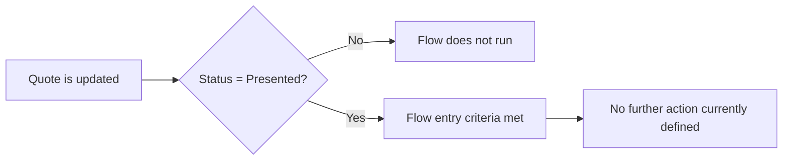

## Overview

Quote Expiry Alert is a background automation on the standard Quote object. It watches for a Quote
being saved with **Status = Presented**, which is the moment a quote has gone out to a customer and
its clock toward expiry effectively starts. As currently configured, the flow's entry criteria fire on
that status change but the flow contains no further defined actions — so no email, task, or field
update is sent yet. Nothing else in the system calls or depends on it; it runs purely on its own
record-trigger criteria whenever a Quote is updated.

```callout
type: note
This flow currently only defines its trigger (Quote saved with **Status = Presented**). No downstream
action — such as sending a reminder or flagging an expiring quote — has been built into it yet, so users
will not see any visible alert from this automation today.
```

## Prerequisites

- User must have edit access to the Quote object and the **Status** field.
- The Quote record must support the **Presented** status value on its Status picklist.

## Steps to Navigate

This automation runs in the background after a Quote is saved — there is no menu or setting for a user
to turn it on. It is triggered simply by changing a Quote's status.

1. Open the relevant **Opportunity**, then open its related **Quotes** list, or navigate directly to an
   existing **Quote** record.
2. Edit the Quote and set the **Status** field to **Presented**.
3. Click **Save**.

```screenshot
id: quote-expiry-alert-status-field
alt: Quote record edit panel showing the Status field set to Presented
step: Open a Quote record, edit it, and set Status to Presented, then save
url_pattern: /lightning/r/Quote/{recordId}/view
actions:
  - open_record: Quote
```

## Use Cases

### Standard path — Quote marked Presented

1. A sales user finishes preparing a Quote and updates its **Status** to **Presented** to indicate it
   has been sent to the customer.
2. Saving the record fires the Quote Expiry Alert flow's entry criteria in the background.
3. Today, this results in no visible change to the user — the flow has no configured actions beyond
   matching the trigger criteria.

### Quote saved with a different status

1. A user updates a Quote but leaves (or sets) its **Status** to anything other than **Presented**
   (for example **Draft** or **Accepted**).
2. The flow's entry criteria formula evaluates to false for that save, so the flow does not run at all.

### Quote re-saved while already Presented

1. A user edits and saves a Quote that is already in **Presented** status without changing the Status
   field itself.
2. Because the trigger is a record-triggered flow on **Update** and the filter formula checks the
   current value of **Status**, the criteria still evaluates true and the flow runs again on every
   subsequent save while the record remains in **Presented** status.

## Validations & Business Rules



- Entry criteria: the flow only starts when a Quote is updated (`RecordAfterSave`) and its **Status**
  field equals **Presented**.
- The flow definition currently contains only its trigger/start element — there is no email alert,
  task creation, or field update configured, so it has no user-visible effect beyond firing.

## Related Features

- No other business pages reference this flow yet.
