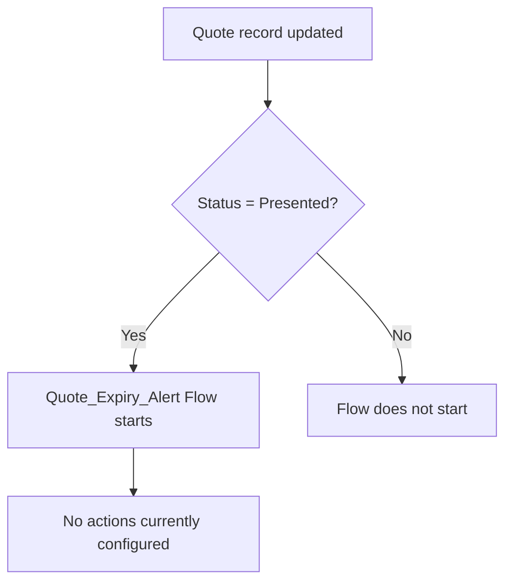

## Overview

This feature is intended to alert users when a Quote has been marked **Presented** to a customer, so
that expiring Quotes can be tracked and followed up on before they lapse. It is implemented as a
record-triggered Flow that fires immediately after a Quote is updated.

```callout
type: warning
The **Quote_Expiry_Alert** Flow is currently active and will fire whenever a Quote is updated to
**Presented**, but it has no actions configured yet (no email alert, task, field update, or
notification is created). At this time, updating a Quote to Presented does not produce any visible
expiry warning to the user — this page documents the trigger condition as configured in the org
today.
```

## Prerequisites

- The **Status** field on the Quote must be set to `Presented` at the time the Quote is saved.
- No additional permission set is required to trigger this Flow — it runs automatically in the
  background whenever a matching Quote is updated.

## Steps to Navigate

The alert is not something a user manually navigates to — it is triggered automatically by updating
a Quote's Status. To update a Quote so it meets the trigger criteria:

1. Click the **App Launcher** and search for **Quotes**.
2. Open an existing Quote record.
3. Click **Edit**.
4. Set the **Status** field to **Presented**.
5. Click **Save**.

```screenshot
id: quote-expiry-alert-status-field
alt: Quote edit form with the Status field set to Presented
step: Open an existing Quote and set the Status field to Presented
url_pattern: /lightning/r/Quote/{recordId}/view
actions:
  - open_app_launcher
  - search_app_launcher: Quotes
  - click_app_launcher_result: Quotes
```

## Use Cases

### Quote updated to Presented

1. A user edits an existing Quote and sets **Status** to **Presented**.
2. Immediately after the record saves, the **Quote_Expiry_Alert** Flow evaluates the entry condition
   (`Status = "Presented"`) and starts an interview.
3. Currently, the Flow performs no further action — no email, task, field update, or Chatter
   notification is sent. The Quote is saved normally with no visible difference to the user, and no
   expiry warning is ever shown.

### Quote updated to a different Status

1. A user edits a Quote and sets **Status** to a value other than `Presented` (for example `Draft`,
   `Accepted`, or `Denied`).
2. The Flow's entry condition is not met, so the Flow does not start an interview for this update.

### Quote created directly with Status = Presented

1. A user creates a new Quote and sets **Status** to **Presented** on initial save.
2. Because the Flow's trigger type is **Update only** (`RecordAfterSave` with `recordTriggerType`
   of `Update`), the Flow does not fire on the insert — only a subsequent update to the record while
   already Presented (or a later save that keeps/sets it to Presented) will start the interview.



## Validations & Business Rules

- Automation: **Quote_Expiry_Alert** is an auto-launched, record-triggered Flow on the Quote object,
  configured with `RecordAfterSave` and `Update`-only trigger type.
- Entry condition: the Flow's filter formula is `{!$Record.Status} = "Presented"` — it only starts
  for Quotes updated while (or into) a `Presented` status.
- The Flow does not fire on Quote creation (insert), only on update, so a Quote inserted directly
  with Status already Presented will not trigger it on that initial save.
- As configured, the Flow has no downstream elements (no Decision, Assignment, Create Records, or
  Send Email actions), so no expiry warning is actually delivered to any user today.

## Related Features

- Quote lifecycle and status management on the Quote object
