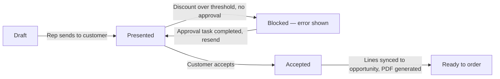

## Overview

This feature takes a deal from priced opportunity to a signed, order-ready quote. A rep generates a quote
directly from an opportunity's existing line items — each line is re-priced using the same rules engine
that prices opportunities, so the quote reflects the account's tier and any margin floors. Once drafted,
moving the quote to **Presented** is automatically checked against the company's discount policy: quotes
with too steep a discount are blocked from going out until a manager completes an approval task. When a
customer accepts a quote, the accepted prices become the deal's official numbers — they're pushed back onto
the opportunity's line items — and a quote document is generated and logged to the quote's activity history.



## Prerequisites

- 'Manage Opportunities' or equivalent access to create and edit Quotes
- The opportunity has a Pricebook and at least one product line before generating a quote
- A completed Task with subject starting **"Discount approval"** is the only thing that satisfies the
  approval gate for a given quote — someone with approval authority must create and complete that task
  before the quote can be presented

```callout
type: note
Quote generation, approval gating, and line sync are also exposed through
`CustomerLifecycleOrchestrator` for scripted/anonymous-Apex use (e.g. test data setup or admin
scripts) — `priceAndQuote(opportunityId)` reprices and generates in one call, and
`acceptAndOrder(quoteId)` accepts, syncs, and creates the order in one call. Day-to-day reps use
the UI steps below instead.
```

## Steps to Navigate

1. Open the **Quotable Opportunities** component (available on the Home page or an app page where it's
   placed) to see open opportunities that have at least one product line — this is the list a quote can be
   generated from.

```screenshot
id: quote-lifecycle-quotable-opportunities
alt: Quotable Opportunities list component showing open opportunities with amount and stage
step: Open the app page or Home tab containing the Quotable Opportunities component
url_pattern: /lightning/page/home
```

2. From the opportunity record, use the **New Quote** related action (or the Quotes related list) to
   generate a quote. This creates the Quote header (copied from the opportunity) and mirrors every
   opportunity line as a quote line at the current rules-engine price.

```screenshot
id: quote-lifecycle-opportunity-quotes-related-list
alt: Opportunity record page showing the Quotes related list with a newly generated quote
step: Open an opportunity that has product lines and generate a quote from it
url_pattern: /lightning/r/Opportunity/{recordId}/view
```

3. Open the generated Quote record. It's created with **Status = Draft**, an **Expiration Date** 30 days
   out, and one Quote Line Item per opportunity line.

```screenshot
id: quote-lifecycle-quote-record-draft
alt: Quote record page in Draft status with quote line items and expiration date
step: Open the newly generated Quote record
url_pattern: /lightning/r/Quote/{recordId}/view
```

4. When the quote is ready to send, change **Status** to **Presented** and save.

```screenshot
id: quote-lifecycle-status-to-presented
alt: Quote status field being changed to Presented
step: Edit the Quote's Status field and set it to Presented, then save
url_pattern: /lightning/r/Quote/{recordId}/view
```

5. When the customer accepts, change **Status** to **Accepted** and save. This triggers the price sync back
   to the opportunity and queues the quote document generation.

## Use Cases

### Generate a quote from a priced opportunity

1. Open the opportunity (it must already have a Pricebook and at least one product line).
2. Generate a new quote. The quote header copies the opportunity's name (suffixed " — Quote"), account,
   and pricebook.
3. Every opportunity line is copied as a quote line. If the line has a list price, it's re-priced through
   the same rules engine used for opportunity pricing, using the account's tier — so a quote line's price
   can differ from the opportunity line's current price if the tier or product family pricing rules apply.
4. The quote is created in **Draft** status with a 30-day expiration date, ready for review before sending.

### Present a quote within the discount policy (standard path)

1. Set the quote's Status to **Presented**.
2. The system calculates the quote's blended discount (list price total vs. sold price total across all
   quote lines).
3. Because the discount is under the policy threshold, the status change saves with no error and the
   quote is now presented to the customer.

### Present a quote that needs approval (exception path)

1. Set the quote's Status to **Presented** on a quote whose blended discount is over 30%, or over 20% on a
   deal worth more than $100,000.
2. The save is blocked with an error naming the exact blended discount percentage, and the status remains
   unchanged. The attempt is logged to the sales-ops audit trail.
3. A manager (or whoever owns discount approval) creates a Task on the quote with a **Subject starting with
   "Discount approval"** and marks it **Completed**.
4. The rep sets Status to **Presented** again. This time the completed approval task satisfies the gate and
   the save succeeds.

```screenshot
id: quote-lifecycle-approval-blocked-error
alt: Error banner on the Quote record blocking the status change to Presented due to discount
step: Attempt to set Status to Presented on a quote whose discount exceeds the approval threshold
url_pattern: /lightning/r/Quote/{recordId}/view
```

### Accept a quote and sync prices to the opportunity

1. Set the quote's Status to **Accepted**.
2. For every quote line, the matching opportunity line (same pricebook entry) has its unit price updated
   to the accepted quote line's price — but only where the price actually differs, so unrelated lines are
   left untouched.
3. A queued job generates the quote document: it logs a completed Task on the quote recording the quote's
   name, grand total, and expiration date, giving the team an auditable record that the document went out.
4. The opportunity can now move to Closed Won, since it has an accepted quote on file (see Validations
   below).

```screenshot
id: quote-lifecycle-accepted-sync-task
alt: Quote activity timeline showing the completed Quote document generated Task after acceptance
step: Set an accepted quote's related opportunity page and check the Activity timeline for the generated Task
url_pattern: /lightning/r/Quote/{recordId}/view
```

### Bulk-accept quotes (batch path)

1. When multiple quotes are updated to **Accepted** in the same operation (e.g. a data load or bulk edit),
   the price sync processes all of them together — opportunity lines across every affected opportunity are
   matched and updated in a single pass.
2. A document-generation job is queued separately for each accepted quote in the batch.

## Validations & Business Rules

- **Approval gate on Presented:** Moving a Quote to **Status = Presented** is blocked (via `addError`)
  when the blended discount exceeds 30%, or exceeds 20% on a deal with `GrandTotal` over $100,000 — unless
  a Task with Subject starting `Discount approval` and Status `Completed` already exists on that quote.
  Blocked attempts are recorded to the sales-ops audit log.
- **Blended discount calculation:** discount % is `(1 − sold total / list total) × 100` across all of a
  quote's line items, not a per-line figure — a few heavily discounted lines can be offset by others at
  list price.
- **Price sync on acceptance:** when a Quote's Status changes to **Accepted**, matching opportunity lines
  (same `PricebookEntryId`) are updated to the quote line's price. Only lines whose price actually changed
  are written. This update bypasses the Opportunity Line Item trigger so it doesn't re-trigger other
  automation.
- **Document generation:** acceptance queues an asynchronous job that logs a completed Task on the Quote
  with the total and expiration date — this stands in for a real document-generation/e-sign integration.
- **Closed Won requires an accepted quote:** a separate opportunity-stage rule blocks moving an Opportunity
  to Closed Won unless it has at least one Quote in **Accepted** status.
- **Trigger bypass respected:** all Quote trigger behavior (approval gate, sync, PDF) is skipped when the
  Quote trigger is bypassed for the current context (used by admin/integration scripts that set status
  directly).
- Quote generation and approval-gate checks reuse the same pricing engine as opportunity pricing, so
  account tier and product-family margin floors apply consistently across both.

## Related Features

- Opportunity pricing and discount rules — the rules engine that prices both opportunity and quote lines
- Opportunity stage guardrails — enforces that Closed Won requires an accepted quote
- Order generation from quote — the next step after a quote is accepted
