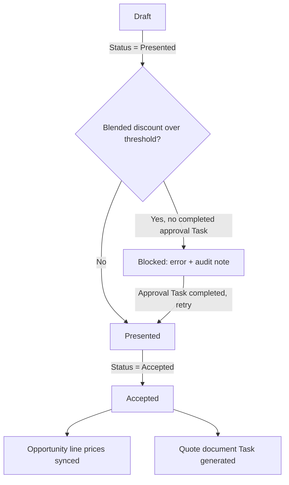
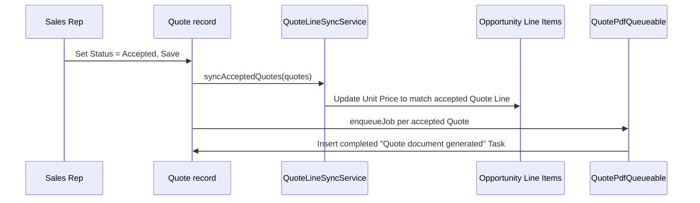

## Overview

This feature carries a Quote through its full life: from being generated off an Opportunity's priced
products, through a discount check that can block it from being sent to a customer, to acceptance —
where the agreed prices flow back onto the Opportunity and a quote document is produced automatically.
Sales reps see the effect of this as a **Quotable Opportunities** list showing which deals are ready to
quote, a blocked **Presented** status with an explanatory error until a discount approval is on file, and
a completed **Task** appearing on the Quote once it is accepted.

```callout
type: note
Copying an Opportunity's products into a new Quote (`QuoteGenerationService.generateFromOpportunity`) is
not yet wired to a button in the UI. Today it runs only when an admin or integration drives the full
journey — for example via `CustomerLifecycleOrchestrator.priceAndQuote`, called from anonymous Apex or an
integration job. The **Quotable Opportunities** component only shows candidate Opportunities; it does not
itself create the Quote.
```

## Prerequisites

- Edit access to Quotes and Quote Line Items.
- The Opportunity being quoted must have at least one Opportunity Line Item and a Pricebook assigned —
  generation copies every line at its `PriceRuleEngine`-computed price.
- To move a Quote to **Presented** when its discount is over the threshold, a completed Task with a
  Subject starting **"Discount approval"** must already exist on that Quote.

## Steps to Navigate

1. Click the **App Launcher** and search for **Home**, or open an Opportunity record page that has the
   **Quotable Opportunities** component placed on it.
2. Review the **Quotable Opportunities** list — it shows open Opportunities that have at least one
   product on them and are candidates for quoting.

```screenshot
id: quote-lifecycle-generation-approval-quotable-opportunities
alt: Quotable Opportunities component listing open opportunities with products, name, stage, and amount
step: Open the Home page (or an Opportunity record page) where the Quotable Opportunities component is placed
url_pattern: /lightning/page/home
```

3. Once a Quote exists for the Opportunity, click the **App Launcher** and search for **Quotes**, then
   open the Quote record.

```screenshot
id: quote-lifecycle-generation-approval-quote-record
alt: Quote record page showing Status, GrandTotal, and Quote Line Items related list
step: Open a Quote record generated from an Opportunity
url_pattern: /lightning/r/Quote/{recordId}/view
actions:
  - open_record: Quote
```

4. Click **Edit**, set **Status** to **Presented**, and click **Save** to send the Quote to the customer.
5. Once the customer agrees, edit the Quote again, set **Status** to **Accepted**, and click **Save**.

## Use Cases

### Generating a Quote from an Opportunity

1. An admin or integration calls `CustomerLifecycleOrchestrator.priceAndQuote` (or
   `QuoteGenerationService.generateFromOpportunity` directly) for a priced Opportunity.
2. A new Quote is inserted in **Draft** status, named after the Opportunity, linked to the same
   Pricebook, and defaulted to expire 30 days from today.
3. Every Opportunity Line Item is copied into a Quote Line Item at the same quantity. If the line has a
   list price, it is re-priced through `PriceRuleEngine` using the account's tier (from `Account.Rating`)
   and the product's family — so the Quote can reflect volume/tier pricing even if the Opportunity line
   was priced differently.

### Presenting a Quote within discount limits (happy path)

1. A rep opens a Draft Quote whose blended discount (list price total vs. sold price total across all
   lines) is 15%.
2. The rep sets **Status** to **Presented** and saves.
3. `QuoteApprovalService.gatePresentation` computes the blended discount and finds it does not exceed the
   approval threshold, so the save completes with no error.

### Presenting a Quote that needs approval first (blocked)

1. A rep opens a Quote whose blended discount is 35% (or 25% on a deal over $100,000) and sets **Status**
   to **Presented**.
2. On save, `QuoteApprovalService.gatePresentation` finds no completed "Discount approval" Task on the
   Quote and adds an error: *"This quote's discount (35%) needs a completed approval task first."* The
   Status change is rejected and the Quote remains in its prior status.
3. An audit note recording the blocked attempt is logged via `SalesOpsAuditService`.

```screenshot
id: quote-lifecycle-generation-approval-blocked-status
alt: Quote edit form showing an error on the Status field after trying to set it to Presented without an approval
step: Edit a heavily discounted Quote and set Status to Presented to see the validation error
url_pattern: /lightning/r/Quote/{recordId}/view
actions:
  - open_record: Quote
  - click_button: Edit
  - fill_field: { field: Status, value: Presented }
  - click_button: Save
```

### Completing the approval, then presenting successfully

1. A manager or approver creates a Task on the blocked Quote with a **Subject** starting with **"Discount
   approval"** and sets its **Status** to **Completed**.
2. The rep re-opens the Quote, sets **Status** to **Presented** again, and saves.
3. `quotesWithCompletedApproval` now finds the completed Task for this Quote, `gatePresentation` finds no
   discount violation, and the save succeeds.

```screenshot
id: quote-lifecycle-generation-approval-approval-task
alt: Task related list on a Quote record showing a completed Discount approval task
step: View the Activity related list on the Quote showing the completed Discount approval Task
url_pattern: /lightning/r/Quote/{recordId}/view
```

### Accepting a Quote — pricing syncs back and a document is generated

1. A rep sets a Presented Quote's **Status** to **Accepted** and saves.
2. In after-update, `QuoteLineSyncService.syncAcceptedQuotes` matches each Quote Line Item to the
   Opportunity Line Item sharing the same Pricebook Entry and updates the Opportunity line's **Unit
   Price** wherever it differs — the accepted Quote price becomes the deal's price. The Opportunity
   Line Item trigger is bypassed during this write so it doesn't recursively re-fire.
3. A `QuotePdfQueueable` job is enqueued for the Quote. It looks up the Quote's Name, Grand Total, and
   Expiration Date and inserts a completed **Task** — *"Quote document generated: [Quote Name]"* — as a
   stand-in for a real document-generation service.

```screenshot
id: quote-lifecycle-generation-approval-generated-task
alt: Activity related list on the Quote showing the auto-generated "Quote document generated" completed Task
step: View the Activity related list on an Accepted Quote to see the generated document Task
url_pattern: /lightning/r/Quote/{recordId}/view
```

### Bulk-accepting multiple Quotes (e.g. data load or integration)

1. Multiple Quotes are updated to **Accepted** in a single operation (for example, a data import or an
   integration call).
2. `QuoteTriggerHandler.afterUpdate` collects every Quote in the batch that just transitioned into
   Accepted, calls `QuoteLineSyncService.syncAcceptedQuotes` once for the whole set (so all Opportunity
   line updates happen together), and still enqueues one `QuotePdfQueueable` job per accepted Quote.





## Validations & Business Rules

- Automation (before-update, `QuoteApprovalService.gatePresentation`): only fires for Quotes newly
  transitioning **into** Presented status. It computes each Quote's blended discount (1 − sold total ÷
  list total across its Quote Line Items) and blocks the save with `addError` if
  `PriceRuleEngine.requiresApproval` returns true — discount over 30%, or over 20% on a deal with
  `GrandTotal` over $100,000 — and no completed Task with Subject like `Discount approval%` exists on
  that Quote. Every blocked attempt is logged via `SalesOpsAuditService`.
- There is no automatic creation of the "Discount approval" Task for Quotes — unlike the equivalent
  Opportunity discount check, someone must create and complete that Task manually before a blocked
  Quote can be presented.
- Automation (after-update, `QuoteTriggerHandler.afterUpdate`): only fires for Quotes newly transitioning
  into **Accepted** status. It calls `QuoteLineSyncService.syncAcceptedQuotes` for the whole batch, then
  enqueues one `QuotePdfQueueable` job per accepted Quote.
- `QuoteLineSyncService` only updates an Opportunity Line Item when its Unit Price actually differs from
  the matching accepted Quote Line's price (matched by Pricebook Entry), and performs that update with
  the Opportunity Line Item trigger bypassed via `TriggerControl` so it does not recursively re-trigger
  Opportunity repricing.
- `QuoteGenerationService.generateFromOpportunity` re-prices each copied line only when the source
  Opportunity line has a positive **List Price**; otherwise the Opportunity line's existing Unit Price is
  copied as-is. Pricing uses the same `PriceRuleEngine` rules (volume, tier, family, margin floor) shared
  with Opportunities and Orders.
- `QuoteApprovalService.opportunitiesWithAcceptedQuote` is used by the Opportunity stage guard to block a
  move to **Closed Won** until at least one Quote on the Opportunity is Accepted — see
  [[opportunity-pricing-approval-automation]].
- All Quote trigger logic can be bypassed via `TriggerControl.bypass('Quote')` — used internally, e.g. by
  `CustomerLifecycleOrchestrator.acceptAndOrder`, when an integration needs to set a Quote to Accepted
  without re-running the discount gate.

## Related Features

- Opportunity pricing, forecasting, and stage-approval gates share the same `PriceRuleEngine` and the
  accepted-quote check used to unblock Closed Won — see [[opportunity-pricing-approval-automation]].
- The Quote Expiry Alert Flow watches for the same **Presented** status change but currently takes no
  further action — see [[quote-expiry-alert]].
